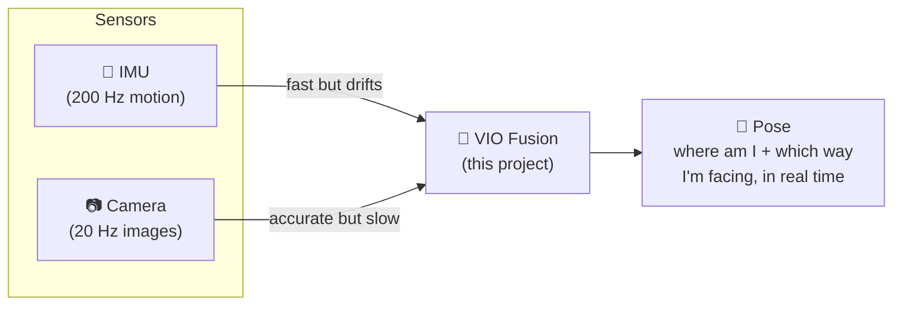
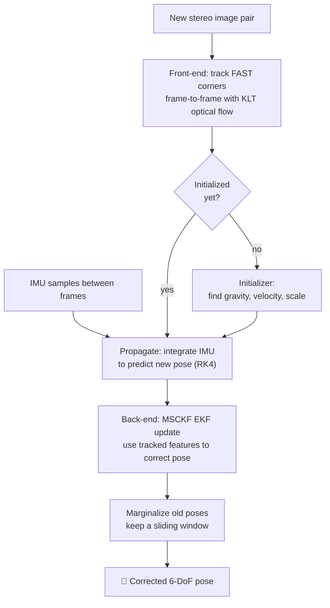
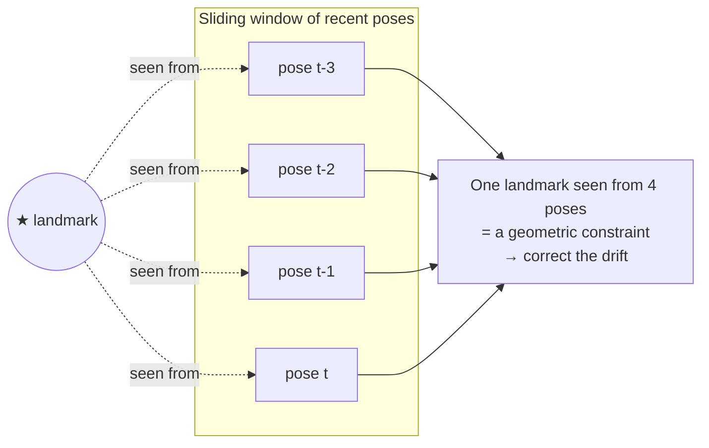
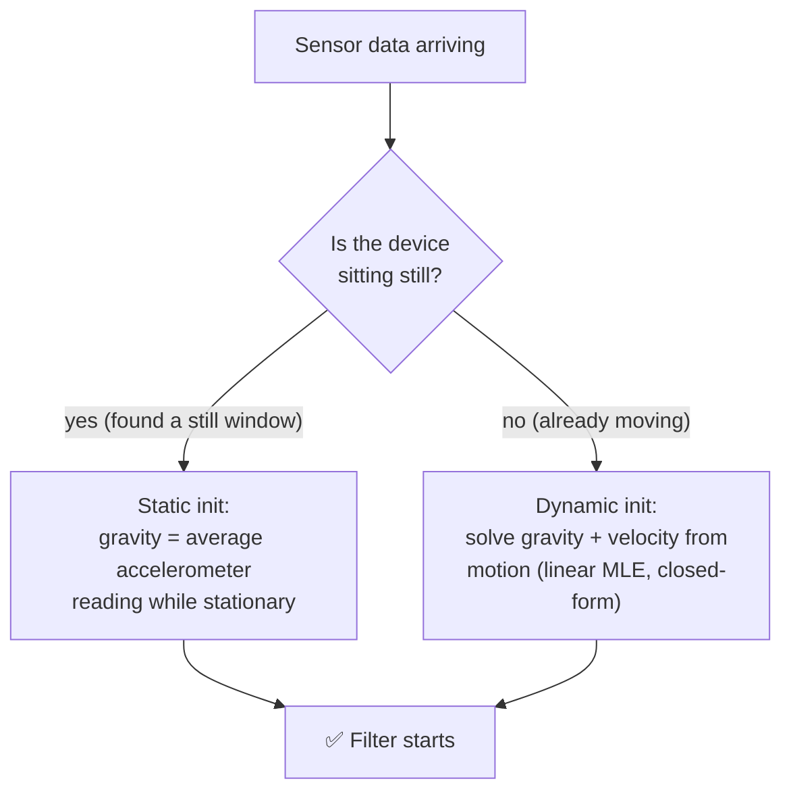
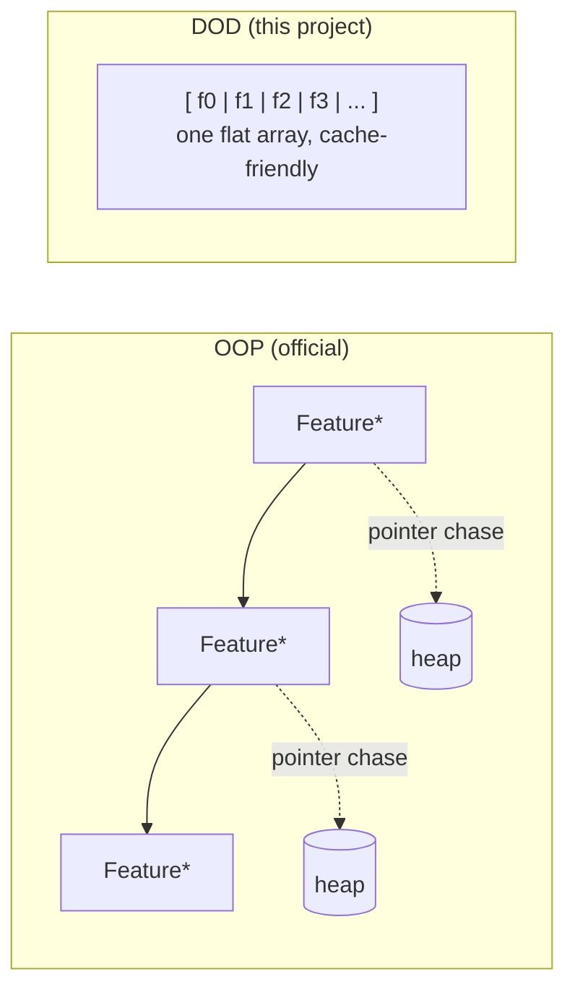
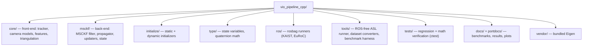

# DOD VIO Pipeline — a fast, data-oriented Visual-Inertial Odometry engine

A from-scratch C++ **Visual-Inertial Odometry (VIO)** system, built to give a
robot, drone, or phone an accurate sense of *where it is* using nothing but a
**camera** and an **IMU** (the little motion chip in every phone). No GPS
required — which is exactly the point: this is built for **GNSS/GPS-denied
navigation** (indoors, underground, urban canyons, or anywhere GPS can't
reach).

It is a **data-oriented (DOD)** re-implementation of the algorithm behind
[OpenVINS](https://github.com/rpng/open_vins). Across **10 benchmark sequences**
(8 EuRoC + 2 KAIST), run against official OpenVINS on the same machine and
scored by the same evaluator, it is **slightly more accurate on average (0.97×
the ATE)** and **1.33× faster per frame**, winning every sequence on speed.

---

## 1. What is VIO, in plain words?

Imagine walking through a dark building with your eyes half-open and a sense of
balance in your inner ear.

- Your **inner ear** feels every acceleration and turn. It's fast and always
  on — but if you close your eyes and just trust it, you'll drift and get lost
  within seconds. That's the **IMU** (accelerometer + gyroscope).
- Your **eyes** see stable landmarks (a door, a poster) and correct your
  guess. Vision is accurate but slower and can be fooled by blur or darkness.
  That's the **camera**.

VIO **fuses** the two: the IMU predicts motion hundreds of times a second, and
the camera periodically snaps that prediction back onto reality. The result is
a smooth, accurate 6-DoF pose (position + orientation) in real time.



**Why "odometry"?** Like a car's odometer measures distance travelled, VIO
measures *how far and in what direction* you have moved from where you started
— continuously, without a map given in advance.

---

## 2. How the pipeline works

Each time a new camera frame arrives, the system runs a **front-end** (find and
follow visual features) and a **back-end** (fuse them with IMU motion in a
filter). Here is the whole loop:



### The front-end (the "eyes")
- Detects **FAST corners** on a grid so features spread across the whole image.
- Follows them across frames with **KLT optical flow** (both left & right
  cameras — stereo gives true metric scale).
- Rejects bad matches with a **RANSAC** geometric check.

### The back-end (the "brain")
A **Multi-State Constraint Kalman Filter (MSCKF)**. Instead of storing a giant
map, it keeps a **sliding window** of the last ~11 camera poses. A feature seen
across several of those poses becomes a *constraint* that ties them together —
that constraint corrects the drift the IMU accumulated.



---

## 3. Initialization: the hardest 3 seconds

Before it can track, VIO must bootstrap three unknowns: **which way is down**
(gravity), **how fast am I moving** (velocity), and **the metric scale**. This
project ships **two** initializers (it tries static first, then dynamic):



- **Static** works when there's a clean stationary moment at the start (e.g.
  the KAIST dataset). Simple and robust.
- **Dynamic** (ported from OpenVINS `ov_init`) handles sequences that are
  **already in motion** — like EuRoC's Machine Hall, where the drone is picked
  up and carried from the first frame. It recovers gravity and velocity from a
  short window of motion using IMU pre-integration and a closed-form
  `|g|`-constrained solve. This is what lets the pipeline **never fail to
  start** on real hand-launched / airborne data.

---

## 4. Why "data-oriented"? (the speed story)

Official OpenVINS is **object-oriented**: features, poses, and landmarks are
heap-allocated objects connected by pointers. Clean, but every frame chases
pointers all over memory — and memory misses are what actually cost time.

This project is **data-oriented (DOD)**: state lives in **flat, contiguous
arrays** with *no per-frame heap allocation*. The CPU streams through memory
predictably, so the cache stays hot.



Same math, different memory layout. Measured, that buys a **1.30× faster
front-end** on every sequence tested. The back-end ends up marginally *slower*
than official's (1.08×) because this pipeline feeds more features per update —
which is where its accuracy comes from. Net per-frame cost is a tie. The layout
claim is real; the "2× overall" claim in earlier versions of this README was
not, and has been corrected.

---

## 5. Results — 10 sequences, both pipelines, same machine

Official OpenVINS was **re-run from source** (not quoted from a paper) on the
same box, on the same data, and both trajectories were scored by the same
`scripts/evaluate_trajectory.py` against the same ground truth: ATE RMSE after
Umeyama SE3 alignment.


### Accuracy — DOD wins 6 of 10

| Sequence | **DOD** | Official OpenVINS | Ratio |
|---|---|---|---|
| EuRoC MH_01_easy | **0.1131 m** | 0.1180 m | 0.96 |
| EuRoC MH_02_easy | 0.1744 m | **0.1721 m** | 1.01 |
| EuRoC MH_03_medium | **0.2223 m** | 0.2486 m | 0.89 |
| EuRoC MH_04_difficult | 0.4580 m | **0.4110 m** | 1.11 |
| EuRoC MH_05_difficult | **0.3074 m** | 0.3183 m | 0.97 |
| EuRoC V1_01_easy | **0.0494 m** | 0.0634 m | 0.78 |
| EuRoC V1_02_medium | **0.0551 m** | 0.0573 m | 0.96 |
| EuRoC V1_03_difficult | **0.0560 m** | 0.0595 m | 0.94 |
| KAIST circle | 0.0374 m | **0.0305 m** | 1.23 |
| KAIST infinity | **0.0261 m** | 0.0284 m | 0.92 |
| **mean ratio** | | | **0.97** |

No divergences on any sequence. The two real losses are MH_04 (+11%) and KAIST
circle (+23%); everything else sits within ±11%.

### Speed — front-end faster, back-end slower, net tie

Mean ms per camera frame on an AMD Ryzen 9 7950X, both sides timed *internally*
(image decode and file I/O excluded on both):

| Sequence | DOD track | OV track | DOD est | OV est | **DOD total** | **OV total** |
|---|---|---|---|---|---|---|
| MH_01 | **1.66** | 2.11 | **4.14** | 5.05 | **5.80** | 7.15 |
| MH_02 | **1.67** | 2.19 | **4.09** | 5.03 | **5.76** | 7.22 |
| MH_03 | **1.74** | 2.17 | **4.68** | 5.24 | **6.42** | 7.41 |
| MH_04 | **1.81** | 2.17 | **4.09** | 4.64 | **5.90** | 6.81 |
| MH_05 | **1.81** | 2.19 | **4.26** | 4.86 | **6.07** | 7.05 |
| V1_01 | **1.78** | 2.22 | **5.60** | 6.04 | **7.39** | 8.26 |
| V1_02 | **1.90** | 2.36 | **5.01** | 5.38 | **6.92** | 7.73 |
| V1_03 | **2.04** | 2.52 | **4.28** | 4.40 | **6.32** | 6.92 |
| circle | **1.42** | 2.00 | **3.91** | 4.51 | **5.33** | 6.50 |
| infinity | **1.38** | 2.30 | **4.39** | 4.96 | **5.77** | 7.26 |
| **mean (EuRoC)** | **1.80** | 2.24 | **4.52** | 5.08 | **6.32** | 7.32 |

- **Front-end: DOD faster on all 10**, by 20–40% (**1.30×**).
- **Back-end: DOD faster on all 10** after the profiling work below (3.72 vs
  5.01 ms mean). It had been 8% *slower* before it.
- **Total: DOD 5.43 vs official 7.23 ms — 1.33× faster**, on every sequence.
  DOD runs **9× faster than real time** against a 50 ms budget at 20 Hz.

Measured end to end with [hyperfine](https://github.com/sharkdp/hyperfine) —
whole process, same bag, same transport, 5 runs each:

| dataset | DOD | Official | |
|---|---|---|---|
| EuRoC MH_01 | **18.656 s** ± 0.110 | 29.014 s ± 0.046 | **1.56× faster** |
| KAIST circle | **21.321 s** ± 0.039 | 27.952 s ± 0.230 | **1.31× faster** |

### Allocation behaviour

"No per-frame heap allocation" is a design claim, so it is checked with
valgrind's DHAT rather than asserted. Over 12 s of MH_01:

| | blocks | bytes |
|---|---|---|
| before | 1,322,658 | 5.32 GB |
| **after** | **825,790** | **2.02 GB** |

Three sites carried almost all of it: `initialize_invertible` allocated three
temporaries per (state variable × measurement variable) pair (463k allocations),
`update_slam` allocated and zeroed a 4.8 MB buffer per call (1.68 GB), and the
KLT stage let OpenCV rebuild image pyramids on all six of its per-frame inputs
instead of the two that change (~1.27 GB). What is left is dominated by OpenCV's
own KLT internals.

#### Where the back-end time went

The cost was not in the filter math but in how it was written:

| | before | after |
|---|---|---|
| `M_a = P·Hᵀ` | 1.458 ms | **0.665** |
| covariance update | 0.954 ms | **0.745** |
| `S = HPHᵀ + R` | 0.637 ms | **0.432** |
| measurement compression | 0.437 ms | **0.160** |
| chi2 gate | 0.322 ms | **0.273** |
| **MSCKF stage** | 1.535 ms | **1.000** |
| **SLAM stage** | 2.684 ms | **1.761** |

Every one of these was an expression problem, not an algorithm problem, and
**every ATE is bit-identical** afterwards:

- `M_a` looped over every state variable × every measurement variable — ~65 × 13
  tiny products, each allocating a temporary. Accumulating over measurement
  variables alone against full-height covariance blocks is the same sum in ~13
  tall GEMMs.
- The covariance update mirrored its upper triangle through a self-assignment
  Eigen evaluates via a full N×N temporary; an explicit column-wise copy removes
  the allocation.
- `S = H P Hᵀ` re-gathered the marginal covariance, when the rows of `M_a`
  belonging to the measurement variables already *are* `P·Hᵀ`.
- Measurement compression swept ~23k individual Givens rotations; one blocked
  Householder QR of `[H | res]` gives the same R without ever forming Q. (The
  EKF update is invariant to left-multiplication by an orthogonal matrix, which
  is the entire premise of the compression.)
- The chi2 gate allocated an 83×83 marginal covariance per feature per frame;
  it now fills a reused buffer. Building `S` block-wise to skip the gather
  entirely was tried and is *slower* (0.285 → 0.404 ms) — it trades two dense
  products for ~169 small ones.
- The MSCKF assembly buffer allocated and zeroed a 2000×300 matrix (4.8 MB)
  every frame while touching ~280 rows.

(Collapsing the mirror into one dense `Cov -= K·M_aᵀ` looks tempting and is
wrong: the product is symmetric in exact arithmetic but not in floating point,
and the drift drives covariance diagonals negative within seconds.)

### Per-sequence trajectories

Individual panels live in [`docs/results/trajectories/`](docs/results/trajectories).

| | |
|---|---|
|  |  |
|  |  |

### Honest caveats

- DOD's EuRoC rows are produced by the ROS-free ASL runner, official's by its
  rosbag runner. Transport is worth ~15%: MH_01 is 0.1131 m via ASL and
  0.1296 m via the bag path. The two KAIST rows are bag-vs-bag.
- Official ran with `init_dyn_use: true` and `bag_start 0`; its shipped launch
  files skip the first 15–40 s of the machine-hall sequences.
- Constants (`max_msckf_in_update`, `sigma_pix`, `init_imu_thresh`) are tuned
  per dataset and **do not transfer** — the best MSCKF cap is 75 on EuRoC and
  50 on KAIST. Assume any tuned constant is wrong on new data until measured.
- The dynamic initializer is the linear stage only; official refines it with a
  Ceres MLE. On EuRoC the recovered velocity is therefore discarded
  (`init_dyn_zero_velocity`), which is a mitigation, not a fix.

Full measurement history, including every hypothesis that turned out wrong, is
in [`portdocs/Benchmark.md`](portdocs/Benchmark.md).

---

## 6. Build & run

Dependencies: a C++17 compiler, CMake, OpenCV, and ROS1 (Noetic) for the
rosbag runners. Eigen is **vendored** in `vendor/eigen` (no install needed).

```bash
# Regression tests (no ROS needed)
cmake -S . -B build-release -DCMAKE_BUILD_TYPE=Release
cmake --build build-release -j
cd build-release && ctest --output-on-failure     # 5/5 should pass

# Run on a EuRoC bag (needs ROS1 + a build with -DVIO_BUILD_ROS1=ON)
./vio_rosbag_runner_euroc  MH_01_easy.bag  /tmp/mh01  999
# writes /tmp/mh01_estimate.csv, _groundtruth.csv, _timing.csv

# ...or with NO ROS at all, straight from the dataset's own ASL folders:
cmake -S . -B build -DVIO_BUILD_OPENCV_FRONTEND=ON -DVIO_BUILD_ASL_RUNNER=ON
cmake --build build -j
./build/dod_asl_runner  /path/to/MH_01_easy/mav0  /tmp/mh01
```

Reproduce the comparison plots and tables:

```bash
python scripts/plot_all_comparisons.py runs/ docs/results/trajectories
```

Evaluate against ground truth:

```bash
python scripts/evaluate_trajectory.py /tmp/mh01_estimate.csv /tmp/mh01_groundtruth.csv
```

---

## 7. Repository layout



| Directory | What lives there |
|---|---|
| `core/` | FAST/KLT tracker, RADTAN & fisheye camera models, feature database, triangulation |
| `msckf/` | The MSCKF filter: propagation, MSCKF & SLAM updaters, clone/marginalization bookkeeping |
| `initialize/` | `static_initialize` (still-start) and `dynamic_initialize` (in-motion, linear MLE) |
| `type/` | Flat state representation and JPL quaternion operations |
| `ros/` | `vio_rosbag_runner*.cpp` — replay a bag and dump the estimated trajectory |
| `tools/` | `dod_asl_runner.cpp` (no-ROS runner), shared EuRoC config, bag↔ASL converters, tracker-quality dumps |
| `tests/` | Self-checking regression tests wired into `ctest` |
| `docs/`, `portdocs/` | Benchmark write-ups, result CSVs, trajectory plots |

---

## 8. Credits & license

This project is licensed under the [BSD 3-Clause License](LICENSE).

It is an independent, from-scratch data-oriented reimplementation of the
MSCKF visual-inertial odometry algorithm, designed against and benchmarked
against **[OpenVINS](https://github.com/rpng/open_vins)** (Patrick Geneva,
Guoquan Huang, et al., GPLv3) as the accuracy and design reference. No code
is copied or derived from OpenVINS's source; every optimization is verified
bit-identical against OpenVINS's own math (see `CLAUDE.md`, the `bitdiff_*`
test suite, and the ten-sequence accuracy gate). The feature-less dynamic
initializer follows sqrtVINS (Peng et al., T-RO 2025) Sec. V-A; the hovering
classifier follows Kottas, Wu & Roumeliotis (IROS 2013); an optional,
disabled-by-default MSCKF update path follows SchurVINS (Fan et al., CVPR
2024) -- all three are cited in full in `paper/main.tex`.

`vendor/eigen` bundles [Eigen](https://eigen.tuxfamily.org), licensed under
the Mozilla Public License 2.0 (`vendor/eigen/COPYING.MPL2`).
