# DOD VIO Pipeline — a fast, data-oriented Visual-Inertial Odometry engine

A from-scratch C++ **Visual-Inertial Odometry (VIO)** system, built to give a
robot, drone, or phone an accurate sense of *where it is* using nothing but a
**camera** and an **IMU** (the little motion chip in every phone). No GPS
required — which is exactly the point: this is built for **GNSS/GPS-denied
navigation** (indoors, underground, urban canyons, or anywhere GPS can't
reach).

It is a **data-oriented (DOD)** re-implementation of the algorithm behind
[OpenVINS](https://github.com/rpng/open_vins). Across **10 benchmark sequences**
(8 EuRoC + 2 KAIST), run against official OpenVINS on the same machine and
scored by the same evaluator, it is **slightly more accurate on average (0.97×
the ATE)** with a **1.30× faster front-end** and an **overall per-frame cost
within 1%** of official's.

---

## 1. What is VIO, in plain words?

Imagine walking through a dark building with your eyes half-open and a sense of
balance in your inner ear.

- Your **inner ear** feels every acceleration and turn. It's fast and always
  on — but if you close your eyes and just trust it, you'll drift and get lost
  within seconds. That's the **IMU** (accelerometer + gyroscope).
- Your **eyes** see stable landmarks (a door, a poster) and correct your
  guess. Vision is accurate but slower and can be fooled by blur or darkness.
  That's the **camera**.

VIO **fuses** the two: the IMU predicts motion hundreds of times a second, and
the camera periodically snaps that prediction back onto reality. The result is
a smooth, accurate 6-DoF pose (position + orientation) in real time.

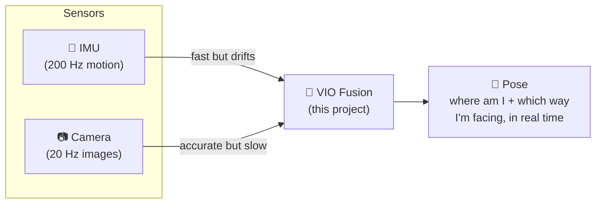

**Why "odometry"?** Like a car's odometer measures distance travelled, VIO
measures *how far and in what direction* you have moved from where you started
— continuously, without a map given in advance.

---

## 2. How the pipeline works

Each time a new camera frame arrives, the system runs a **front-end** (find and
follow visual features) and a **back-end** (fuse them with IMU motion in a
filter). Here is the whole loop:

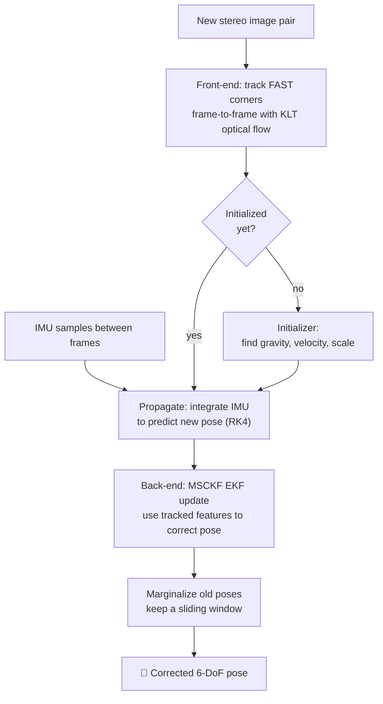

### The front-end (the "eyes")
- Detects **FAST corners** on a grid so features spread across the whole image.
- Follows them across frames with **KLT optical flow** (both left & right
  cameras — stereo gives true metric scale).
- Rejects bad matches with a **RANSAC** geometric check.

### The back-end (the "brain")
A **Multi-State Constraint Kalman Filter (MSCKF)**. Instead of storing a giant
map, it keeps a **sliding window** of the last ~11 camera poses. A feature seen
across several of those poses becomes a *constraint* that ties them together —
that constraint corrects the drift the IMU accumulated.

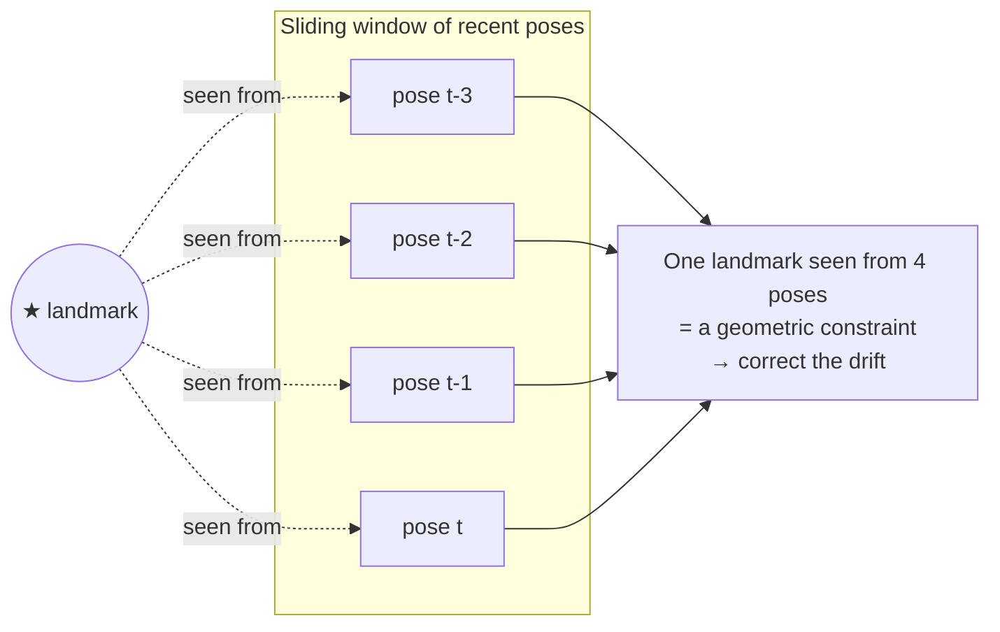

---

## 3. Initialization: the hardest 3 seconds

Before it can track, VIO must bootstrap three unknowns: **which way is down**
(gravity), **how fast am I moving** (velocity), and **the metric scale**. This
project ships **two** initializers (it tries static first, then dynamic):

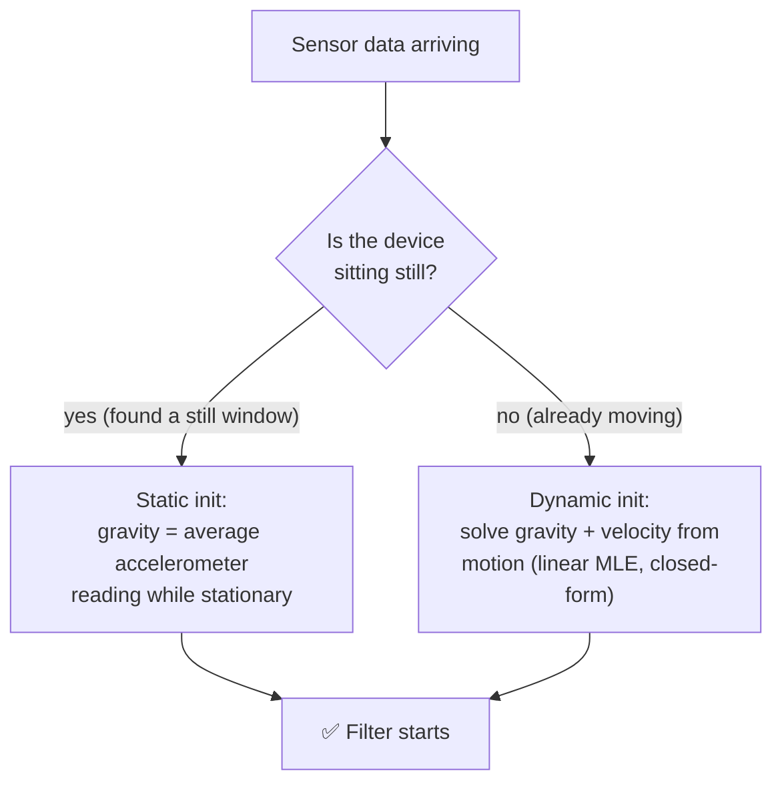

- **Static** works when there's a clean stationary moment at the start (e.g.
  the KAIST dataset). Simple and robust.
- **Dynamic** (ported from OpenVINS `ov_init`) handles sequences that are
  **already in motion** — like EuRoC's Machine Hall, where the drone is picked
  up and carried from the first frame. It recovers gravity and velocity from a
  short window of motion using IMU pre-integration and a closed-form
  `|g|`-constrained solve. This is what lets the pipeline **never fail to
  start** on real hand-launched / airborne data.

---

## 4. Why "data-oriented"? (the speed story)

Official OpenVINS is **object-oriented**: features, poses, and landmarks are
heap-allocated objects connected by pointers. Clean, but every frame chases
pointers all over memory — and memory misses are what actually cost time.

This project is **data-oriented (DOD)**: state lives in **flat, contiguous
arrays** with *no per-frame heap allocation*. The CPU streams through memory
predictably, so the cache stays hot.

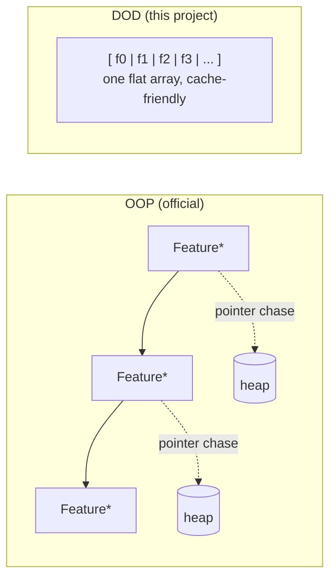

Same math, different memory layout. Measured, that buys a **1.30× faster
front-end** on every sequence tested. The back-end ends up marginally *slower*
than official's (1.08×) because this pipeline feeds more features per update —
which is where its accuracy comes from. Net per-frame cost is a tie. The layout
claim is real; the "2× overall" claim in earlier versions of this README was
not, and has been corrected.

---

## 5. Results — 10 sequences, both pipelines, same machine

Official OpenVINS was **re-run from source** (not quoted from a paper) on the
same box, on the same data, and both trajectories were scored by the same
`scripts/evaluate_trajectory.py` against the same ground truth: ATE RMSE after
Umeyama SE3 alignment.

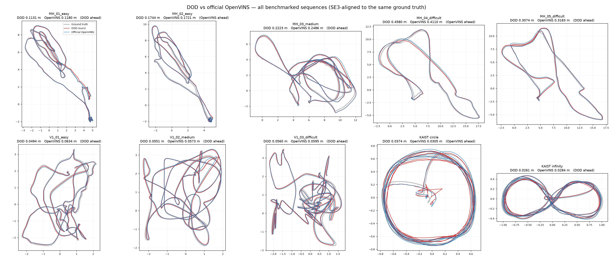

### Accuracy — DOD wins 6 of 10

| Sequence | **DOD** | Official OpenVINS | Ratio |
|---|---|---|---|
| EuRoC MH_01_easy | **0.1131 m** | 0.1180 m | 0.96 |
| EuRoC MH_02_easy | 0.1744 m | **0.1721 m** | 1.01 |
| EuRoC MH_03_medium | **0.2223 m** | 0.2486 m | 0.89 |
| EuRoC MH_04_difficult | 0.4580 m | **0.4110 m** | 1.11 |
| EuRoC MH_05_difficult | **0.3074 m** | 0.3183 m | 0.97 |
| EuRoC V1_01_easy | **0.0494 m** | 0.0634 m | 0.78 |
| EuRoC V1_02_medium | **0.0551 m** | 0.0573 m | 0.96 |
| EuRoC V1_03_difficult | **0.0560 m** | 0.0595 m | 0.94 |
| KAIST circle | 0.0374 m | **0.0305 m** | 1.23 |
| KAIST infinity | **0.0261 m** | 0.0284 m | 0.92 |
| **mean ratio** | | | **0.97** |

No divergences on any sequence. The two real losses are MH_04 (+11%) and KAIST
circle (+23%); everything else sits within ±11%.

### Speed — front-end faster, back-end slower, net tie

Mean ms per camera frame on an AMD Ryzen 9 7950X, both sides timed *internally*
(image decode and file I/O excluded on both):

| Sequence | DOD track | OV track | DOD est | OV est | **DOD total** | **OV total** |
|---|---|---|---|---|---|---|
| MH_01 | **1.657** | 2.107 | 5.142 | **5.046** | **6.800** | 7.152 |
| MH_02 | **1.677** | 2.191 | 5.125 | **5.032** | **6.802** | 7.223 |
| MH_03 | **1.710** | 2.172 | 5.803 | **5.240** | 7.513 | **7.412** |
| MH_04 | **1.813** | 2.169 | 5.027 | **4.641** | 6.840 | **6.810** |
| MH_05 | **1.804** | 2.190 | 5.287 | **4.859** | 7.091 | **7.049** |
| V1_01 | **1.741** | 2.219 | 6.982 | **6.040** | 8.723 | **8.259** |
| V1_02 | **1.914** | 2.358 | 6.225 | **5.377** | 8.139 | **7.735** |
| V1_03 | **2.058** | 2.519 | 5.268 | **4.405** | 7.326 | **6.924** |
| circle | **1.392** | 1.998 | 4.792 | **4.507** | **6.184** | 6.504 |
| infinity | **1.371** | 2.295 | 5.459 | **4.964** | **6.830** | 7.259 |
| **mean** | **1.71** | 2.22 | 5.51 | **5.11** | 7.22 | 7.23 |

- **Front-end: DOD faster on all 10**, by 20–40% (**1.30×**).
- **Back-end: DOD slower on all 10**, by 2–20% (**1.08×**) — the cost of feeding
  ~2× the features per MSCKF update, which is what buys the accuracy above.
- **Total: a tie** (7.22 vs 7.23 ms). Both run **6–8× faster than real time**
  against a 50 ms budget at 20 Hz.

### Per-sequence trajectories

Individual panels live in [`docs/results/trajectories/`](docs/results/trajectories).

| | |
|---|---|
| 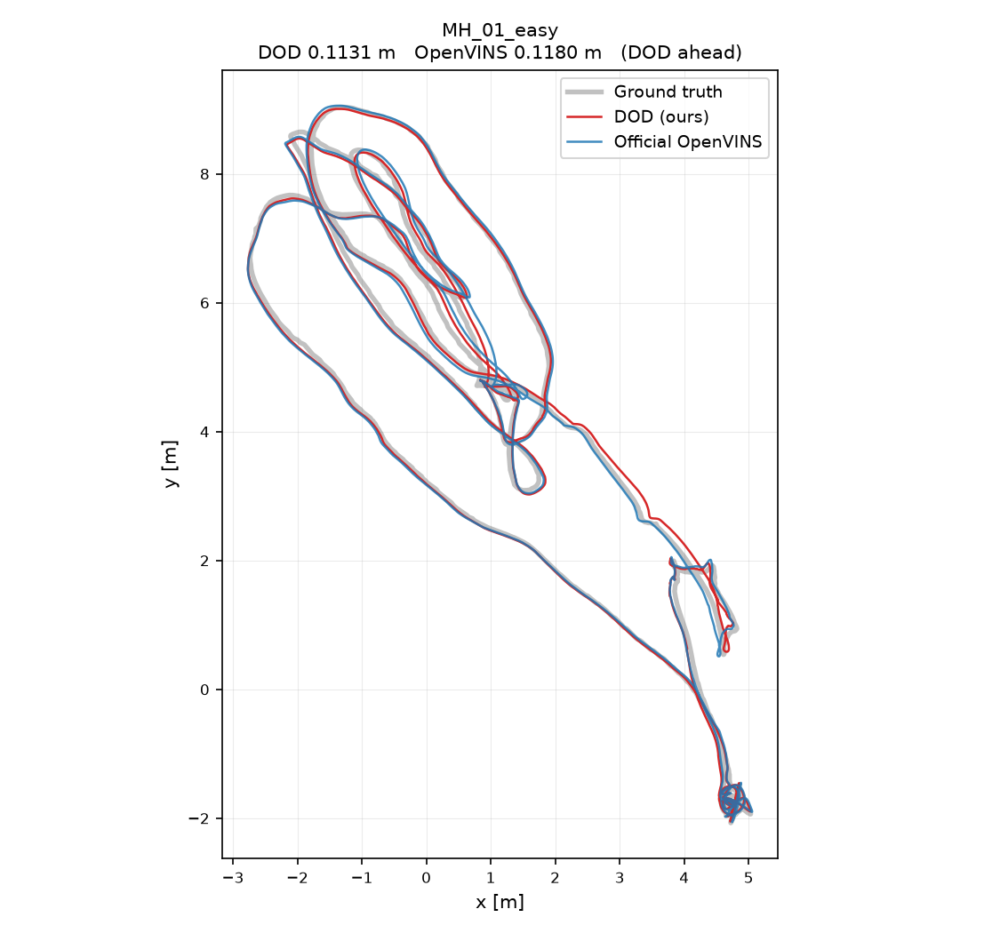 | 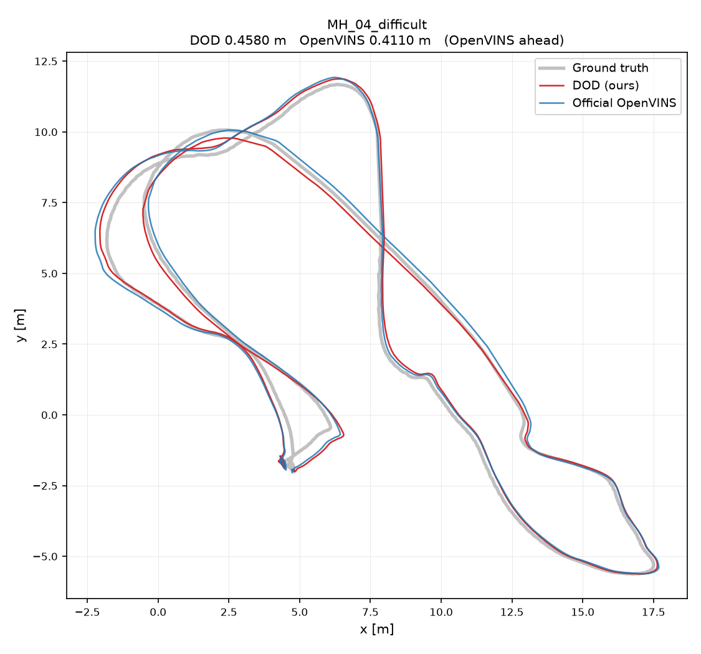 |
| 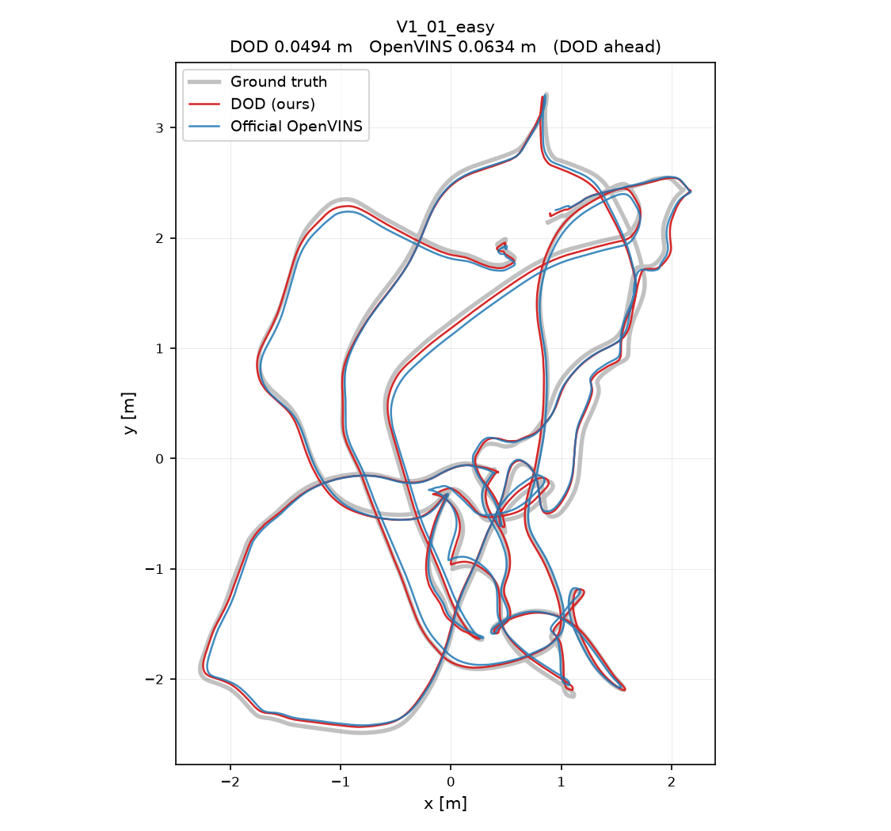 | 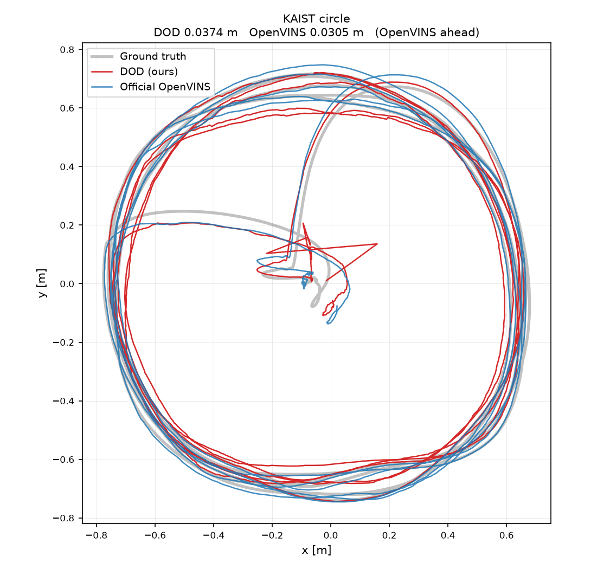 |

### Honest caveats

- DOD's EuRoC rows are produced by the ROS-free ASL runner, official's by its
  rosbag runner. Transport is worth ~15%: MH_01 is 0.1131 m via ASL and
  0.1296 m via the bag path. The two KAIST rows are bag-vs-bag.
- Official ran with `init_dyn_use: true` and `bag_start 0`; its shipped launch
  files skip the first 15–40 s of the machine-hall sequences.
- Constants (`max_msckf_in_update`, `sigma_pix`, `init_imu_thresh`) are tuned
  per dataset and **do not transfer** — the best MSCKF cap is 75 on EuRoC and
  50 on KAIST. Assume any tuned constant is wrong on new data until measured.
- The dynamic initializer is the linear stage only; official refines it with a
  Ceres MLE. On EuRoC the recovered velocity is therefore discarded
  (`init_dyn_zero_velocity`), which is a mitigation, not a fix.

Full measurement history, including every hypothesis that turned out wrong, is
in [`portdocs/Benchmark.md`](portdocs/Benchmark.md).

---

## 6. Build & run

Dependencies: a C++17 compiler, CMake, OpenCV, and ROS1 (Noetic) for the
rosbag runners. Eigen is **vendored** in `vendor/eigen` (no install needed).

```bash
# Regression tests (no ROS needed)
cmake -S . -B build-release -DCMAKE_BUILD_TYPE=Release
cmake --build build-release -j
cd build-release && ctest --output-on-failure     # 5/5 should pass

# Run on a EuRoC bag (needs ROS1 + a build with -DVIO_BUILD_ROS1=ON)
./vio_rosbag_runner_euroc  MH_01_easy.bag  /tmp/mh01  999
# writes /tmp/mh01_estimate.csv, _groundtruth.csv, _timing.csv

# ...or with NO ROS at all, straight from the dataset's own ASL folders:
cmake -S . -B build -DVIO_BUILD_OPENCV_FRONTEND=ON -DVIO_BUILD_ASL_RUNNER=ON
cmake --build build -j
./build/dod_asl_runner  /path/to/MH_01_easy/mav0  /tmp/mh01
```

Reproduce the comparison plots and tables:

```bash
python scripts/plot_all_comparisons.py runs/ docs/results/trajectories
```

Evaluate against ground truth:

```bash
python scripts/evaluate_trajectory.py /tmp/mh01_estimate.csv /tmp/mh01_groundtruth.csv
```

---

## 7. Repository layout

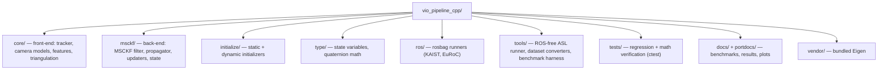

| Directory | What lives there |
|---|---|
| `core/` | FAST/KLT tracker, RADTAN & fisheye camera models, feature database, triangulation |
| `msckf/` | The MSCKF filter: propagation, MSCKF & SLAM updaters, clone/marginalization bookkeeping |
| `initialize/` | `static_initialize` (still-start) and `dynamic_initialize` (in-motion, linear MLE) |
| `type/` | Flat state representation and JPL quaternion operations |
| `ros/` | `vio_rosbag_runner*.cpp` — replay a bag and dump the estimated trajectory |
| `tools/` | `dod_asl_runner.cpp` (no-ROS runner), shared EuRoC config, bag↔ASL converters, tracker-quality dumps |
| `tests/` | Self-checking regression tests wired into `ctest` |
| `docs/`, `portdocs/` | Benchmark write-ups, result CSVs, trajectory plots |

---

## 8. Credits & license

The algorithm and the ported dynamic initializer are based on
**[OpenVINS](https://github.com/rpng/open_vins)** (Patrick Geneva, Guoquan
Huang, et al.), used under its open-source license. This is an independent
data-oriented re-implementation for research on GNSS-denied navigation.
