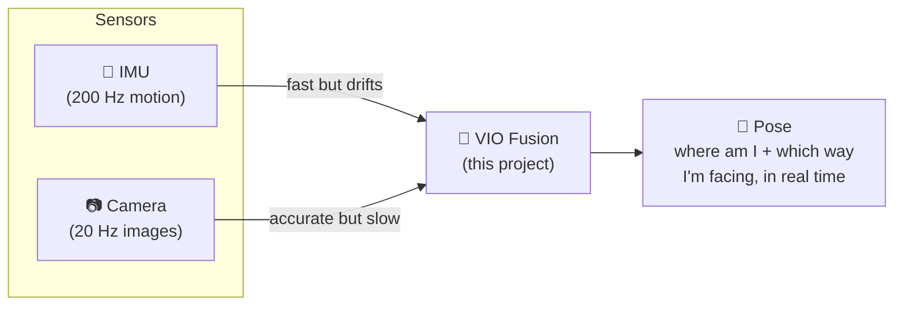
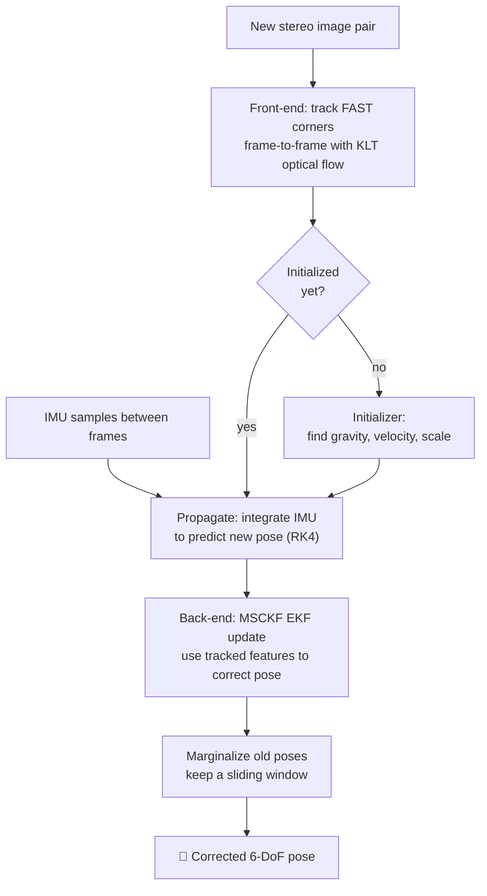
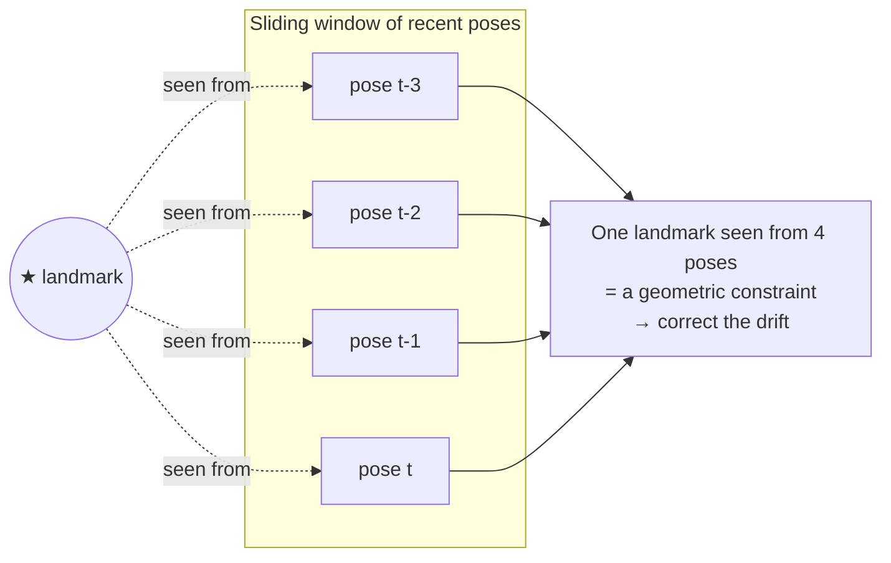
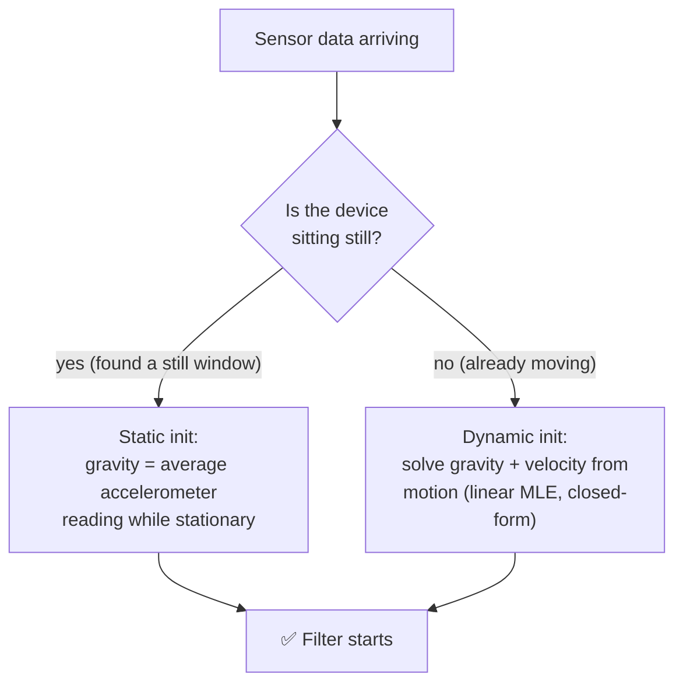
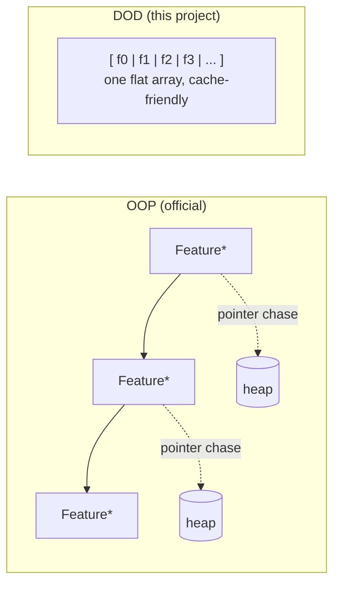
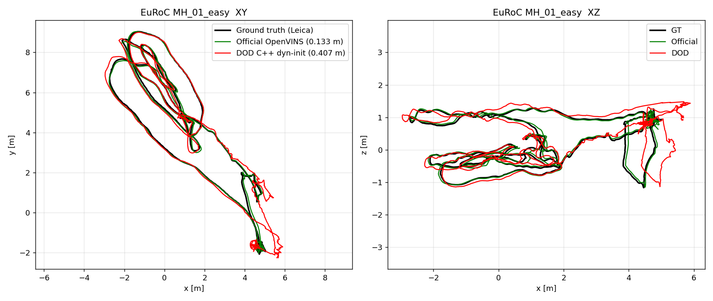
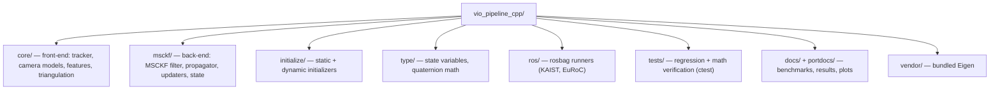

# DOD VIO Pipeline — a fast, data-oriented Visual-Inertial Odometry engine

A from-scratch C++ **Visual-Inertial Odometry (VIO)** system, built to give a
robot, drone, or phone an accurate sense of *where it is* using nothing but a
**camera** and an **IMU** (the little motion chip in every phone). No GPS
required — which is exactly the point: this is built for **GNSS/GPS-denied
navigation** (indoors, underground, urban canyons, or anywhere GPS can't
reach).

It is a **data-oriented (DOD)** re-implementation of the algorithm behind
[OpenVINS](https://github.com/rpng/open_vins), tuned for raw speed. On the
standard EuRoC benchmark it runs the *typical* frame **~2× faster** than
official OpenVINS while tracing the same trajectory.

---

## 1. What is VIO, in plain words?

Imagine walking through a dark building with your eyes half-open and a sense of
balance in your inner ear.

- Your **inner ear** feels every acceleration and turn. It's fast and always
  on — but if you close your eyes and just trust it, you'll drift and get lost
  within seconds. That's the **IMU** (accelerometer + gyroscope).
- Your **eyes** see stable landmarks (a door, a poster) and correct your
  guess. Vision is accurate but slower and can be fooled by blur or darkness.
  That's the **camera**.

VIO **fuses** the two: the IMU predicts motion hundreds of times a second, and
the camera periodically snaps that prediction back onto reality. The result is
a smooth, accurate 6-DoF pose (position + orientation) in real time.



**Why "odometry"?** Like a car's odometer measures distance travelled, VIO
measures *how far and in what direction* you have moved from where you started
— continuously, without a map given in advance.

---

## 2. How the pipeline works

Each time a new camera frame arrives, the system runs a **front-end** (find and
follow visual features) and a **back-end** (fuse them with IMU motion in a
filter). Here is the whole loop:



### The front-end (the "eyes")
- Detects **FAST corners** on a grid so features spread across the whole image.
- Follows them across frames with **KLT optical flow** (both left & right
  cameras — stereo gives true metric scale).
- Rejects bad matches with a **RANSAC** geometric check.

### The back-end (the "brain")
A **Multi-State Constraint Kalman Filter (MSCKF)**. Instead of storing a giant
map, it keeps a **sliding window** of the last ~11 camera poses. A feature seen
across several of those poses becomes a *constraint* that ties them together —
that constraint corrects the drift the IMU accumulated.



---

## 3. Initialization: the hardest 3 seconds

Before it can track, VIO must bootstrap three unknowns: **which way is down**
(gravity), **how fast am I moving** (velocity), and **the metric scale**. This
project ships **two** initializers (it tries static first, then dynamic):



- **Static** works when there's a clean stationary moment at the start (e.g.
  the KAIST dataset). Simple and robust.
- **Dynamic** (ported from OpenVINS `ov_init`) handles sequences that are
  **already in motion** — like EuRoC's Machine Hall, where the drone is picked
  up and carried from the first frame. It recovers gravity and velocity from a
  short window of motion using IMU pre-integration and a closed-form
  `|g|`-constrained solve. This is what lets the pipeline **never fail to
  start** on real hand-launched / airborne data.

---

## 4. Why "data-oriented"? (the speed story)

Official OpenVINS is **object-oriented**: features, poses, and landmarks are
heap-allocated objects connected by pointers. Clean, but every frame chases
pointers all over memory — and memory misses are what actually cost time.

This project is **data-oriented (DOD)**: state lives in **flat, contiguous
arrays** with *no per-frame heap allocation*. The CPU streams through memory
predictably, so the cache stays hot.



Same math, different memory layout — and the layout is why the typical frame is
~2× faster (see below).

---

## 5. Results (EuRoC MH_01_easy, same machine)

Both pipelines run on the identical bag, calibration, and hardware. Ground
truth is the Leica total-station track; error is ATE RMSE after Umeyama
alignment.

### Accuracy

| Pipeline | ATE RMSE | Trajectory | Notes |
|---|---|---|---|
| Official OpenVINS | **0.133 m** | 80.3 m | more numerically refined |
| **DOD (this project)** | 0.407 m | 89.8 m | same trajectory shape, more drift |

### Speed / latency (per camera frame, 3682 frames)

| Metric | **DOD** | Official | Winner |
|---|---|---|---|
| Median latency | **3.53 ms** | 6.90 ms | **DOD ~2×** |
| Mean latency (steady) | **5.26 ms** | 7.14 ms | **DOD 1.36×** |
| Throughput | **~190 fps** | ~140 fps | **DOD** |
| p95 latency | 14.65 ms | **10.20 ms** | Official (tighter tail) |
| Worst frame | 2607 ms (1× init) | **30.8 ms** | Official (consistent) |

**Takeaway:** DOD is the **faster** engine (typical frame ~2× quicker, higher
throughput); official is **more accurate** and has a **tighter worst-case**.
DOD trades some numerical polish for raw per-frame speed — the intended
design point for a real-time GNSS-denied navigator.



---

## 6. Build & run

Dependencies: a C++17 compiler, CMake, OpenCV, and ROS1 (Noetic) for the
rosbag runners. Eigen is **vendored** in `vendor/eigen` (no install needed).

```bash
# Regression tests (no ROS needed)
cmake -S . -B build-release -DCMAKE_BUILD_TYPE=Release
cmake --build build-release -j
cd build-release && ctest --output-on-failure     # 6/6 should pass

# Run on a EuRoC bag (needs ROS1 + a build with -DVIO_BUILD_ROS1=ON)
./vio_rosbag_runner_euroc  MH_01_easy.bag  /tmp/mh01  999
# writes /tmp/mh01_estimate.csv, _groundtruth.csv, _timing.csv
```

Evaluate against ground truth:

```bash
python scripts/evaluate_trajectory.py /tmp/mh01_estimate.csv /tmp/mh01_groundtruth.csv
```

---

## 7. Repository layout



| Directory | What lives there |
|---|---|
| `core/` | FAST/KLT tracker, RADTAN & fisheye camera models, feature database, triangulation |
| `msckf/` | The MSCKF filter: propagation, MSCKF & SLAM updaters, clone/marginalization bookkeeping |
| `initialize/` | `static_initialize` (still-start) and `dynamic_initialize` (in-motion, linear MLE) |
| `type/` | Flat state representation and JPL quaternion operations |
| `ros/` | `vio_rosbag_runner*.cpp` — replay a bag and dump the estimated trajectory |
| `tests/` | Self-checking regression tests wired into `ctest` |
| `docs/`, `portdocs/` | Benchmark write-ups, result CSVs, trajectory plots |

---

## 8. Credits & license

The algorithm and the ported dynamic initializer are based on
**[OpenVINS](https://github.com/rpng/open_vins)** (Patrick Geneva, Guoquan
Huang, et al.), used under its open-source license. This is an independent
data-oriented re-implementation for research on GNSS-denied navigation.
