# VIO Pipeline V2: Full Technical Documentation (Implementation-Grounded)

Version: 2.1  
Date: 2026-04-16  
Repository: vio_pipeline_v2  
Document status: complete, code-aligned with current V2 implementation

---

## 1. Document Intent

This document provides a complete, implementation-grounded technical understanding of the V2 repository. It is intentionally long and detailed so it can serve as:

- an architecture reference,
- a mathematics reference,
- a runtime behavior reference,
- a maintenance/development guide,
- and a debugging aid.

The focus is to describe what the code does today, not what a canonical paper or external implementation does in theory.

---

## 2. Scope and Non-Scope

### 2.1 In scope

- ROS node startup and callback flow.
- IMU and camera data paths.
- State definition, covariance layout, and dynamic resizing.
- Propagation internals and integration methods.
- Front-end tracking, feature database, and triangulation.
- Inertial initialization behavior.
- MSCKF and SLAM update pipelines.
- ZUPT logic and thresholds.
- Hover detection and FIFO/LIFO switching.
- Configuration loading and option plumbing.
- File-by-file deep notes.

### 2.2 Out of scope

- External ROS launch orchestration beyond what is referenced by topics/params.
- Third-party package internals (OpenCV, NumPy, SciPy).
- Performance benchmark claims not measured in this document.

---

## 3. Revision Rationale

The repository path and implementation correspond to V2. This version keeps all architecture and algorithm descriptions aligned to modules and runtime behavior that exist in the current codebase.

---

## 4. Repository Topology

Top-level implementation files and folders:

- main.py
- config/
- core/
- initialize/
- msckf/
- type/

Core implementation files used by runtime:

- config/config_loader.py
- main.py
- core/sensor_data.py
- core/track_base.py
- core/track_KLT.py
- core/feature_database.py
- core/feature.py
- core/feature_helper.py
- core/feature_initializer.py
- core/feat_initializer_options.py
- core/cam_base.py
- core/cam_radtan.py
- core/CamEqui.py
- initialize/InertialInitializer.py
- initialize/static.py
- initialize/InertialInitializerOptions.py
- initialize/InitailizerHelper.py
- initialize/dynamic.py (present but empty)
- msckf/VioManager.py
- msckf/VioManagerOptions.py
- msckf/State.py
- msckf/StateOptions.py
- msckf/Propagator.py
- msckf/UpdaterMSCKF.py
- msckf/UpdaterSLAM.py
- msckf/update_zero_velocity.py
- msckf/updater_helper.py
- msckf/state_helper.py
- msckf/NoiseManager.py
- msckf/UpdaterOptions.py
- type/quat_ops.py
- type/IMU.py
- type/PoseJPL.py
- type/JPLQuat.py
- type/Landmark.py
- type/LandmarkRepresentation.py
- type/Type.py
- type/Vec.py

---

## 5. High-Level Architecture

The V2 stack is an on-manifold EKF VIO pipeline with:

- IMU-driven propagation,
- clone-based MSCKF constraints,
- optional in-state SLAM landmarks,
- optional ZUPT updates,
- KLT visual front-end,
- static inertial initialization,
- and a custom hover-aware mode controller with FIFO/LIFO switching.

The custom hover logic is a major extension relative to a plain always-FIFO pipeline.

---

## 6. Runtime Threading Model

### 6.1 Node-level threading in main.py

RosVioManager uses:

- ROS callbacks for IMU and camera ingestion,
- a camera queue lock,
- a flag for update worker running status,
- optional background update worker thread depending on configuration.

### 6.2 Design intent

The architecture mirrors a C++ pattern where IMU callback drives progression and camera callbacks enqueue only.

This gives:

- low latency IMU-rate odometry publishing,
- serialized camera processing decision point,
- controlled queue drain based on IMU timestamp availability.

---

## 7. End-to-End Dataflow

### 7.1 Startup

Sequence:

1. ROS node init.
2. Config path resolved from param or default config/Custom_v1.
3. ConfigLoader.load_all builds VioManagerOptions.
4. VioManager(options) constructs state and modules.
5. Publishers and subscribers initialized.
6. Camera queue and locks initialized.

### 7.2 IMU callback flow

On each IMU message:

1. Convert to ImuData(timestamp, wm, am).
2. VioManager.feed_measurement_imu:
   - feed Propagator IMU buffer,
   - feed initializer if not initialized and init thread not running,
   - feed ZUPT buffer if initialized and allowed.
3. visualize_odometry uses fast_state_propagate for IMU-rate odometry.
4. If camera update worker not running, start worker (sync or thread based on use_multi_threading_subs).

### 7.3 Camera callback flow

Mono/stereo callbacks:

- rate-limit by track_frequency per camera id,
- convert to mono8,
- build CameraData with sensor_ids/images/masks,
- append to queue sorted by timestamp.

### 7.4 Camera worker drain condition

Worker computes camera-frame IMU timestamp:

- timestamp_imu_inC = imu_timestamp - dt_CAMtoIMU

Then processes queue head while:

- camera_timestamp < timestamp_imu_inC

For each popped image:

- VioManager.feed_measurement_camera,
- visualization call,
- timing logs.

---

## 8. State Definition and Error-State Layout

State object is in msckf/State.py.

### 8.1 Base IMU state

Nominal variables:

- q_GtoI (JPL quaternion [x,y,z,w])
- p_IinG
- v_IinG
- b_g
- b_a

Error-state DOF for IMU block: 15.

### 8.2 Optional calibration blocks

Conditioned by StateOptions flags:

- do_calib_imu_intrinsics:
  - dw (6)
  - da (6)
  - optional tg (9) if do_calib_imu_g_sensitivity
  - model-dependent rotational misalignment block (3)
- do_calib_camera_timeoffset:
  - dt_CAMtoIMU (1)
- do_calib_camera_pose:
  - per camera PoseJPL block (6 each)
- do_calib_camera_intrinsics:
  - per camera Vec(8) block

### 8.3 Dynamic blocks

- clone map: timestamp -> PoseJPL
- SLAM map: feature id -> Landmark

### 8.4 Covariance size

Let:

- n_imu = 15
- n_calib = sum of enabled calibration error dimensions
- N_clone = clone count
- n_slam = sum of active landmark dimensions

Total covariance dimension:

$$
n = n_{imu} + n_{calib} + 6N_{clone} + n_{slam}
$$

Covariance:

$$
P \in \mathbb{R}^{n \times n}
$$

### 8.5 IMU intrinsic matrix reconstruction

State.Dm converts 6-vector to model-specific triangular 3x3 matrix.

- KALIBR model: lower-triangular parameterization.
- RPNG model: upper-triangular parameterization.

State.Tg converts 9-vector into 3x3 gravity-sensitivity matrix by columns.

---

## 9. Coordinate Frames and Conventions

### 9.1 Frames

- G: global/inertial frame.
- I: IMU frame.
- C: camera frame.
- A: anchor camera frame for relative landmarks.

### 9.2 Quaternion convention

JPL format [x, y, z, w] is used throughout.

### 9.3 Common transforms

- R_GtoI: rotates vectors from G to I.
- p_IinG: IMU position in G.
- R_ItoC and p_CinI from calibration pose object.

### 9.4 ROS visualization conversion

visualize() converts q_GtoI to ROS body pose using sign flip of vector part in output quaternion convention in this wrapper path.

---

## 10. Noise and Process Model

NoiseManager defines:

- sigma_w, sigma_a (white noises)
- sigma_wb, sigma_ab (bias random walks)

Propagator squares these values and uses them in Qc construction.

Continuous corrected measurements:

$$
\hat a = R_{ACC\to IMU} D_a (a_m - b_a)
$$

$$
\hat \omega = R_{GYRO\to IMU} D_w (\omega_m - b_g - T_g \hat a)
$$

Core dynamics used in integration:

$$
\dot q = \frac{1}{2}\Omega(\hat \omega) q
$$

$$
\dot p = v
$$

$$
\dot v = R(q)^T \hat a - g
$$

with random walks for biases.

---

## 11. Propagation Internals

Primary implementation: msckf/Propagator.py.

### 11.1 IMU buffer management

- feed_imu appends sample.
- clean_old_imu_measurements drops entries older than threshold.
- timestamp ranges include camera-IMU time offset compensation.

### 11.2 Range selection

select_imu_readings:

- interpolates boundary samples at time0/time1,
- includes all interior samples,
- ensures nonzero dt sequence,
- can extrapolate/stretch last interval in sparse edge case.

### 11.3 Integration methods

Configured by StateOptions.integration_method:

- DISCRETE
- RK4
- ANALYTICAL

#### 11.3.1 Discrete mean step

$$
q_{k+1} = \text{quatnorm}(\mathbf{BigO}(\omega,\Delta t) q_k)
$$

$$
v_{k+1} = v_k + R_k^T \hat a\Delta t - g\Delta t
$$

$$
p_{k+1} = p_k + v_k\Delta t + \frac{1}{2}R_k^T\hat a\Delta t^2 - \frac{1}{2}g\Delta t^2
$$

#### 11.3.2 RK4 mean step

RK4 integration computes k1..k4 for quaternion differential and translational states using interpolated IMU terms between interval endpoints.

#### 11.3.3 Analytical mean step

Uses precomputed Xi_1..Xi_4 and Jacobian terms from closed-form expressions in compute_Xi_sum and predict_mean_analytic.

### 11.4 Error transition and noise mapping

For each sub-interval:

- compute F and G,
- build Qc with noise variances scaled by 1/dt,
- discrete noise:

$$
Q_d = GQ_cG^T
$$

- covariance propagation:

$$
P_{k+1} = F P_k F^T + Q_d
$$

### 11.5 Summed propagation

propagate_and_clone and propagate_only aggregate interval transitions:

$$
\Phi_{sum} = F_n \cdots F_2 F_1
$$

$$
Q_{sum} = F_n(\cdots(F_2Q_1F_2^T+Q_2)\cdots)F_n^T + Q_n
$$

Then StateHelper.EKFPropagation is called once with summed terms.

### 11.6 Clone behavior

- FIFO: propagate_and_clone adds stochastic clone with augment_clone.
- LIFO: propagate_only updates IMU state and covariance only.

### 11.7 Fast propagate path

fast_state_propagate:

- propagates cached IMU estimate to query timestamp,
- outputs state_plus [quat, pos, vel_local, omega],
- outputs reduced covariance (orientation/position/velocity + angular noise approximation),
- does not mutate filter state.

---

## 12. EKF Core Algebra

Implemented in msckf/state_helper.py.

### 12.1 EKFPropagation

StateHelper.EKFPropagation performs block-structured covariance update for selected NEW and OLD variable orders:

$$
P_{new} = \Phi P_{old} \Phi^T + Q
$$

while updating cross-covariances and preserving symmetry.

### 12.2 EKFUpdate

StateHelper.EKFUpdate:

1. Computes M_a = P H^T block-wise.
2. Builds innovation covariance:

$$
S = H P_{marg} H^T + R
$$

3. Adds jitter to diagonal (numerical robustness).
4. Kalman gain via solve/cholesky fallback:

$$
K = PH^TS^{-1}
$$

5. Covariance update:

$$
P \leftarrow P - KHP
$$

6. State increment:

$$
\delta x = Kr
$$

7. Applies per-variable manifold/vector update.

### 12.3 Clone and marginalization utilities

- clone variable and resize covariance.
- augment_clone with time-offset correlation injection.
- marginalize variable from state and covariance.
- marginalize_old_clone when clone count exceeds max.
- marginalize_slam for landmarks marked should_marg.

### 12.4 Initialization helpers

- initialize (gated augmentation path)
- initialize_invertible
- set_initial_covariance
- get_marginal_covariance

---

## 13. Front-End Tracking Pipeline

Main classes:

- core/track_base.py
- core/track_KLT.py

### 13.1 Tracker selection

VioManager uses TrackKLT in the active runtime path.

### 13.2 Preprocessing

Histogram mode from config:

- none
- histogram equalization
- CLAHE

Image pyramids are built with cv2.buildOpticalFlowPyramid.

### 13.3 KLT settings

In TrackKLT:

- window size = 15x15
- pyramid levels = 5
- cv2.calcOpticalFlowPyrLK for temporal tracking

### 13.4 Outlier rejection

perform_matching:

- KLT step gives tentative correspondences,
- geometric filtering via RANSAC fundamental matrix on undistorted points,
- invalid/mask/ROI points removed.

### 13.5 Mono path

feed_monocular:

- detect if empty tracks,
- top-off detections,
- temporal track,
- RANSAC filter,
- update FeatureDatabase.

### 13.6 Stereo path

feed_stereo:

- manages left/right temporal tracks,
- consistency checks by shared ids,
- mono fallback for one-sided tracks,
- updates FeatureDatabase per camera.

### 13.7 Tracker state used for visualization

TrackBase stores:

- img_last
- pts_last
- ids_last
- masks

Used by display_active and display_history overlays.

---

## 14. Feature Database Semantics

Implementation: core/feature_database.py.

For each feature id, database stores per-camera arrays:

- timestamps
- uvs (distorted)
- uvs_norm (undistorted/normalized)

Key query methods:

- features_not_containing_newer
- features_containing_older
- features_containing
- get_feature
- get_feature_clone
- cleanup, cleanup_measurements, cleanup_measurements_exact
- append_new_measurements

These methods are heavily used by VioManager update scheduling.

---

## 15. Feature Geometry and Triangulation

Implementation: core/feature_initializer.py and core/feature_helper.py.

### 15.1 Anchor selection

Anchor camera is chosen as camera with most observations, and anchor timestamp is the most recent measurement in that camera timeline.

### 15.2 Linear triangulation

Builds normal equations from bearing orthogonality constraints:

$$
A = \sum_i B_i^\perp{}^T B_i^\perp
$$

$$
b = \sum_i B_i^\perp{}^T B_i^\perp p_{C_i}^{A}
$$

$$
p_F^A = A^{-1}b
$$

Checks include:

- condition number,
- depth range,
- NaN safety.

### 15.3 1D triangulation

Depth-only solve along anchor bearing:

$$
\lambda = \frac{\sum_i (B_i^\perp \hat b_A)^T(B_i^\perp p_{C_i}^A)}{\sum_i \|B_i^\perp \hat b_A\|^2}
$$

Then:

$$
p_F^A = \lambda \hat b_A
$$

### 15.4 Gauss-Newton / LM refinement

Refines inverse-depth parameters (alpha, beta, rho) using LM damping:

- Hessian and gradient accumulation over all observations,
- adaptive lambda increase/decrease,
- convergence on dx and cost reduction,
- baseline and depth validity checks.

### 15.5 Disparity helper

FeatureHelper provides:

- compute_disparity_two_frames
- compute_disparity

used by initialization and ZUPT stationarity logic.

---

## 16. Inertial Initialization

Main orchestrator: initialize/InertialInitializer.py.

### 16.1 Data windows and gating

Initializer:

- prunes feature history to init window,
- prunes IMU data to init interval with cam-imu offset compensation,
- computes disparity-based movement signals,
- decides static-init attempt conditions.

### 16.2 Static initialization

In initialize/static.py:

1. Split IMU data into two half-windows over init_window_time.
2. Compute accel variances and means.
3. Apply threshold logic for still/jerk gate.
4. Build gravity-aligned orientation via Gram-Schmidt.
5. Set biases:

$$
b_g = \bar\omega
$$

$$
b_a = \bar a - R_{G\to I} g
$$

6. Set IMU nominal state.
7. Build initial covariance blocks.
8. Return timestamp/order for StateHelper.set_initial_covariance.

### 16.3 Dynamic initializer status

initialize/dynamic.py is empty in this repository. Dynamic path is functionally unavailable.

---

## 17. Updater Helper Jacobians

Implementation: msckf/updater_helper.py.

Provides two major Jacobian constructors:

- get_feature_jacobian_representation
- get_feature_jacobian_full

### 17.1 Representation Jacobian

Computes:

- dp_F/dlambda for selected representation,
- dp_F/dx for anchor clone and calibration dependencies.

Covers all representations in LandmarkRepresentation.

### 17.2 Full measurement Jacobian

For each measurement:

- project global feature to clone IMU then camera frame,
- normalize and distort,
- residual r = uv_meas - uv_pred,
- chain-rule composition for feature and state Jacobians,
- includes optional camera extrinsic/intrinsic calibration terms,
- supports FEJ usage paths.

### 17.3 Nullspace projection

Given linearized per-feature system:

$$
r \approx H_x\delta x + H_f\delta f + n
$$

Left-nullspace projection removes feature increment:

$$
\tilde H = Q_2^T H_x
$$

$$
\tilde r = Q_2^T r
$$

where columns of Q_2 span nullspace of H_f^T.

### 17.4 Measurement compression

QR-style compression reduces overdetermined stacked systems.

---

## 18. MSCKF Update Pipeline

Implementation: msckf/UpdaterMSCKF.py.

### 18.1 Core flow

1. Clean feature measurements to active clone timestamps.
2. Remove under-observed tracks.
3. Build camera clone poses from IMU clones + calibration.
4. Triangulate and optionally refine features.
5. Compute full Jacobians/residuals.
6. Nullspace project feature states.
7. Innovation quality checks:
   - finite checks,
   - condition number guard,
   - chi-square gate.
8. Stack accepted constraints.
9. Measurement compression.
10. Minimum-row guard.
11. EKF update.

### 18.2 Innovation gate

For each feature block:

$$
S = HPH^T + \sigma_{pix}^2I
$$

Mahalanobis score:

$$
\chi^2 = r^T S^{-1}r
$$

Compared to:

$$
\chi^2 \leq \text{chi2_multiplier} \cdot \chi^2_{0.95,\,dof}
$$

### 18.3 Robustness options

UpdaterOptions adds:

- min_features_for_update
- min_update_rows
- max_innovation_condition
- ekf_innovation_jitter

---

## 19. SLAM Update and Delayed Initialization

Implementation: msckf/UpdaterSLAM.py.

### 19.1 Delayed initialization flow

1. Clean measurements.
2. Triangulate/refine candidate features.
3. Build Jacobians.
4. Build Landmark object by representation.
5. Initialize into state via StateHelper.initialize.

### 19.2 Existing landmark update flow

1. Clean/validate feature measurements.
2. Build full Jacobians including landmark block.
3. Gate by chi-square.
4. Stack and EKF update.

### 19.3 Anchor change flow

When marginalizing oldest clone, anchored landmarks tied to that clone are transformed to a new anchor and covariance is propagated through Jacobian-based mapping.

---

## 20. ZUPT Update

Implementation: msckf/update_zero_velocity.py.

### 20.1 Buffering and interval

- Own IMU buffer and lock.
- Select interval consistent with camera-imu offset handling.

### 20.2 Residual model

For each IMU interval, builds gyro and accel residuals (or optional integrated accel formulation).

Gyro residual:

$$
r_\omega = -\frac{\sqrt{\Delta t}}{\sigma_\omega}\hat\omega
$$

Accel residual (default branch):

$$
r_a = -\frac{\sqrt{\Delta t}}{\sigma_a}(\hat a - R_{G\to I}g)
$$

### 20.3 Compression and gate

- Compresses H and r.
- Innovation and chi-square check.
- Optional disparity override using FeatureHelper.compute_disparity_two_frames.
- Velocity threshold check.

### 20.4 Update application

On acceptance:

- optional bias RW covariance propagation,
- EKF update,
- timestamp update,
- optional cleanup of feature measurements for repeated stationary periods.

---

## 21. VioManager Orchestration Deep Dive

Implementation: msckf/VioManager.py.

### 21.1 Construction

VioManager:

- prints loaded options,
- sets OpenCV threads/seed,
- constructs State,
- loads IMU and camera calibration values into state,
- sets trackers and module objects,
- initializes runtime flags and visualization storage,
- initializes hover mode state.

### 21.2 Measurement entry points

- feed_measurement_imu
- feed_measurement_camera
- feed_measurement_simulation

### 21.3 Camera update pipeline

track_image_and_update:

1. copy/downsample message if enabled,
2. tracker feed,
3. optional ZUPT try_update,
4. initialization path if not initialized,
5. do_feature_propagate_update when initialized.

---

## 22. Hover Detection and Mode Switching

This is one of the defining V2 extensions.

### 22.1 Modes

- FIFO (default): standard clone-propagate-and-update pipeline.
- LIFO: hover mode with frozen clone window and deferred covariance strategy.

### 22.2 Detection inputs

- feature correspondences across previous/current frame,
- relative IMU rotation prior between frame times,
- baseline estimate from clone/current pose,
- velocity norm,
- temporal smoothing queue.

### 22.3 Bearing residual criterion

For normalized bearing pair (b_prev, b_curr):

$$
r = \|b_{curr} - C_{q\_hat} b_{prev}\|^2
$$

When baseline is larger than threshold, epipolar inlier filtering is applied before residual averaging.

Decision statistic d_k is mean residual of inliers (or median fallback under sparse inlier case).

Binary decision:

$$
\xi_k = 1 \text{ if } d_k < \tau_{hover},\quad 0 \text{ otherwise}
$$

### 22.4 Temporal smoothing

Deque of recent decisions is enforced for stable mode transition. If not fully consistent yet, last stable decision is retained.

### 22.5 FIFO -> LIFO guards

Entry blocked when motion indicators exceed configured safety thresholds:

- baseline > hover_entry_max_baseline
- velocity > hover_entry_max_velocity

### 22.6 LIFO -> FIFO exits

Exit conditions include:

- hover decision drops to 0,
- velocity exceeds hover_exit_velocity_threshold,
- hover duration exceeds hover_max_duration_sec.

### 22.7 LIFO chain tracking

LIFO mode builds backward observation chains:

- ORB descriptor at tracked points for optional fallback matching,
- geometric and reprojection costs,
- Hungarian assignment,
- optional mutual consistency,
- quality score evolution,
- pruning by misses/quality.

### 22.8 LIFO update semantics

- Per-step state-only MSCKF update restores covariance snapshot (mean update retained, covariance deferred).
- Hover measurements are accumulated.
- On switch back to FIFO, perform_covariance_update applies accumulated measurements while restoring state snapshot semantics as implemented.

---

## 23. FIFO Update Internals

In fifo_update:

1. Require minimum clone count before update.
2. Determine lost, marginal, and max-track features.
3. Build SLAM update and delayed-init sets.
4. marginalize_slam for flagged landmarks.
5. Run UpdaterMSCKF on selected tracks.
6. Run UpdaterSLAM update in chunks.
7. Run UpdaterSLAM delayed_init.
8. Retriangulate active tracks for visualization.
9. Feature database cleanup.
10. UpdaterSLAM.change_anchors.
11. cleanup_measurements for old marg time.
12. marginalize_old_clone.

---

## 24. Visualization and Output Channels

### 24.1 IMU-rate odometry

visualize_odometry publishes:

- pose from fast_state_propagate,
- local-frame velocity and angular velocity,
- reduced pose covariance mapping into ROS format.

### 24.2 Post-update visualization

visualize publishes:

- TF global -> body,
- post-update odom,
- path history,
- feature history image.

---

## 25. Configuration System

Loader: config/config_loader.py.

### 25.1 Files expected per config folder

- estimator_config.yaml
- kalibr_imu_chain.yaml
- kalibr_imucam_chain.yaml

### 25.2 Estimator config loading

Maps keys into:

- StateOptions flags,
- VioManagerOptions tracker/init/hover/zupt settings,
- UpdaterOptions values.

### 25.3 IMU calibration loading

From kalibr_imu_chain.yaml:

- noise densities and random walks,
- model selection (kalibr/rpng),
- Tw/Ta/Tg and alignment rotations,
- conversion to vec_dw/vec_da/vec_tg,
- quaternion conversion for rotations.

### 25.4 Camera calibration loading

From kalibr_imucam_chain.yaml per camera:

- intrinsics + distortion coeffs + resolution,
- camera model selection (radtan/equidistant),
- T_cam_imu parsed into PoseJPL,
- timeshift_cam_imu loaded (camera 0 key usage in loader).

### 25.5 Final synchronization

sync_state_options copies loaded calibration into state_options containers.

---

## 26. Feature Representations in Detail

Representation enum file: type/LandmarkRepresentation.py.

### 26.1 Supported representations

- GLOBAL_3D
- GLOBAL_FULL_INVERSE_DEPTH
- ANCHORED_3D
- ANCHORED_FULL_INVERSE_DEPTH
- ANCHORED_MSCKF_INVERSE_DEPTH
- ANCHORED_INVERSE_DEPTH_SINGLE

### 26.2 Landmark conversion behavior

type/Landmark.py implements:

- set_from_xyz for each representation,
- get_xyz conversion back to Euclidean coordinate,
- special handling for single inverse depth with cached bearing vectors.

---

## 27. Mathematical Types and Update Rules

### 27.1 JPLQuat update

type/JPLQuat.py uses left multiplicative update with small-angle perturbation:

$$
\delta q = [0.5\delta\theta, 1]
$$

$$
q^+ = \text{quatnorm}(\delta q \otimes q)
$$

### 27.2 PoseJPL update

type/PoseJPL.py:

- orientation updated by JPL small-angle quaternion multiplication,
- position updated by additive translation increment.

### 27.3 IMU update

type/IMU.py:

- orientation, position, velocity, and biases updated from 15D increment.

### 27.4 Core quaternion ops

type/quat_ops.py provides:

- rot_2_quat,
- quat_2_Rot,
- quat_multiply,
- skew_x,
- exp_so3, log_so3, Jr_so3, and related Lie utilities.

---

## 28. Current Implementation Boundaries

### 28.1 Dynamic initializer

Present as file only; no implementation.

### 28.2 Naming/history mismatch

The doc filename still contains V3 wording for historical continuity, but content is V2 and code-aligned.

---

## 29. File-by-File Detailed Notes

This section gives per-file technical intent and key internals.

### 29.1 main.py

- Defines RosVioManager ROS wrapper.
- Loads config path and constructs VioManager.
- Owns camera deque and update thread state.
- IMU callback drives queue drain and IMU-rate odometry.
- Camera callbacks are queue-only and rate-limited.
- visualize_odometry and visualize publish state outputs.

### 29.2 config/config_loader.py

- Robust YAML reading with OpenCV header stripping.
- Estimator key parsing and option propagation.
- IMU model and matrix vectorization logic.
- Camera intrinsics/extrinsics object construction.
- Final sync_state_options call.

### 29.3 core/sensor_data.py

- ImuData dataclass with ordering by timestamp.
- CameraData container with ordering by timestamp and sensor id tie-break.

### 29.4 core/track_base.py

- Shared tracker infrastructure.
- FeatureDatabase ownership.
- Last frame caches and visualization rendering helpers.

### 29.5 core/track_KLT.py

- KLT front-end implementation.
- Mono and stereo feed handlers.
- Detection top-off and optical flow matching.
- RANSAC filtering and DB update.

### 29.6 core/feature_database.py

- Thread-safe feature map.
- Query and cleanup operations used by estimator scheduling.
- Merge utility for additional measurements.

### 29.7 core/feature.py

- Per-feature measurement storage.
- Measurement pruning and cleanup operations.

### 29.8 core/feature_helper.py

- Disparity computation helpers used for init and ZUPT.

### 29.9 core/feature_initializer.py

- Linear triangulation, 1D triangulation.
- LM/GN refinement and validity checks.

### 29.10 core/feat_initializer_options.py

- Triangulation/refinement tunables.

### 29.11 core/cam_base.py, core/cam_radtan.py, core/CamEqui.py

- Camera projection/distortion interface and model-specific behavior.

### 29.12 initialize/InertialInitializer.py

- Initialization orchestration and gating.
- Static initializer path invocation.
- Dynamic path guarded but unavailable.

### 29.13 initialize/static.py

- IMU window variance checks.
- gravity alignment and bias extraction.
- initial covariance output.

### 29.14 initialize/InertialInitializerOptions.py

- Initialization config values and validation checks.

### 29.15 initialize/InitailizerHelper.py

- Utility math used by static initialization.

### 29.16 initialize/dynamic.py

- Empty file in current repo state.

### 29.17 msckf/VioManagerOptions.py

- Unified option object for estimator modules.
- Hover/FIFO-LIFO parameters included here.

### 29.18 msckf/StateOptions.py

- Core state feature flags and representations.
- Integration and IMU model enums.

### 29.19 msckf/UpdaterOptions.py

- Generic update tuning (chi2, sigma pixel, robustness guards).

### 29.20 msckf/NoiseManager.py

- IMU noise values and squared terms.

### 29.21 msckf/State.py

- State variable construction and IDs.
- Optional calibration block insertion.
- Covariance initialization and dynamic containers.

### 29.22 msckf/Propagator.py

- IMU buffering, interpolation, propagation, cloning.
- Fast propagate function for visualization.
- F/G/Q computation across integrators.

### 29.23 msckf/updater_helper.py

- Jacobian construction and nullspace/compression routines.

### 29.24 msckf/UpdaterMSCKF.py

- MSCKF batch update pipeline and gating.

### 29.25 msckf/UpdaterSLAM.py

- SLAM delayed init, update, and anchor-change logic.

### 29.26 msckf/update_zero_velocity.py

- ZUPT residuals, gating, and update application.

### 29.27 msckf/state_helper.py

- EKF propagation/update and variable management primitives.

### 29.28 type/Type.py and type/Vec.py

- Base typed-state abstraction and vector variable behavior.

### 29.29 type/JPLQuat.py

- Quaternion type with rotation cache and FEJ storage.

### 29.30 type/PoseJPL.py

- Pose composition from quaternion + position variable.

### 29.31 type/IMU.py

- IMU aggregate variable and accessors.

### 29.32 type/Landmark.py

- Representation-specific storage and conversions.

### 29.33 type/LandmarkRepresentation.py

- Enum and utility conversion helpers.

### 29.34 type/quat_ops.py

- Lie/group and quaternion utility functions.

---

## 30. Runtime Phase Behavior Summary

### 30.1 Phase A: boot and calibration load

- parse YAML,
- instantiate modules,
- load calibration into state.

### 30.2 Phase B: pre-initialization accumulation

- track features,
- collect IMU,
- run init gating.

### 30.3 Phase C: initialization

- static initializer solves gravity orientation and biases,
- initial covariance inserted,
- clone/state catches up.

### 30.4 Phase D: nominal operation

- IMU propagation + camera updates,
- MSCKF and optional SLAM,
- optional ZUPT.

### 30.5 Phase E: hover handling

- detector evaluates low-motion condition,
- switch to LIFO when needed,
- deferred covariance strategy,
- switch back to FIFO with covariance reconciliation.

---

## 31. Detailed Config Key Mapping Appendix

This appendix maps keys in config/Custom_v1/estimator_config.yaml to VioManagerOptions and module effects.

### 31.1 Core filter and model keys

- use_fej -> state_options.do_fej
- integration -> state_options.integration_method
- use_stereo -> use_stereo
- max_cameras -> state_options.num_cameras
- calib_cam_extrinsics -> state_options.do_calib_camera_pose
- calib_cam_intrinsics -> state_options.do_calib_camera_intrinsics
- calib_cam_timeoffset -> state_options.do_calib_camera_timeoffset
- calib_imu_intrinsics -> state_options.do_calib_imu_intrinsics
- calib_imu_g_sensitivity -> state_options.do_calib_imu_g_sensitivity

### 31.2 State size and update limits

- max_clones -> state_options.max_clone_size
- max_slam -> state_options.max_slam_features
- max_slam_in_update -> max_slam_in_update (manager-level batching)
- max_msckf_in_update -> max_msckf_in_update
- dt_slam_delay -> dt_slam_delay

### 31.3 Hover and LIFO keys

- hovering_threshold
- hover_smoothing_required
- hover_baseline_threshold
- hover_epipolar_inlier_threshold
- hover_bearing_inlier_threshold
- hover_min_inliers
- hover_entry_max_baseline
- hover_entry_max_velocity
- hover_exit_velocity_threshold
- hover_max_duration_sec

and additional LIFO chain keys from VioManagerOptions defaults:

- lifo_backward_match_threshold
- lifo_backward_min_chain_length
- lifo_backward_reproj_threshold
- lifo_backward_mutual_consistency
- lifo_backward_max_age_steps
- lifo_orb_descriptor_fallback
- lifo_orb_hamming_threshold
- lifo_quality_init
- lifo_quality_inc_match
- lifo_quality_inc_orb
- lifo_quality_dec_miss
- lifo_quality_min_keep
- lifo_quality_min_output
- lifo_max_misses

### 31.4 Gravity and representations

- gravity_mag -> gravity_mag and init_options.gravity_mag
- feat_rep_msckf -> state_options.feat_rep_msckf
- feat_rep_slam -> state_options.feat_rep_slam
- feat_rep_aruco -> state_options.feat_rep_aruco

### 31.5 ZUPT keys

- try_zupt
- zupt_chi2_multipler (and alias zupt_chi2_multiplier)
- zupt_max_velocity
- zupt_noise_multiplier
- zupt_max_disparity
- zupt_only_at_beginning

### 31.6 Initialization keys

- init_window_time
- init_imu_thresh
- init_max_disparity
- init_max_features
- init_dyn_use
- init_dyn_mle_opt_calib
- init_dyn_mle_max_iter
- init_dyn_mle_max_threads
- init_dyn_mle_max_time
- init_dyn_num_pose
- init_dyn_min_deg
- init_dyn_inflation_ori
- init_dyn_inflation_vel
- init_dyn_inflation_bg
- init_dyn_inflation_ba
- init_dyn_min_rec_cond
- init_dyn_bias_g
- init_dyn_bias_a

### 31.7 Tracker keys

- use_klt
- num_pts
- fast_threshold
- grid_x
- grid_y
- min_px_dist
- knn_ratio
- track_frequency
- downsample_cameras
- num_opencv_threads
- histogram_method
- use_aruco
- num_aruco
- downsize_aruco

### 31.8 Updater keys

- up_msckf_sigma_px
- up_msckf_chi2_multipler
- msckf_min_features_for_update
- msckf_min_update_rows
- msckf_max_innovation_condition
- msckf_ekf_innovation_jitter
- up_slam_sigma_px
- up_slam_chi2_multipler
- up_aruco_sigma_px
- up_aruco_chi2_multipler

### 31.9 Misc keys

- record_timing_information
- record_timing_filepath
- use_mask
- relative_config_imu
- relative_config_imucam

---

## 32. IMU YAML Mapping Appendix

From kalibr_imu_chain.yaml:

### 32.1 Noise fields

- accelerometer_noise_density -> imu_noises.sigma_a
- gyroscope_noise_density -> imu_noises.sigma_w
- accelerometer_random_walk -> imu_noises.sigma_ab
- gyroscope_random_walk -> imu_noises.sigma_wb

### 32.2 Intrinsic fields

- Tw
- Ta
- R_IMUtoGYRO
- R_IMUtoACC
- Tg

Loader computes:

- Dw = inv(Tw)
- Da = inv(Ta)
- R_ACCtoIMU = R_IMUtoACC^T
- R_GYROtoIMU = R_IMUtoGYRO^T
- vec_dw and vec_da by model convention
- vec_tg from column flatten
- q_ACCtoIMU, q_GYROtoIMU via rot_2_quat

---

## 33. Camera YAML Mapping Appendix

From kalibr_imucam_chain.yaml per camera:

- intrinsics
- distortion_coeffs
- resolution
- distortion_model
- T_cam_imu
- timeshift_cam_imu (camera 0 path in loader)

Constructs:

- camera object CamRadtan or CamEqui,
- PoseJPL for extrinsics,
- calibration time shift into options and initializer options.

---

## 34. Algorithmic Pseudocode Appendix

### 34.1 IMU callback pseudo-flow

1. parse imu msg
2. feed_measurement_imu
3. publish fast odom
4. if worker running: return
5. start update worker
6. worker drains camera queue with timestamp alignment

### 34.2 Camera update pseudo-flow

1. track_image_and_update(message)
2. if initialized and ZUPT eligible: try_update
3. if not initialized: try_to_initialize
4. do_feature_propagate_update
5. detect hover and switch mode
6. run fifo_update or lifo_update

### 34.3 FIFO update pseudo-flow

1. collect feature sets
2. MSCKF update
3. SLAM update + delayed init
4. retriangulate active tracks
5. cleanup + anchor change + clone marginalization

### 34.4 LIFO update pseudo-flow

1. update backward chains
2. collect hover measurements
3. state-only MSCKF update with covariance restore
4. deferred covariance update on exit to FIFO

---

## 35. Numerical Stability and Safety Guards

Present guards include:

- finite checks on Jacobians/residuals,
- innovation condition-number gate,
- innovation jitter,
- chi-square gates,
- fallback linear solves in EKF update,
- covariance symmetry enforcement,
- variance floor when needed,
- update minimum feature and row thresholds.

---

## 36. Operational Checklist

### 36.1 For reliable startup

- Ensure all three config files exist in selected config folder.
- Verify ROS topics map to real sensors.
- Ensure camera rate-limit aligns with track_frequency.

### 36.2 For initialization success

- Provide stationary/jerk conditions compatible with init thresholds.
- Ensure enough features and adequate disparity signals.

### 36.3 For stable tracking

- Tune num_pts, grid_x/grid_y, min_px_dist, histogram mode.
- Avoid overly aggressive downsampling unless required.

### 36.4 For hover-heavy operation

- Tune hover thresholds and smoothing carefully.
- Inspect LIFO quality thresholds if chain churn appears.

### 36.5 For ZUPT-heavy operation

- Balance chi2 multiplier, velocity threshold, disparity threshold.

---

## 37. Runtime Clarity Notes

To avoid ambiguity:

- dynamic.py is present but empty in the current repository state.

---

## 38. Final Architecture Summary

V2 is a complete, configurable VIO pipeline with:

- robust IMU propagation (three integration modes),
- clone-based MSCKF updates,
- optional SLAM landmarks,
- optional ZUPT,
- KLT visual front-end,
- static inertial initialization,
- and custom hover-aware FIFO/LIFO mode control with backward-chain handling and deferred covariance logic.

This combination makes the pipeline especially tailored for challenging low-motion hover segments while retaining standard EKF-MSCKF foundations.

---

## 39. Document Completeness Statement

This document is intentionally long-form and detailed. It is aligned to the current implementation files in this repository and is designed to replace shorter summaries with a deeper engineering reference suitable for maintenance and further development.

---

## 41. Algorithm Walkthrough by Timeline

This chapter narrates estimator behavior as a time-evolving process and connects runtime phases to implementation paths.

### 41.1 Stage S0: Startup and cold buffers

At startup:

1. Node and options are created.
2. State and modules are constructed.
3. IMU and camera data begin buffering.

No valid camera update is applied until initialization success.

### 41.2 Stage S1: Initialization accumulation

During the init window:

1. Tracker fills FeatureDatabase.
2. IMU samples are collected for initializer.
3. Disparity and IMU variance gates are evaluated.

If static constraints are not satisfied, initialization is retried.

### 41.3 Stage S2: Initialization commit

On successful static init:

1. Gravity-aligned orientation and biases are set.
2. Initial covariance and ordering are inserted.
3. State timestamp is moved to initialized timeline.

### 41.4 Stage S3: Nominal FIFO operation

For each eligible camera frame:

1. Propagate to frame time with clone augmentation.
2. Run MSCKF and optional SLAM updates.
3. Cleanup measurements and marginalize oldest clone.

### 41.5 Stage S4: Hover candidate evaluation

Each camera update computes hover statistic from visual bearings and IMU rotational prior.

Decision is smoothed in time before mode transition.

### 41.6 Stage S5: LIFO hover phase

On FIFO to LIFO transition:

1. Clone window context is frozen for hover operation.
2. Propagation continues without clone augmentation.
3. Backward chains and state-only update logic are used.

### 41.7 Stage S6: Recovery and forced constraints

If repeated MSCKF failures occur:

1. Failure counter rises.
2. Hover override path may force LIFO entry.
3. Forced ZUPT may be attempted under stationarity cues.

### 41.8 Stage S7: LIFO exit and covariance reconciliation

On LIFO to FIFO transition:

1. Deferred hover measurements are used in covariance reconciliation path.
2. Regular FIFO update cadence resumes.

---

## 42. Pseudocode Specification

This section provides implementation-shaped pseudocode for quick onboarding.

### 42.1 IMU callback

```text
on_imu(msg):
  imu = parse_imu(msg)
  manager.feed_measurement_imu(imu)
  publish_fast_odometry()
  if not worker_running:
   start_update_worker()
```

### 42.2 Worker drain

```text
update_worker():
  while camera_queue_head_timestamp < imu_timestamp_in_camera_clock:
   cam = pop_queue_head()
   manager.feed_measurement_camera(cam)
   publish_visualization()
```

### 42.3 Camera processing entry

```text
track_image_and_update(message):
  preprocess_optional(message)
  tracker.feed_new_camera(message)

  if initialized and try_zupt:
   if updater_zupt.try_update(...):
    return

  if not initialized:
   if not try_to_initialize(message):
    return

  do_feature_propagate_update(message)
```

### 42.4 Propagate and update dispatch

```text
do_feature_propagate_update(message):
  if state.timestamp != message.timestamp:
   if mode == FIFO:
    propagator.propagate_and_clone(state, message.timestamp)
   else:
    propagator.propagate_only(state, message.timestamp)

  hover_flag = detect_hovering(...)
  maybe_switch_mode(hover_flag)

  if mode == FIFO:
   fifo_update(message)
  else:
   lifo_update(message)
```

### 42.5 FIFO update

```text
fifo_update(message):
  if clone_count < minimum_required:
   return

  sets = collect_msckf_and_slam_feature_sets()
  updater_msckf.update(state, sets.msckf)
  updater_slam.update(state, sets.slam_existing)
  updater_slam.delayed_init(state, sets.slam_new)

  cleanup_feature_database()
  updater_slam.change_anchors(state)
  marginalize_oldest_clone(state)
```

### 42.6 LIFO update

```text
lifo_update(message):
  update_backward_chains()
  collect_hover_measurements_for_deferred_covariance()
  success = msckf_state_only_update(selected_hover_tracks)
  update_failure_counter(success)
```

---

## 43. Scenario and Edge-Case Analysis

### 43.1 Smooth forward motion with rich texture

Expected:

1. FIFO dominates.
2. MSCKF updates accepted frequently.
3. LIFO is rare.

Typical risk:

1. Over-strict RANSAC can reduce update rows.

### 43.2 Hover with vibration

Expected:

1. Hover statistic trends below threshold.
2. LIFO occupancy increases.

Typical risks:

1. Mode flapping from threshold proximity.
2. Chain quality decay under blur.

### 43.3 Pure rotation with tiny baseline

Expected:

1. Orientation remains constrained.
2. Translational observability weakens.

Mitigation:

1. Keep ZUPT available where stationarity is valid.
2. Use hover smoothing and safe entry guards.

### 43.4 Aggressive dynamic motion

Expected:

1. FIFO should remain active.
2. Hover entry guards should block LIFO.

Risk:

1. Motion blur and poor tracks can trigger consecutive failures.

### 43.5 Low-texture lighting transition

Expected:

1. Track count temporarily drops.
2. Update may skip due min feature/min row guards.

Mitigation:

1. Tune histogram preprocessing and detector thresholds.

### 43.6 Timestamp jitter and queue lag

Expected:

1. Queue sorting handles mild disorder.
2. Severe lag delays updates and increases drift risk.

Mitigation:

1. Lower update workload.
2. Monitor worker lag diagnostics.

---

## 44. Observability and Practical Filtering Notes

### 44.1 Why hovering is difficult

In low-baseline hovering, MSCKF feature constraints lose translational strength after nullspace projection. Orientation remains better constrained than translation and depth.

### 44.2 Role of ZUPT

ZUPT adds strong stationary constraints coupling orientation, gravity alignment, velocity, and biases. This can stabilize low-motion drift if stationarity assumptions hold.

### 44.3 Supervisory logic interpretation

V2 uses mode switching as practical observability management:

1. detect weak translational excitation,
2. switch to hover-oriented behavior,
3. return to standard FIFO once motion cues recover.

### 44.4 Theoretical vs practical tradeoff

Strict sequential coupling of mean and covariance is softened in LIFO state-only steps. This is an engineered approximation for robustness and should be validated empirically per platform.

---

## 45. Architecture, Process, and Dataflow Diagrams

This chapter adds implementation-aligned Mermaid diagrams for V2.

### 45.1 System architecture

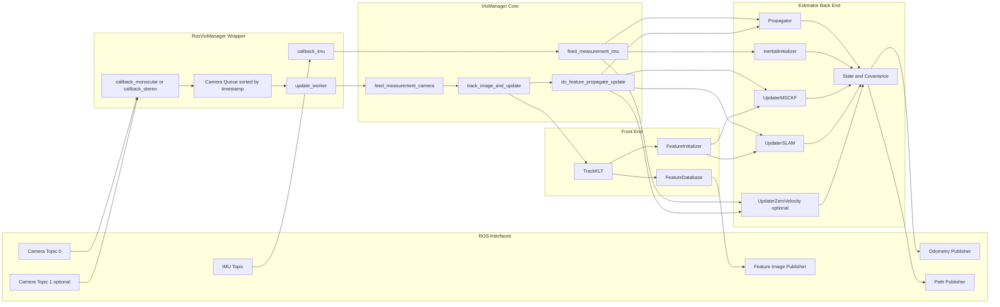

### 45.2 Threading and queueing interaction

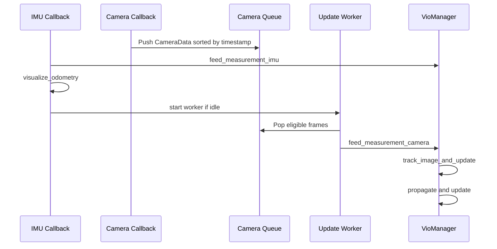

### 45.3 End-to-end process flow

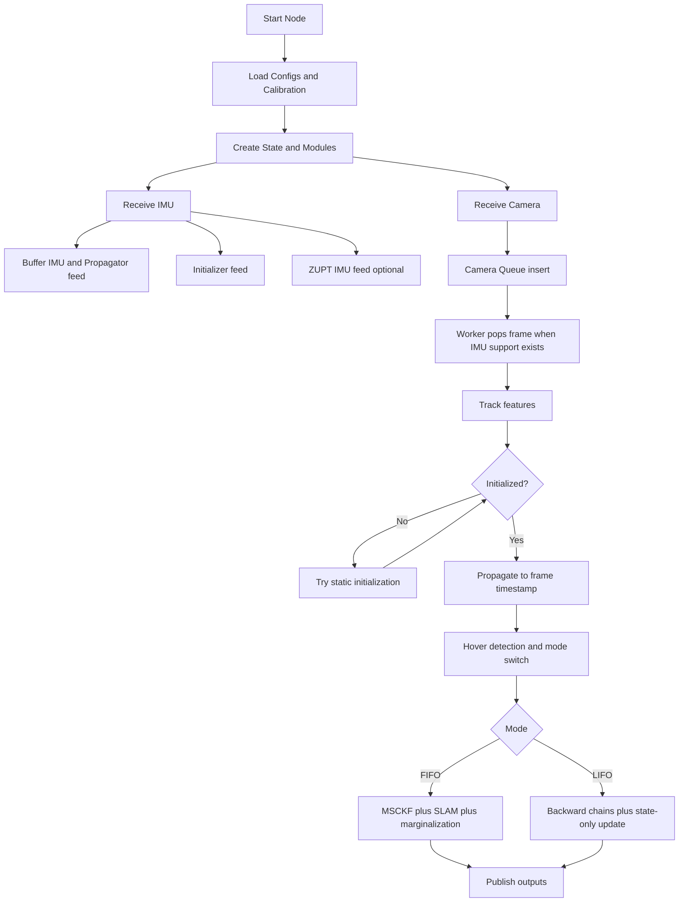

### 45.4 Primary dataflow

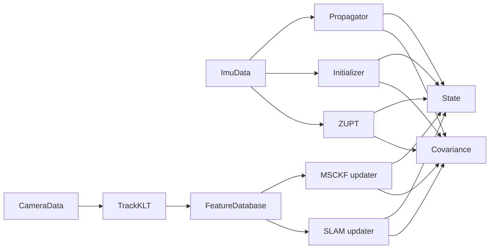

### 45.5 State and covariance block structure

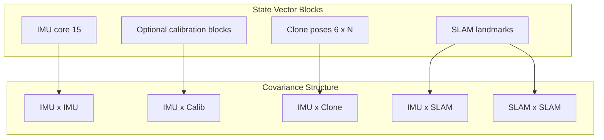

### 45.6 Propagation internals

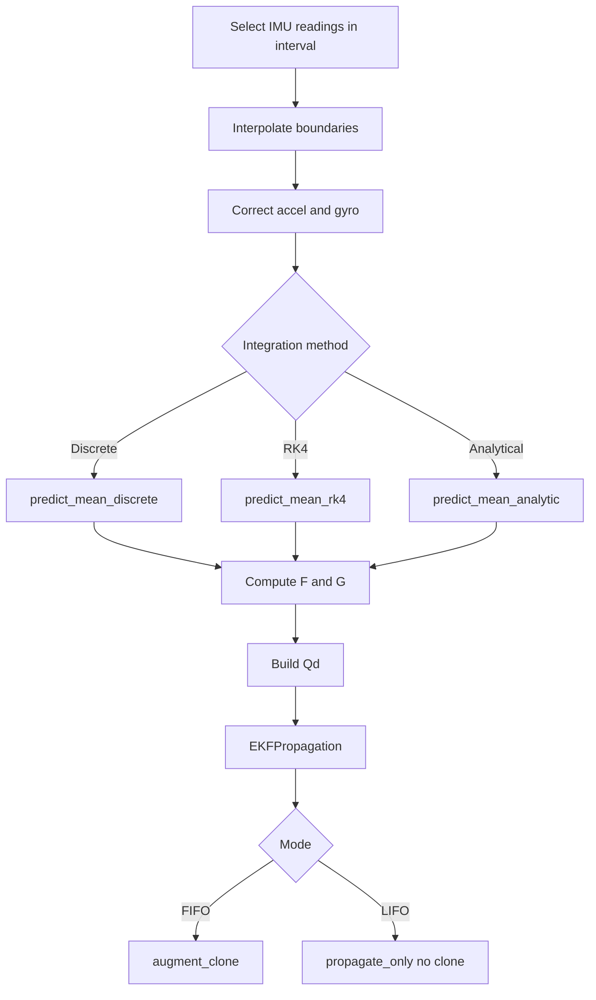

### 45.7 MSCKF update internals

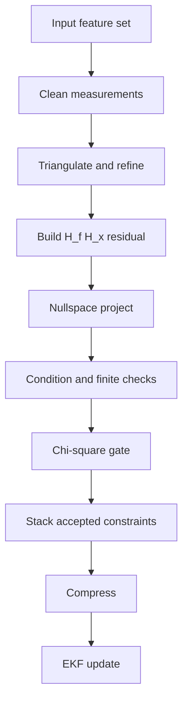

### 45.8 SLAM delayed-init and update flow

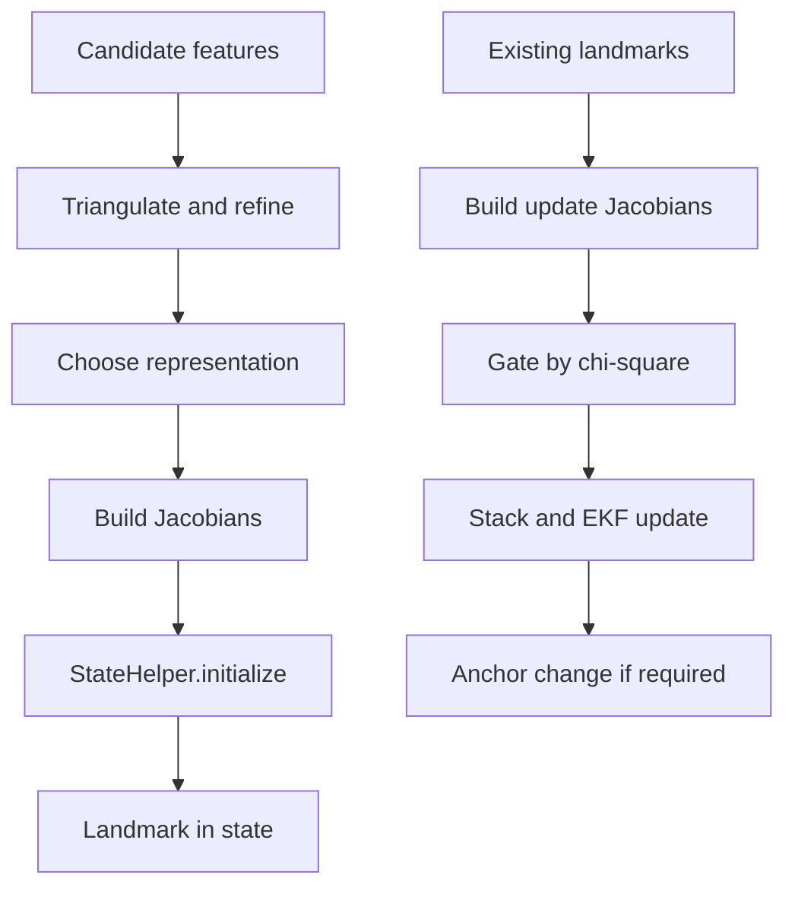

### 45.9 FIFO and LIFO state machine

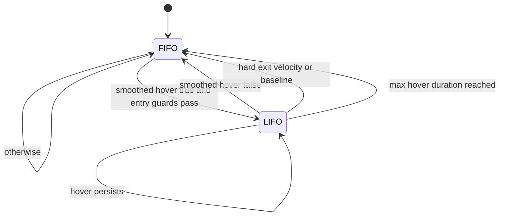

### 45.10 Hover decision flow

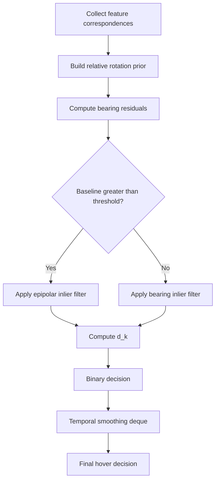

### 45.11 ZUPT decision flow

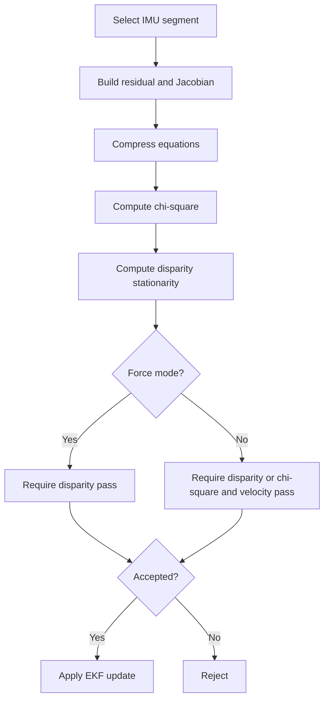

### 45.12 Initialization flow

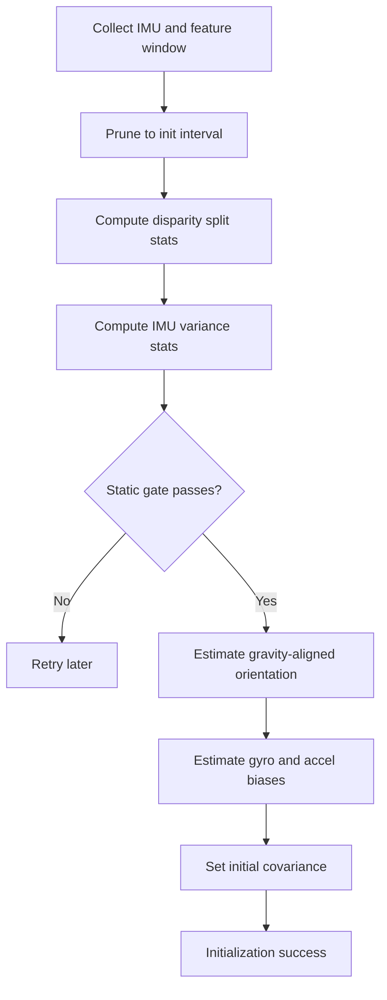

### 45.13 Feature tracking and database flow

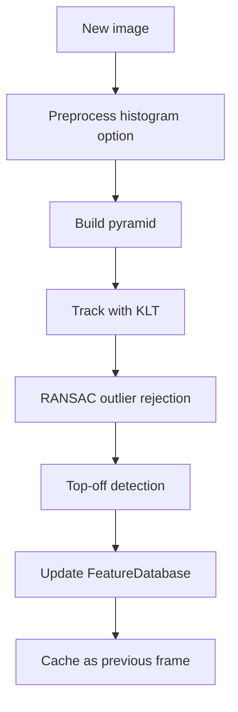

### 45.14 Error recovery supervisory flow

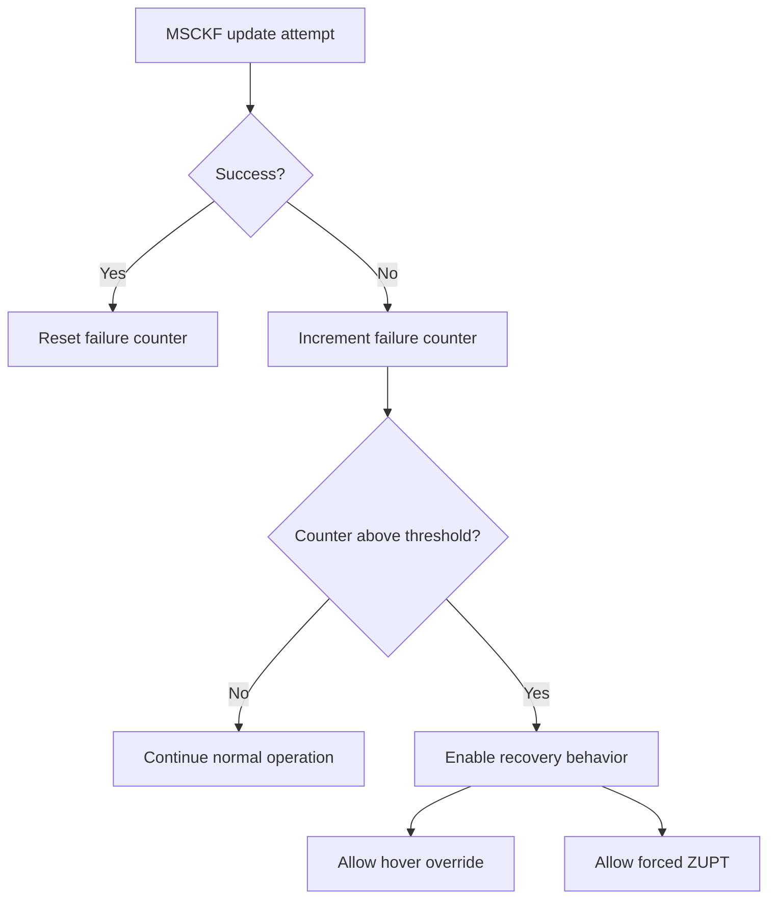

## 46. Expanded OpenVINS Comparison (V2-Focused)

### 46.1 Shared foundation

V2 and canonical OpenVINS-style pipelines share:

1. error-state EKF with JPL quaternions,
2. IMU propagation with bias random walks,
3. clone-window MSCKF constraints,
4. FEJ-enabled consistency options.

### 46.2 Primary V2 divergences

1. Hover-aware FIFO/LIFO supervisory state machine.
2. Backward chain logic and quality-scored LIFO matching.
3. Deferred covariance behavior during LIFO state-only updates.
4. Explicit recovery coupling between failure streaks and ZUPT/hover logic.

### 46.3 Practical consequence

V2 trades strict canonical simplicity for stronger robustness under low-excitation hovering conditions.

---

## 47. Extended Tuning Playbook

### 47.1 If false hover entries occur

1. reduce hover threshold sensitivity,
2. increase hover_smoothing_required,
3. tighten hover_entry_max_velocity and hover_entry_max_baseline.

### 47.2 If hover never triggers when expected

1. relax bearing and epipolar inlier thresholds,
2. relax entry guards moderately,
3. verify feature correspondence quality under low motion.

### 47.3 If LIFO mode becomes sticky

1. reduce hover_max_duration_sec,
2. reduce hover_exit_velocity_threshold,
3. strengthen hard exit baseline policy.

### 47.4 If update failures repeat in dynamic motion

1. increase feature count and distribution quality,
2. tune updater condition/chi-square thresholds,
3. verify calibration consistency and timestamp quality.

---

## 48. Final Addendum

This addendum extends the original V2 rewrite with deeper operations guidance and a complete visual diagram index. It preserves the same implementation-grounded principle: every major claim is tied to current V2 modules and current runtime behavior.
