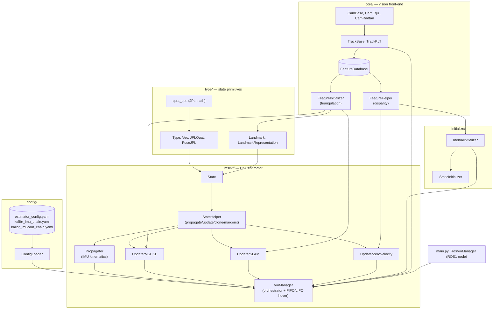
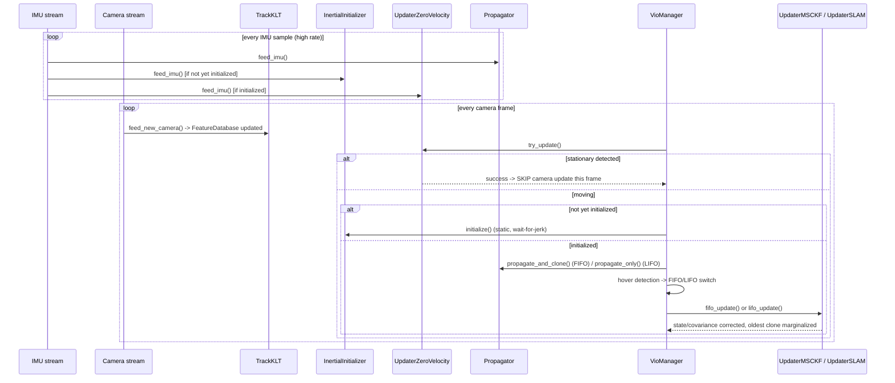

# System Architecture

`open_vins_python` is a Python reimplementation of **OpenVINS**, a
Multi-State Constraint Kalman Filter (MSCKF) based visual-inertial odometry
/ SLAM system, exposed as a ROS1 node. This document gives the 30,000-foot
view; every subsystem has its own detailed doc linked below.

The repo ships **two pipeline versions**: `vio_pipeline/` (v1, baseline,
no hovering detection) and `vio_pipeline_v2/` (adds the FIFO/LIFO hovering
extension described below). This doc set covers `vio_pipeline_v2/` only —
`vio_pipeline/` shares the same module structure minus the hovering logic.

## Package layout

```
Open_vins_python/
├── README.md
├── vio_pipeline/                   v1: baseline, no hovering detection
│   └── (same module layout as v2, minus hovering)
└── vio_pipeline_v2/
    ├── main.py                     ROS1 node wrapper (RosVioManager)
    ├── setup.py                    Package: "vio_pipeline" v0.1.0
    ├── docs/                       <- you are here
    ├── type/                       State-variable primitives (JPL quaternion math)
    ├── core/                       Cameras, KLT tracking, feature DB, triangulation
    ├── msckf/                      EKF state, propagation, updaters, orchestrator
    ├── initialize/                 Static initialization (dynamic init unimplemented)
    ├── config/                     YAML config loader + two ready-made profiles
    └── vio_pipeline.egg-info/      Packaging metadata (stale — predates msckf/, config/, main.py)
```

## Module dependency graph



## Per-frame processing pipeline



## The five layers, briefly

1. **[state-and-types.md](state-and-types.md)** — `type/`. The manifold
   type system (`Type`/`Vec`/`JPLQuat`/`PoseJPL`/`Landmark`) every EKF state
   variable is built from, using the **JPL quaternion convention** (not
   Hamilton — a critical, easy-to-get-wrong distinction).
2. **[cameras-and-tracking.md](cameras-and-tracking.md)** +
   **[triangulation.md](triangulation.md)** — `core/`. Camera projection
   models, KLT optical-flow tracking, the shared `FeatureDatabase`, and
   geometric triangulation (linear + Levenberg-Marquardt refinement).
3. **[estimator-core.md](estimator-core.md)** +
   **[propagation.md](propagation.md)** +
   **[updaters.md](updaters.md)** +
   **[zero-velocity-update.md](zero-velocity-update.md)** — `msckf/`. The
   EKF itself: state/covariance bookkeeping, IMU propagation, MSCKF/SLAM
   measurement updates, and zero-velocity updates.
4. **[initialization.md](initialization.md)** — `initialize/`. Static
   (stationary-platform) initialization. **Dynamic initialization is
   configured but not implemented** — `dynamic.py` is empty.
5. **[configuration.md](configuration.md)** — `config/`. YAML → typed
   options plumbing, and the two shipped profiles (`Custom_v1` monocular
   UAV/hover, `kaist_vio` stereo ground-vehicle).

Sitting on top of all of it: **[ros-integration.md](ros-integration.md)** —
`main.py`, the ROS1 node wrapper that is this repo's only working entry
point.

## The custom hovering extension

Beyond a straight port of OpenVINS, `VioManager` implements a **FIFO/LIFO
state machine** for detecting near-zero-parallax ("hovering") motion
segments and switching to a frozen-covariance, backward-ORB-matched update
strategy during them, with a deferred covariance correction on exit. This
has no counterpart in stock OpenVINS C++ and is documented in full in
[vio-manager.md](vio-manager.md#hovering-detection-fifolifo-state-machine).
A reference paper is shipped alongside the source:
`vio_pipeline_v2/Detecting and Dealing with Hovering Maneuvers in
Vision-aided Inertial Navigation Systems (1).pdf`.

## Known limitations

- **Dynamic initialization is unimplemented** (`initialize/dynamic.py` is a
  0-byte file). Only static (stationary-start) initialization works. See
  [initialization.md](initialization.md#dynamic-initialization-status-unimplemented).
- **Packaging metadata is stale**: `vio_pipeline.egg-info/top_level.txt`
  and `SOURCES.txt` predate the `msckf/`, `config/`, and `main.py` additions
  — they only list `core`, `initialize`, `type`. Re-run `python setup.py
  egg_info` (or rebuild the package) if you depend on this metadata being
  accurate; no source code was changed to fix this as part of this
  documentation pass.
- **GIL-limited "parallel" tracking**: `TrackKLT.feed_new_camera` spawns
  Python `threading.Thread`s per camera for multi-mono setups, mirroring
  the C++ original's structure, but pure-Python code on these threads
  serializes on the GIL — only the underlying `cv2` calls (which release
  the GIL) get genuine overlap.
- **`main.py` is ROS1-only** — there is no standalone dataset-replay/bag
  script; to run against pre-recorded data you need `rosbag play` (or
  equivalent) feeding the subscribed topics.
- Two independent, overlapping config-parsing paths exist
  (`ConfigLoader` vs. individual option classes' own `print(parser)`
  methods) — see [configuration.md](configuration.md).
