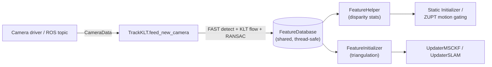
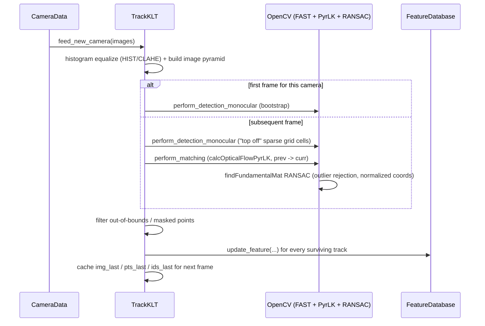

# Cameras & Feature Tracking (`vio_pipeline_v2/core/`)

This module handles everything "in image space": camera projection/distortion
models, KLT-based optical-flow feature tracking, and the shared feature
database that both the tracker and the estimator read/write.

Files covered: `cam_base.py`, `CamEqui.py`, `cam_radtan.py`, `feature.py`,
`feature_database.py`, `feature_helper.py`, `track_base.py`, `track_KLT.py`,
`sensor_data.py`. Triangulation (`feature_initializer.py`,
`feat_initializer_options.py`) has its own doc: [triangulation.md](triangulation.md).

## Data flow overview



## `sensor_data.py` — raw measurement containers

- **`ImuData`** (`@dataclass(order=True)`): `timestamp`, `wm` (angular
  velocity), `am` (linear acceleration); both coerced to `np.ndarray` in
  `__post_init__`. Orderable by timestamp so IMU queues can be sorted.
- **`CameraData`**: `timestamp`, `sensor_ids` (list, e.g. `[0]` mono,
  `[0,1]` stereo), `images` (list of `np.ndarray`), `masks` (list, e.g.
  dynamic-object/ROI exclusion masks). `__lt__` sorts by timestamp, then by
  smallest sensor id — supports merging async camera/IMU streams in a
  priority queue.

## Camera models (`cam_base.py`, `CamEqui.py`, `cam_radtan.py`)

All cameras are treated as **pinhole + a distortion function**. `CamBase`
(ABC) stores `_width`, `_height`, an 8-element raw parameter vector
`camera_values = [fx, fy, cx, cy, d0, d1, d2, d3]`, and derives OpenCV-format
`K` (3×3) and `D` (4-vector) from it.

Abstract interface every concrete model implements:

| Method | Signature | Purpose |
|---|---|---|
| `undistort_f(uv_dist)` | raw pixel → normalized undistorted coords | Used before triangulation/RANSAC — geometry must be evaluated in a linear (undistorted) space. |
| `distort_f(uv_norm)` | normalized coords → raw pixel | Forward projection, used to predict measurements for EKF residuals. |
| `compute_distort_jacobian(uv_norm)` | → `(H_dz_dzn, H_dz_dzeta)` | `H_dz_dzn` (2×2): Jacobian of pixel measurement w.r.t. normalized bearing. `H_dz_dzeta` (2×8): Jacobian w.r.t. the 8 intrinsic parameters — needed when `do_calib_camera_intrinsics=True`. |

### `CamRadtan` — Radial-Tangential / Brown-Conrady (pinhole lenses)

Standard OpenCV pinhole distortion, param order `[fx,fy,cx,cy,k1,k2,p1,p2]`:

```
r²      = x² + y²
radial  = 1 + k1·r² + k2·r⁴
x_dist  = x·radial + 2·p1·x·y + p2·(r² + 2x²)
y_dist  = y·radial + p1·(r² + 2y²) + 2·p2·x·y
u = fx·x_dist + cx,   v = fy·y_dist + cy
```

`undistort_f` delegates to `cv2.undistortPoints`. `compute_distort_jacobian`
differentiates the above polynomial analytically for both output blocks.

### `CamEqui` — Equidistant / Fisheye

Appropriate for wide-FOV lenses, param order `[fx,fy,cx,cy,k1,k2,k3,k4]`:

```
r      = sqrt(x²+y²)
theta  = atan(r)                                    # angle of incidence
theta_d = theta·(1 + k1θ² + k2θ⁴ + k3θ⁶ + k4θ⁸)      # distortion in ANGLE, not radius
cdist  = theta_d / r          (= 1 as r→0)
x_dist = x·cdist,  y_dist = y·cdist
u = fx·x_dist + cx,  v = fy·y_dist + cy
```

`undistort_f` delegates to `cv2.fisheye.undistortPoints`.
`compute_distort_jacobian` differentiates via `d(theta_d)/d(theta)`,
`d(theta)/dr = 1/(1+r²)`, and `d(theta_d)/dk_i = theta^(2i+1)`.

Model selection happens in `config/config_loader.py` from the YAML
`distortion_model` field (`"radtan"` → `CamRadtan`, `"equidistant"` →
`CamEqui`) — see [configuration.md](configuration.md).

## `feature.py` — `Feature`: one tracked point's history

Plain data container, keyed by camera:

```python
featid: int
timestamps:  Dict[cam_id -> List[float]]
uvs:         Dict[cam_id -> List[np.ndarray(2,)]]   # raw pixel coords
uvs_norm:    Dict[cam_id -> List[np.ndarray(2,)]]   # undistorted/normalized
p_FinG:      np.ndarray                              # 3D position, global frame (post-triangulation)
p_FinA:      np.ndarray                              # 3D position, anchor frame
anchor_cam_id, anchor_clone_timestamp
to_delete:   bool                                    # marginalization flag
```

Pruning methods: `clean_old_measurements(valid_times)` (keep only
measurements at given timestamps, per camera), `clean_invalid_measurements`
(inverse), `clear_older_measurements(timestamp)` (keep only strictly newer
— used after a clone is marginalized).

## `feature_database.py` — `FeatureDatabase`

Thread-safe (`threading.RLock`) map `featid -> Feature`, the single shared
data structure between the tracker and the estimator.

| Method | Purpose |
|---|---|
| `update_feature(featid, timestamp, cam_id, u, v, u_n, v_n)` | Main ingestion API, called every frame by `TrackKLT` — appends an observation, creating the `Feature` entry if new. |
| `get_feature(featid, remove=False)` | Lookup, optionally pop. |
| `get_feature_clone(featid, feat_out)` | Deep-copy into a caller-provided `Feature` (for safe visualization/logging). |
| `features_not_containing_newer(timestamp, ...)` | Tracks whose *last* observation is older than `timestamp` — i.e. lost tracks, candidates for MSCKF update+marginalization. |
| `features_containing_older(timestamp, ...)` | Tracks with at least one observation older than `timestamp`. |
| `features_containing(timestamp, ...)` | Tracks observed exactly at `timestamp`. |
| `cleanup()` | Purge all features flagged `to_delete`. |
| `cleanup_measurements(timestamp)` / `cleanup_measurements_exact(timestamp)` | Trim per-feature history older than / exactly at a timestamp; drop features left with zero measurements. |
| `get_oldest_timestamp()` | Earliest observation across the whole DB. |
| `append_new_measurements(database)` | Merge another DB's measurements into this one. |

## `feature_helper.py` — `FeatureHelper` (disparity statistics)

Static-method class used for motion/stillness gating (static initialization,
hover detection, ZUPT):

- **`compute_disparity_two_frames(db, time0, time1)`** → `(mean, std, n)`:
  for features observed at *both* exact timestamps (same camera), computes
  Euclidean pixel disparity `‖uv1 − uv0‖`, returns sample mean/std
  (`ddof=1`) and count.
- **`compute_disparity(db, newest_time=-1, oldest_time=-1)`** → `(mean,
  std, n)`: same statistic but over a *time window* — finds each feature's
  first observation newer than `oldest_time` and its last observation
  before `newest_time`, rather than requiring exact-timestamp matches.
  `-1` disables a bound.

## `track_base.py` — `TrackBase` (tracker interface)

Base class for feature trackers. Holds `cameras: Dict[cam_id -> CamBase]`,
a `FeatureDatabase`, per-camera `threading.RLock`s, and "last frame" caches
(`img_last`, `pts_last`, `ids_last`). Feature IDs are namespace-reserved for
ArUco: `currid = 4*numaruco + 1`, so KLT feature IDs never collide with the
4-corners-per-tag IDs used by an ArUco tracker.

`display_active`/`display_history` are OpenCV visualization helpers (draw
current/historical tracked points, color-graded by age, onto a composite
multi-camera image) — ports of OpenVINS C++'s equivalents.

## `track_KLT.py` — `TrackKLT(TrackBase)`: Lucas-Kanade optical flow

Constructor adds: `threshold` (FAST corner threshold), `grid_x`/`grid_y`
(spatial detection grid), `min_px_dist` (minimum enforced feature spacing),
`win_size=(15,15)`, `pyr_levels=5`.

### Per-frame algorithm (`feed_new_camera`)



1. **Preprocessing**: optional `cv2.equalizeHist` (mode 1) or
   `cv2.createCLAHE` (mode 2), then `cv2.buildOpticalFlowPyramid`.
2. **Dispatch**: `feed_monocular` (1 image), `feed_stereo` (2 images +
   `use_stereo=True`), or parallel per-camera `feed_monocular` via Python
   `threading.Thread` for multi-mono setups. *Note:* due to the GIL this is
   not true CPU parallelism — it preserves the C++ API's structure but
   OpenCV calls still serialize on the interpreter lock for pure-Python
   code paths (the underlying `cv2` calls themselves release the GIL, so
   there is some real overlap for compute-heavy OpenCV routines).
3. **`perform_matching(img0pyr, img1pyr, kpts0, kpts1, id0, id1)`**: the
   core KLT + outlier-rejection routine.
   - Requires ≥10 points (else returns an all-zero/failed mask).
   - `cv2.calcOpticalFlowPyrLK` with `winSize=(15,15)`, `maxLevel=5`,
     termination `(EPS|COUNT, 30, 0.01)`, seeded with an initial-flow guess.
     *Only* the base pyramid level is passed (Python `cv2` bindings don't
     accept prebuilt pyramid lists the way the C++ API does) — OpenCV
     rebuilds the pyramid internally.
   - Both point sets are **undistorted** (`undistort_cv`) into normalized
     camera coordinates before RANSAC, since epipolar geometry is nonlinear
     in distorted pixel space.
   - `cv2.findFundamentalMat(..., cv2.FM_RANSAC, threshold=2.0/max_focal,
     confidence=0.999)` — the 2-pixel threshold is converted to normalized
     coordinates by dividing by the larger of the two cameras' focal
     lengths.
   - Final track mask = KLT success **AND** RANSAC inlier.
4. **`perform_detection_monocular` / `perform_detection_stereo`**:
   spatially-uniform new-feature detection.
   - Two occupancy grids: a fine "close" grid (cell size `min_px_dist`) to
     enforce minimum spacing, and a coarse `grid_x × grid_y` grid to
     balance feature count per region.
   - Existing points within `edge=10`px of image borders, out of bounds, or
     mask-occluded are discarded; survivors "stamp" a `min_px_dist`-sized
     exclusion rectangle so new detections don't crowd them.
   - If surviving count is below `num_features - min(20, 0.5*num_features)`,
     triggers `_perform_griding` over under-populated, non-fully-masked
     cells.
   - New feature IDs are monotonically increasing (`self.currid`).
   - Stereo detection additionally KLT-projects newly detected LEFT
     features into the RIGHT image to seed stereo correspondences
     immediately — matches become dual-camera features (same ID both
     cameras), unmatched detections stay mono.
5. **`_perform_griding(img, mask, valid_locs, num_features, grid_x, grid_y,
   threshold, nonmax_suppression)`**: inline port of OpenVINS
   `Grider_GRID::perform_griding`. Recomputes grid dims if
   `num_features < grid_x*grid_y`. Per cell: `cv2.FastFeatureDetector_create`
   on the ROI (inverted mask as the FAST mask arg), keeps top
   `num_features_grid` by `.response`, offsets back to full-image
   coordinates, rejects mask-excluded points, refines to sub-pixel with
   `cv2.cornerSubPix` (5×5 window, `TERM_CRITERIA_COUNT+EPS, 20, 0.001`).

### `feed_stereo` specifics

Left and right images tracked independently (parallel threads) via
`perform_matching`; a feature is promoted to a stereo observation
(pushed into the DB under both `cam_id_left` and `cam_id_right`) only if
its ID is found and passes RANSAC in *both* temporal tracks
(`found_right`); otherwise it remains a mono observation in whichever
camera tracked it.

## How `core/` connects to the rest

`TrackKLT` (or `TrackSIM` for simulation, referenced by `VioManagerOptions`)
consumes `CameraData` and writes into the shared `FeatureDatabase`.
`VioManager` (see [vio-manager.md](vio-manager.md)) reads from that same
database every frame to decide which features are lost, which are
candidates for marginalization, and which should be triangulated via
`FeatureInitializer` (see [triangulation.md](triangulation.md)) and pushed
into the EKF state as `Landmark`s (see [state-and-types.md](state-and-types.md)).
`FeatureHelper.compute_disparity*` feeds the static-initializer's
jerk/stillness classification (see [initialization.md](initialization.md))
and the zero-velocity-update's disparity override (see
[zero-velocity-update.md](zero-velocity-update.md)).
