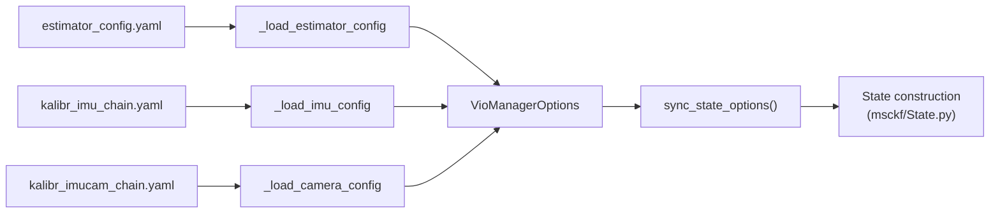

# Configuration System (`vio_pipeline_v2/config/`)

Parses OpenVINS/Kalibr-style YAML configuration into a fully-populated
`VioManagerOptions` object. Files: `config_loader.py` (`ConfigLoader`), and
two ready-made profiles: `Custom_v1/` and `kaist_vio/`.

## `ConfigLoader.load_all(config_dir) -> VioManagerOptions`

The single integration point. Expects exactly three files in
`config_dir` (hardcoded names, though the YAML also carries
`relative_config_imu`/`relative_config_imucam` keys that appear to be
documentation-only metadata rather than actively used paths):

```
config_dir/
├── estimator_config.yaml      # master tuning file
├── kalibr_imu_chain.yaml      # IMU noise/intrinsics
└── kalibr_imucam_chain.yaml   # camera intrinsics/extrinsics
```

Exits with an error (`sys.exit(1)`) if any file is missing. Calls three
private loaders in sequence, then `options.sync_state_options()`
(reconciles the top-level `VioManagerOptions` with the nested
`StateOptions`/`msckf_options` after all three sources are merged).

`_read_yaml_safe(path)`: strips a leading `%YAML:1.0` OpenCV-style header
(present in all provided YAML files) before `yaml.safe_load`, since PyYAML
doesn't understand that directive natively.



## `_load_estimator_config(path, opts)` — `estimator_config.yaml`

| YAML key | Maps to | Notes |
|---|---|---|
| `use_fej` | `state_options.do_fej` | |
| `integration` | `state_options.integration_method` | `"discrete"\|"rk4"\|"analytical"`, case-insensitive |
| `calib_cam_extrinsics` / `calib_cam_intrinsics` / `calib_cam_timeoffset` | `state_options.do_calib_camera_*` | Online calibration toggles |
| `calib_imu_intrinsics` / `calib_imu_g_sensitivity` | `state_options.do_calib_imu_*` | |
| `max_cameras` | `opts.num_cameras` (mirrored into `state_options.num_cameras`) | |
| `use_stereo`, `use_mask` | direct | |
| `hovering_threshold`, `hover_smoothing_required`, `hover_baseline_threshold`, `hover_epipolar_inlier_threshold`, `hover_bearing_inlier_threshold`, `hover_min_inliers`, `hover_entry_max_baseline`, `hover_entry_max_velocity`, `hover_exit_velocity_threshold`, `hover_max_duration_sec` | hovering-mode fields (see [vio-manager.md](vio-manager.md#hovering-detection-fifolifo-state-machine)) | Read with `getattr(opts, ..., default)` fallback for backward compatibility — **custom, not stock OpenVINS**. |
| `max_clones` | `state_options.max_clone_size` | Sliding-window pose-clone count |
| `max_slam` | `state_options.max_slam_features` | Persistent SLAM landmark budget |
| `max_slam_in_update`, `max_msckf_in_update` | batch sizes | Features processed per sequential EKF update call |
| `use_klt`, `num_pts`, `fast_threshold`, `grid_x`, `grid_y`, `min_px_dist`, `knn_ratio` | `TrackKLT` constructor params | See [cameras-and-tracking.md](cameras-and-tracking.md) |
| `init_window_time`, `init_imu_thresh`, `init_max_disparity`, `init_max_features` | `InertialInitializerOptions` static-init fields | See [initialization.md](initialization.md) |
| `init_dyn_*` | `InertialInitializerOptions` dynamic-init fields | Currently dead config — see [initialization.md](initialization.md#dynamic-initialization-status-unimplemented) |
| `try_zupt`, `zupt_chi2_multipler` (also accepts corrected spelling `zupt_chi2_multiplier`), `zupt_max_velocity`, `zupt_noise_multiplier`, `zupt_max_disparity`, `zupt_only_at_beginning` | ZUPT config | See [zero-velocity-update.md](zero-velocity-update.md) |
| `gravity_mag` | `opts.gravity_mag` and `opts.init_options.gravity_mag` | Mirrored into both |
| `up_msckf_sigma_px`, `up_msckf_chi2_multipler` | `opts.msckf_options.sigma_pix` / `chi2_multipler` | `sigma_pix_sq` auto-derived |
| `msckf_min_features_for_update`, `msckf_min_update_rows`, `msckf_max_innovation_condition`, `msckf_ekf_innovation_jitter` | `msckf_options` robustness fields | Python-specific additions beyond stock OpenVINS |

Other YAML keys present but parsed by **independent** `print(parser)`
methods on their own option classes rather than by `ConfigLoader` directly
(a parallel, redundant config path keyed on the same field names): e.g.
`feat_rep_msckf`/`feat_rep_slam`/`feat_rep_aruco` (via `StateOptions.print`),
`fi_*` triangulation overrides (via `FeatureInitializerOptions.print`).

## `_load_imu_config(path, opts)` — `kalibr_imu_chain.yaml` (`imu0`)

| YAML key | Maps to |
|---|---|
| `model` (`"kalibr"`/`"calibrated"` → `KALIBR`; `"rpng"` → `RPNG`) | `state_options.imu_model` |
| `accelerometer_noise_density` | `sigma_a` |
| `gyroscope_noise_density` | `sigma_w` |
| `accelerometer_random_walk` | `sigma_ab` |
| `gyroscope_random_walk` | `sigma_wb` |
| `Tw` (default identity) | gyro scale/misalignment matrix |
| `Ta` (default identity) | accel scale/misalignment matrix |
| `R_IMUtoGYRO`, `R_IMUtoACC` (default identity) | axis-misalignment rotations |
| `Tg` (default zero) | gyro g-sensitivity / gravity-coupling matrix |

Derived: `Dw = inv(Tw)`, `Da = inv(Ta)` (via `np.linalg.solve`),
`R_ACCtoIMU = R_IMUtoACC.T`, `R_GYROtoIMU = R_IMUtoGYRO.T`. `Dw`/`Da` are
flattened into 6-element vectors using **KALIBR** ordering
(lower-triangular, column-major: `[D00,D10,D20,D11,D21,D22]`) or **RPNG**
ordering (upper-triangular: `[D00,D01,D11,D02,D12,D22]`) — see
[estimator-core.md](estimator-core.md)'s `State.Dm`. `Tg` flattened into a
9-element column-major vector. `R_GYROtoIMU`/`R_ACCtoIMU` converted to JPL
quaternions via `rot_2_quat` (see [state-and-types.md](state-and-types.md)).

## `_load_camera_config(path, opts)` — `kalibr_imucam_chain.yaml` (`cam0..camN`)

Per camera `i`:

| YAML key | Maps to |
|---|---|
| `intrinsics: [fx,fy,cx,cy]`, `distortion_coeffs` (padded to length 4), `resolution: [w,h]` | 8-param vector passed to `CamBase.set_value` |
| `distortion_model` (`"radtan"` → `CamRadtan`; `"equidistant"` → `CamEqui`; else defaults to `CamRadtan`) | Model class instantiated into `opts.camera_intrinsics[i]` |
| `T_cam_imu` (4×4 homogeneous, camera-to-IMU: encodes `R_CtoI`, `p_CinI`) | Split into `R`/`p`; `R` → JPL quaternion; builds a `PoseJPL` → `opts.camera_extrinsics[i]` (becomes a filter state variable when `do_calib_camera_pose=True`) |
| `timeshift_cam_imu` (cam0 only) | `opts.calib_camimu_dt` (mirrored into `opts.init_options.init_calib_camImu_dt`) — camera-IMU time sync offset, estimable when `do_calib_camera_timeoffset=True` |

## The two provided profiles

Both are matched triples of the three YAML files.

### `Custom_v1/` — monocular, UAV/hover profile

| Setting | Value | Implication |
|---|---|---|
| `max_cameras` / `use_stereo` | 1 / `false` | Monocular |
| Distortion model | `equidistant` (fisheye), 1280×720 | Wide-FOV lens |
| IMU noise | `accelerometer_noise_density: 0.286` (high) | Consumer/MEMS-grade IMU |
| ZUPT | `try_zupt: true`, `zupt_only_at_beginning: true` | Aggressive stillness correction |
| FEJ / integration | `use_fej: true`, RK4 | |
| Online calibration | all `calib_*: false` | Fixed calibration, no online refinement |
| Hovering | `hovering_threshold: 0.00003`, `hover_smoothing_required: 4`, `hover_max_duration_sec: 3600.0` | Conservative but long-duration — consistent with UAV hover use case |
| Landmark representation | `feat_rep_msckf: GLOBAL_3D`, `feat_rep_slam/aruco: ANCHORED_MSCKF_INVERSE_DEPTH` | |

### `kaist_vio/` — stereo, ground-vehicle profile

| Setting | Value | Implication |
|---|---|---|
| `max_cameras` / `use_stereo` | 2 / `true` | Stereo — YAML comment: *"NEED TO USE STEREO! OTHERWISE CAN'T RECOVER SCALE!!!!!! DEGENERATE MOTION!!!"* — monocular scale is unobservable for this dataset's motion profile |
| Distortion model | `radtan`, 640×480, with `T_cn_cnm1` stereo baseline | Standard pinhole |
| Online calibration | `calib_cam_intrinsics: true` (extrinsics/timeoffset fixed) | |
| State size | `max_clones: 11`, `max_slam: 50` | Larger SLAM budget than default |
| Landmark representation | all classes `ANCHORED_MSCKF_INVERSE_DEPTH` | Uniform representation |
| ZUPT | `zupt_chi2_multipler: 0` (disables IMU-based gate), relies on `zupt_max_disparity: 0.20` | Disparity-only stillness detection |
| Triangulation overrides | `fi_max_dist: 10.0`, `fi_max_baseline: 200`, `fi_max_cond_number: 25000` | Tighter max-distance (street-scale depths) than the code default (60m); looser condition-number tolerance than default (10000) |

## Adding a new config profile

1. Create a new directory under `config/` with the three required YAML
   files, following one of the existing profiles as a template.
2. Point `main.py`'s `~config_path` ROS param at it (see
   [ros-integration.md](ros-integration.md)), or pass the directory to
   `ConfigLoader.load_all()` directly if writing a non-ROS entry point.
3. Sanity-check parameters against the actual sensor: `distortion_model`
   must match the physical lens, `T_cam_imu`/`timeshift_cam_imu` must come
   from an actual Kalibr calibration, and `use_stereo` must be `true` if
   the motion profile has insufficient excitation for monocular scale
   (see the `kaist_vio` comment above — this is a real failure mode, not
   a stylistic choice).
