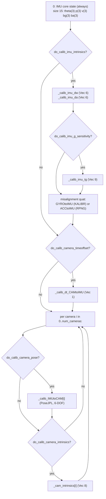

# Estimator Core: State & Covariance Bookkeeping (`vio_pipeline_v2/msckf/`)

The EKF's state vector and covariance matrix, and the generic operations
(propagate, update, clone, marginalize, delayed-initialize) that manipulate
them. This is the layer that turns the abstract `Type` system (see
[state-and-types.md](state-and-types.md)) into a working, growable/shrinkable
filter state.

Files covered: `State.py`, `StateOptions.py`, `state_helper.py`.

## `StateOptions.py` — filter configuration

Two enums:

- **`IntegrationMethod`**: `DISCRETE`, `RK4`, `ANALYTICAL` (default `RK4`) —
  selects the IMU propagation integration scheme (see
  [propagation.md](propagation.md)).
- **`ImuModel`**: `KALIBR`, `RPNG` (default `KALIBR`) — selects the IMU
  intrinsic shape/scale-matrix parameterization convention (lower- vs
  upper-triangular layout, see below).

Fields:

| Field | Default | Meaning |
|---|---|---|
| `do_fej` | `True` | Enable First-Estimates Jacobians (see [state-and-types.md](state-and-types.md#first-estimates-jacobians-fej)). |
| `integration_method` | `RK4` | IMU integration scheme. |
| `do_calib_camera_pose` | — | Estimate camera-IMU extrinsics online. |
| `do_calib_camera_intrinsics` | — | Estimate camera intrinsics online. |
| `do_calib_camera_timeoffset` | — | Estimate camera-IMU time offset online. |
| `do_calib_imu_intrinsics` | — | Estimate IMU shape/scale/misalignment online. |
| `do_calib_imu_g_sensitivity` | — | Estimate gyroscope gravity-sensitivity coupling online. |
| `imu_model` | `KALIBR` | IMU intrinsic parameterization. |
| `max_clone_size` | 11 | MSCKF sliding-window pose-clone cap. |
| `max_slam_features` | 25 | Persistent SLAM-landmark budget. |
| `max_slam_in_update` | 1000 | Max SLAM features processed per single EKF update call (batching). |
| `max_msckf_in_update` | 1000 | Max MSCKF features processed per single EKF update call. |
| `max_aruco_features` | 1024 | ArUco tag ID-space reservation. |
| `num_cameras` | 1 | Camera count. |
| `feat_rep_msckf` / `feat_rep_slam` / `feat_rep_aruco` | `GLOBAL_3D` | Per-feature-class `LandmarkRepresentation`. |

`print(parser)` optionally loads fields from a YAML-style dict and prints
the resolved config (mirrors the C++ OpenVINS console dump); exits on
invalid `integration`/`imu_model` strings.

## `State.py` — the state vector

`State` holds the entire EKF state as a Python list of `Type` objects
(`self._variables`), each self-describing its own `local_id`/`size()`, plus
a single dense `numpy` covariance matrix `self._Cov`.

### Construction order (defines the fixed covariance layout)

Built once at startup, in this fixed order (`current_id` running offset):



Growable containers (not part of the fixed-size initial covariance — added
by `state_helper` at runtime):

- `self._clones_IMU`: `Dict[timestamp -> PoseJPL]` — the MSCKF sliding
  window of historical body poses.
- `self._features_SLAM`: `Dict[featid -> Landmark]` — persistently-tracked
  landmarks.

### Covariance initialization

`self._Cov = (1e-3)² · I(current_id)` as a baseline, then diagonal blocks
overwritten with tuned default prior standard deviations for each enabled
calibration block:

| Block | Prior σ |
|---|---|
| `_calib_imu_dw` | 0.005 |
| `_calib_imu_da` | 0.008 |
| `_calib_imu_tg` | 0.005 |
| gyro/accel misalignment quat | 0.005 |
| `_calib_dt_CAMtoIMU` | 0.01 |
| camera extrinsic rotation | 0.005 |
| camera extrinsic translation | 0.015 |
| camera intrinsic (pinhole) | 1.0 |
| camera intrinsic (distortion) | 0.005 |

### Key methods

| Method | Purpose |
|---|---|
| `Dm(imu_model, vec)` (static) | Builds the 3×3 shape/scale matrix `D` from a 6-vector, per KALIBR (lower-triangular) or RPNG (upper-triangular) layout. |
| `Tg(vec)` (static) | Builds the 3×3 gravity-sensitivity matrix from a 9-vector (columns = 3-vectors). |
| `imu_intrinsic_size()` | Returns 15 (Dw+Da+misalignment) or 24 (+Tg) if calibration enabled, else 0 — sizes the propagation Jacobian blocks. |
| `margtimestep()` | Oldest (minimum) key in `_clones_IMU` — which clone the sliding window will drop next; `-1` if no clones. |
| `max_covariance_size()` | Current `_Cov.shape[0]`. |

## `state_helper.py` — `StateHelper`: the EKF math

Static-method class implementing every covariance-touching operation. This
is the mathematical core (directly analogous to OpenVINS C++'s
`StateHelper`).

### `EKFPropagation(state, order_NEW, order_OLD, Phi, Q)`

The standard covariance propagation step for a linear(ized) state-transition
model:

```
Cov_new = Phi · Cov_old · Phi^T + Q
```

Implemented **block-wise** (touching only the rows/cols named in
`order_OLD`/`order_NEW`, which must be memory-contiguous) rather than as a
dense full-matrix multiply — cross-correlations with the rest of the state
are updated via `Cov_PhiT = Cov[:, order_OLD] @ Phi.T`. `Q` is symmetrized
(upper-triangle mirrored). After writing back, every diagonal entry is
checked `≥ 0` — a **fatal `sys.exit(1)`** if not, since a negative variance
means the covariance has lost positive-semi-definiteness (a numerical bug,
not a recoverable condition).

### `EKFUpdate(state, H_order, H, res, R)`

The generic linearized measurement update:

```
P_small = marginal_covariance(H_order)
S       = H · P_small · H^T + R                    (innovation covariance,
                                                      symmetrized, +1e-9 jitter
                                                      on the diagonal)
K       = (P · H^T) · S^-1                          (Kalman gain; Cholesky
                                                      solve when S is PD,
                                                      falls back to pinv)
P_new   = P − K·H·P                                 (NOT explicit Joseph
                                                      form — the simplified
                                                      covariance update,
                                                      re-symmetrized after)
dx      = K · res
x_new   = x ⊞ dx                                    (manifold retraction,
                                                      per-variable via
                                                      var.update(dx_block))
```

After the update, negative covariance diagonal entries are **floored to
`1e-12`** (rather than aborting, unlike `EKFPropagation`) to keep the filter
running. If camera-intrinsics calibration is enabled, the updated intrinsic
values are also copied back into the live `CamBase` objects used by the
trackers, so tracking immediately benefits from refined calibration.

### `set_initial_covariance(state, covariance, order)`

Overwrites covariance blocks for already-added variables with an externally
supplied covariance (used once, at filter startup — see
[initialization.md](initialization.md)), then re-symmetrizes.

### `get_marginal_covariance` / `get_full_covariance`

Extract a covariance sub-block for an arbitrary ordered list of variables
(used pervasively for chi-square gating and Kalman-gain computation), or
return a full copy.

### `marginalize(state, marg)`

Removes a variable (and its rows/cols) via standard block-partition
marginalization:

```
Cov = [[P11, P12, P13],        Cov_new = [[P11, P13],
       [P21, P22, P23],   -->             [P31, P33]]
       [P31, P32, P33]]
```

(drops all rows/cols belonging to `marg`, i.e. the `P12/P21/P22` block is
simply dropped — no Schur-complement correction, since marginalizing a
variable that is *not* being conditioned on, just discarded). Every
remaining variable with `local_id > marg.id()` has its id shifted down by
`marg.size()`. `marg.set_local_id(-1)` marks it removed.

### `clone(state, variable_to_clone)`

The core of MSCKF **stochastic cloning**: grows the covariance by
`total_size` (zero-padded new rows/cols), then:

```
P_new_new  = P_old_old         # new clone's self-covariance = source's self-covariance
P_rest_new = P_rest_old        # cross-covariance with the rest of the state, copied
P_new_rest = P_old_rest
```

Since the clone's error state initially *equals* the source variable's
error state, the augmentation Jacobian is implicitly the identity — this is
exactly the "augment state with a camera pose clone" step from Mourikis &
Roumeliotis's MSCKF paper. A new `Type` (via `.clone()`) is appended to
`state._variables` with the newly-allocated `local_id`.

### `initialize(state, new_variable, H_order, H_R, H_L, R, res, chi_2_mult)`

**Delayed initialization** of a new state variable (e.g. a SLAM landmark),
using a QR-based left/right nullspace split — the standard technique for
converting an implicit measurement equation into an explicit new-state
augmentation while still being able to chi-square-gate on the part of the
system that constrains *existing* state.

```
1. Full QR of H_L (Jacobian w.r.t. the NEW variable):  H_L = Q · [R; 0]
2. Apply Q^T to H_L, H_R, res.
   -> "init" rows (top new_var_size rows): used to solve for the new variable
      (H_L is now upper-triangular/zero below, i.e. invertible top block)
   -> "update" rows (remaining rows): constrain EXISTING state only
      (new-variable Jacobian is exactly zero here after the QR)
3. Chi-square gate on the "update" portion ONLY:
      S = H_up · P_up · H_up^T + R_up
      Mahalanobis = res^T S^-1 res  vs  chi2.ppf(0.95, dof) * chi_2_mult
   -> reject (return False) if it fails
4. If passed: initialize_invertible(...) augments state/covariance using the
   "init" system, then (if "update" rows exist) EKFUpdate() on those rows too
   -> the new landmark's observations ALSO correct existing state in the
      same step it's created.
```

### `initialize_invertible(state, new_variable, H_order, H_R, H_L, R, res)`

The actual augmentation math (assumes `H_L` is square & invertible — true
after the QR split above):

```
M_a         = P · H_R^T
M           = H_R · P_small · H_R^T + R
H_Linv      = H_L^-1
P_LL        = H_Linv · M · H_Linv^T          # new variable's self-covariance
cross_term  = −M_a · H_Linv^T                # cross-covariance w/ existing state
dx          = H_Linv · res                    # initial correction to seed the new variable
```

`_Cov` is resized, the new variable appended, and `new_variable.update(dx)`
applied. This is the standard MSCKF/OpenVINS delayed-feature-initialization
formula (Mourikis & Roumeliotis; OpenVINS technical report), turning the
implicit `H_L·δf + H_R·δx = res` into an explicit new-state block.

### `augment_clone(state, last_w)`

Wraps `clone()` specifically for the IMU pose: clones
`state._imu.pose()` into `state._clones_IMU[state._timestamp]`. If
`do_calib_camera_timeoffset`, also updates the cross-covariance between the
new clone and `dt_CAMtoIMU` using the Jacobian `[w; v]` (angular/linear
velocity at clone time) — accounts for the clone's true pose depending on
the (uncertain) time offset used to interpolate IMU at image-capture time.

### `marginalize_old_clone(state)`

If `len(clones_IMU) > max_clone_size`, removes the oldest clone
(`state.margtimestep()`) via `marginalize` — maintains the fixed-size MSCKF
sliding window.

### `marginalize_slam(state)`

Iterates `state._features_SLAM`; removes (via `marginalize`) any landmark
flagged `should_marg=True` with `featid > 4*max_aruco_features` (i.e. a
genuine SLAM feature, not an ArUco tag — ArUco tags are handled separately
and never marginalized this way).

## How this connects

`msckf/Propagator.py` calls `EKFPropagation` every IMU step (see
[propagation.md](propagation.md)). `msckf/UpdaterMSCKF.py`,
`msckf/UpdaterSLAM.py`, and `msckf/update_zero_velocity.py` all call
`EKFUpdate` (and `UpdaterSLAM` additionally calls `initialize` for delayed
SLAM-landmark init) — see [updaters.md](updaters.md) and
[zero-velocity-update.md](zero-velocity-update.md). `msckf/VioManager.py`
drives the overall clone/marginalize lifecycle by calling `augment_clone`
(via `Propagator.propagate_and_clone`) and `marginalize_old_clone` once per
frame — see [vio-manager.md](vio-manager.md).
