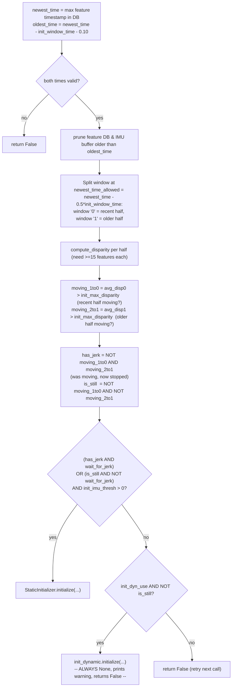
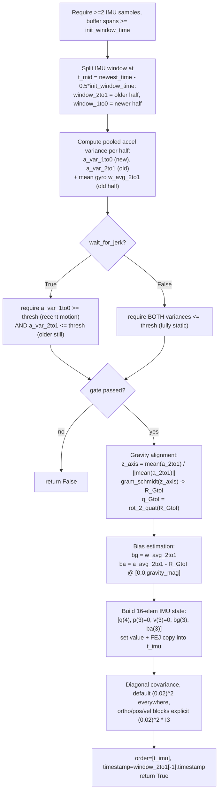

# VIO Initialization (`vio_pipeline_v2/initialize/`)

Determines the initial IMU state (orientation, gyro/accel bias, velocity,
gravity-aligned frame) before the EKF starts propagating/updating. Python
port of OpenVINS C++'s `ov_init` module.

Files: `InertialInitializerOptions.py`, `InertialInitializer.py`,
`InitailizerHelper.py` *(sic — filename typo present in the repo)*,
`static.py`, `dynamic.py`.

> **Important limitation**: `dynamic.py` is an **empty, 0-byte file**.
> Dynamic (motion-based) initialization is architecturally wired into
> `InertialInitializerOptions` and `InertialInitializer` (a full parameter
> surface exists, and the import is present but commented out) but **is not
> implemented**. Only static initialization works in this codebase today.
> See [Dynamic initialization status](#dynamic-initialization-status-unimplemented) below.

## `InertialInitializerOptions.py`

Loaded via `print_and_load_initializer(parser)`. Validates and exits(1) if
`init_max_features < 15`, if static thresholds are `≤0` while dynamic init
is disabled, or if `init_dyn_num_pose < 4`.

**Static-init parameters** (all actively used):

| Field | Default | Meaning |
|---|---|---|
| `init_window_time` | 1.0 s | Length of IMU window analyzed. |
| `init_imu_thresh` | 1.0 | Acceleration-variance threshold: moving vs still. |
| `init_max_disparity` | 1.0 | Max optical-flow disparity (px) to still call the platform stationary. |
| `init_max_features` | 50 | Feature tracks required (must be ≥15). |

**Dynamic-init parameters** (currently unused — no `DynamicInitializer`
exists to consume them):

`init_dyn_use` (default `False`), `init_dyn_mle_opt_calib`,
`init_dyn_mle_max_iter` (20), `init_dyn_mle_max_threads` (20),
`init_dyn_mle_max_time` (5.0s), `init_dyn_num_pose` (5, ≥4),
`init_dyn_min_deg` (45°, minimum total rotation before attempting dynamic
init), covariance-inflation factors
(`init_dyn_inflation_orientation/velocity/bias_gyro/bias_accel`),
`init_dyn_min_rec_cond` (1e-15, minimum reciprocal condition number for
covariance recovery), initial bias guesses `init_dyn_bias_g`/`init_dyn_bias_a`.

**Shared**: `init_calib_camImu_dt` (camera-IMU time offset),
`gravity_mag` (default 9.81 m/s²).

## `InertialInitializer.py` — top-level orchestrator

Holds a rolling IMU buffer (`self.Imu_data`), a `StaticInitializer`
instance, and — architecturally — a `DynamicInitializer` slot that is
**always `None`** in practice (`from
vio_pipeline_v2.initialize.dynamic import DynamicInitializer` is commented
out in the source).

`feed_imu(imu_msg, oldest_time)`: appends and prunes older-than-`oldest_time`
entries.

### `initialize(timestamp, covariance, order, t_imu, wait_for_jerk=True)`

`wait_for_jerk=True` (the default, "wait for a jerk that settles into
stillness") is the classic OpenVINS static-init trigger: don't initialize
the instant the platform is stationary — wait for evidence of a
motion-then-stop event, which is a stronger signal that the IMU readings
reflect genuine gravity rather than, e.g., the platform having been
stationary the whole time in a possibly-tilted resting position that hasn't
been disturbed.

A diagnostic log prints every 50th init attempt (disparities/thresholds/
state flags).

**Net effect**: dynamic initialization is fully wired at the config and
dispatch level but functionally a no-op — the pipeline only supports static
initialization (wait-until-still-after-a-jerk).

## `static.py` — `StaticInitializer` (the only active initializer)

### `initialize(timestamp, covariance, order, t_imu, wait_for_jerk=True)`

Details on each step:

1. **Windowing**: `t_start = newest_time − init_window_time`,
   `window_2to1` (older) = `[t_start, t_mid)`, `window_1to0` (newer) =
   `[t_mid, newest_time]`, `t_mid = newest_time − 0.5·init_window_time`.
2. **Variance** (scalar, pooled across 3 axes):
   `ā = mean(a_i)`, `σ = sqrt( Σ‖a_i − ā‖² / (N−1) )` — computed separately
   for each half.
3. **Gating**: mirrors `InertialInitializer`'s jerk/stillness logic, but
   re-verified here at the raw-variance level (belt-and-suspenders).
4. **Gravity alignment** (using the older, static window's mean accel —
   the assumption is the specific force sensed while stationary is
   anti-parallel/parallel to gravity in the IMU frame):
   - `z_axis = mean(a) / ‖mean(a)‖`.
   - `InitializerHelper.gram_schmidt(z_axis, Ro)` builds an orthonormal
     `R_GtoI` whose 3rd column is `z_axis` (see below) — this fixes
     roll/pitch from gravity while leaving **yaw unconstrained** (the
     classic 4-DOF-unobservable VIO initialization).
   - `q_GtoI = rot_2_quat(Ro)` (Trawny05 eq. 74, via
     [state-and-types.md](state-and-types.md)'s `quat_ops.py`).
5. **Bias estimation**:
   - Gyro bias `bg = w_avg_2to1` — since the platform is truly static, all
     measured angular rate during the old window *is* bias/noise.
   - Accel bias `ba = a_avg_2to1 − R_GtoI · [0,0,gravity_mag]ᵀ` — measured
     specific force minus the expected gravity component rotated into the
     IMU frame.
6. **State vector**: 16 elements `[q(4), p(3)=0, v(3)=0, bg(3), ba(3)]` —
   velocity and position are implicitly zero (never written, default
   `np.zeros(16)`), consistent with the stationary-at-start assumption.
7. **Initial covariance**: diagonal, default `(0.02)²` everywhere, with the
   orientation/position/velocity blocks explicitly set to `(0.02)²·I₃`
   (redundant with the default but explicit in the source).
8. Returns `timestamp = window_2to1[-1].timestamp` (end of the static
   window) and `order = [t_imu]`.

> **Outer safety net**: `VioManager.try_to_initialize` additionally rejects
> implausible results post-hoc — if `|bg| > 0.35 rad/s` or `|ba| > 3.5 m/s²`,
> it resets the IMU state to identity and marks initialization as failed
> (see [vio-manager.md](vio-manager.md)).

## `InitailizerHelper.py` — shared math helpers

Static-methods-only class (imports `ImuData` from `core`, `skew_x` from
`type`):

| Function | Purpose |
|---|---|
| `interpolate_data(imu_1, imu_2, timestamp)` | Linear interpolation of `am`/`wm` between two IMU samples using `λ = (t−t1)/(t2−t1)`. |
| `select_imu_readings(imu_data_tmp, time0, time1)` | Extracts/interpolates a sub-window `[time0, time1]`, inserting interpolated boundary samples, filtering near-duplicate timestamps (`Δt < 1e-12`). **Orphaned in the current port** — intended for dynamic-init IMU-preintegration windows, but no caller exists since dynamic init isn't implemented. |
| `gram_schmidt(gravity_inI, R_GtoI)` | Given a gravity direction in the IMU frame, builds an orthonormal `R_GtoI` (in place) whose 3rd column is the normalized gravity direction. Picks whichever of world `e1=[1,0,0]`/`e2=[0,1,0]` is *less* aligned with `z_axis` (smaller `|dot|`) to cross-product-seed `x_axis`, normalizes, then `y_axis = z_axis × x_axis`. |
| `compute_dongsi_coeff(D, d, gravity_mag)` | Computes a length-7 polynomial-coefficient array for the "Dongsi" closed-form dynamic-initialization gravity solve — see below. |

### `compute_dongsi_coeff` — present but unused

This is the single largest, most mathematically dense function in the
initialization subsystem — a degree-6 polynomial (in a Lagrange-multiplier
auxiliary variable λ) whose coefficients are enormous closed-form algebraic
expressions in the 9 entries of a 3×3 matrix `D` and 3 entries of a vector
`d`, plus the known gravity magnitude `g`.

**What it's for** (per the OpenVINS C++ `helper.h` design it mirrors): `D`
and `d` come from stacking a linear least-squares system `D·g = d` built
from multiple IMU-preintegrated relative-pose constraints across a sliding
window of camera poses (the standard "linear vision-IMU alignment" system,
as in VINS-Mono/OpenVINS dynamic init — unknowns are gravity vector `g`,
scale, and per-pose velocities, eliminated down to a reduced system in `g`
alone). Since `‖g‖ = gravity_mag` is a nonlinear constraint not naturally
satisfied by the unconstrained least-squares solution, this function forms
the Lagrangian-constrained problem and reduces it to finding roots of this
degree-6 polynomial; the smallest positive real root yielding a physically
valid gravity vector would be the answer.

**Status**: **no code in this repository calls `compute_dongsi_coeff`.**
No `DynamicInitializer` class exists to build `D`/`d` from IMU
preintegration or to consume the polynomial roots. This function is dead
code — evidence that dynamic initialization was partially ported (this one
helper) but the top-level orchestration (`dynamic.py`) was never completed.

## Dynamic initialization status (unimplemented)

Summary of what the linear/least-squares systems *would* look like, per the
config surface and the one implemented helper, versus what actually runs:

| Step | Designed for (per config/helper) | Implemented? |
|---|---|---|
| (a) Build `D·g = d` from IMU-preintegrated constraints across `init_dyn_num_pose` (≥4) poses spanning `init_dyn_min_deg` (≥45°) of rotation | ✅ config surface exists | ❌ no code builds this |
| (b) Constrained quadratic/Lagrangian refinement enforcing `‖g‖=gravity_mag`, via degree-6 polynomial root-finding | ✅ `compute_dongsi_coeff` exists | ⚠️ implemented but never called |
| (c) Optional nonlinear MLE refinement (bounded by `init_dyn_mle_max_iter`/`_max_time`/`_max_threads`, optionally also optimizing camera-IMU calibration via `init_dyn_mle_opt_calib`), covariance recovery gated by `init_dyn_min_rec_cond` | ✅ config surface exists | ❌ no code implements this |

**Practical consequence**: this codebase requires the platform to start
**genuinely stationary** (or moving-then-settling into stillness, if
`wait_for_jerk=True`). It cannot initialize while in continuous motion, and
setting `init_dyn_use: true` in a YAML config has no effect beyond printing
a warning and falling through to a failed initialization attempt.

## How initialization fits into the pipeline

`VioManager.__init__` constructs `self.initializer = InertialInitializer(
init_options, trackFEATS.get_feature_database())`.
`VioManager.feed_measurement_imu` feeds it IMU data every sample until
initialized. `VioManager.try_to_initialize` (called from
`track_image_and_update` once per camera frame while
`is_initialized_vio=False`) drives the actual `initialize()` call and
performs the bias-plausibility safety check and state catch-up described
above — see [vio-manager.md](vio-manager.md).
