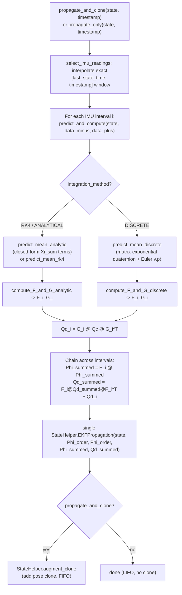

# IMU Propagation (`msckf/Propagator.py`, `msckf/NoiseManager.py`)

Propagates the EKF mean and covariance forward in time using raw IMU
(gyro/accel) measurements — the "predict" half of the filter. Runs at IMU
rate (typically 100–400 Hz), far more often than camera updates.

## `NoiseManager.py` — continuous-time IMU noise model

Container for the four IMU noise densities (continuous-time power spectral
densities), with defaults tuned for a typical MEMS IMU:

| Parameter | Default | Meaning |
|---|---|---|
| `sigma_w` | 1.6968e-4 rad/s/√Hz | Gyroscope white noise |
| `sigma_wb` | 1.9393e-5 rad/s²/√Hz | Gyroscope bias random walk |
| `sigma_a` | 2.0e-3 m/s²/√Hz | Accelerometer white noise |
| `sigma_ab` | 3.0e-3 m/s³/√Hz | Accelerometer bias random walk |

Squared values (`sigma_w_2`, etc.) are precomputed for direct use in noise
covariance matrices. `Propagator.__init__` reads these.

## The IMU kinematic model

State propagated (see [estimator-core.md](estimator-core.md) for the full
15-element IMU state layout): orientation `q` (JPL), position `p`, velocity
`v`, gyro bias `bg`, accel bias `ba`. Continuous-time kinematics:

```
q̇ = 0.5 · Ω(w) · q                (quaternion kinematics, w = true angular velocity)
ṗ = v
v̇ = R(q)^T · a − g                (a = true specific force, g = gravity vector)
ḃg = white noise (random walk)
ḃa = white noise (random walk)
```

Raw sensor measurements are corrected for bias and (optionally) intrinsic
calibration before use:

```
a_hat = R_ACCtoIMU · Da · (am − ba)
w_hat = R_GYROtoIMU · Dw · (wm − bg − Tg·a_hat)
```

where `Da`/`Dw` are 3×3 shape/scale matrices (from `State.Dm`), `Tg` is the
gravity-sensitivity coupling matrix (from `State.Tg`), and
`R_ACCtoIMU`/`R_GYROtoIMU` are axis-misalignment rotations — all optionally
estimated online if `do_calib_imu_intrinsics`/`do_calib_imu_g_sensitivity`.

## `Propagator.py` — `Propagator`

### IMU buffer management

- `feed_imu(message, oldest_time)`: appends a raw `ImuData` sample, prunes
  anything older than `oldest_time − 0.10s`.
- `select_imu_readings(imu_data, time0, time1, warn)`: extracts the exact
  `[time0, time1]` sub-sequence, **linearly interpolating** boundary samples
  (`interpolate_data`) so integration always starts/ends exactly at the
  requested times; strips zero-`dt` duplicate timestamps.

### Two propagation entry points



| Method | Effect |
|---|---|
| `propagate_and_clone(state, timestamp)` | Propagate mean+covariance to `timestamp` (accounting for camera-IMU time offset `t_off`), then `StateHelper.augment_clone` — the normal "FIFO" per-frame path. |
| `propagate_only(state, timestamp)` | Same propagation math, **no cloning** — used in "LIFO"/hovering mode where the clone window is frozen (see [vio-manager.md](vio-manager.md#hovering-detection-fifolifo-state-machine)). |

Both may span **multiple IMU intervals** between the last state timestamp
and the target timestamp. Each interval's `(F_i, Qd_i)` from
`predict_and_compute` is chained:

```
Phi_summed = F_i @ Phi_summed
Qd_summed  = F_i @ Qd_summed @ F_i^T + Qd_i     # discrete Lyapunov-style accumulation
```

then a **single** `StateHelper.EKFPropagation(state, Phi_order, Phi_order,
Phi_summed, Qd_summed)` call applies the accumulated transition to the
covariance — not one call per IMU sample. `Phi_order = [imu]` plus,
if enabled, `[dw, da, (tg), GYROtoIMU-or-ACCtoIMU]` — i.e. the process model
covers IMU state + IMU intrinsic calibration only. Camera
extrinsics/intrinsics/time-offset are **not** part of the process model and
are untouched by propagation (they only change during measurement updates).

### `predict_and_compute(state, data_minus, data_plus)` — single-interval step

Corrects raw gyro/accel (midpoint-averaged between the two IMU samples) as
shown above, then dispatches on `state._options.integration_method`:

**Mean prediction** — one of three schemes:

- **`predict_mean_analytic`** (used with `RK4`/`ANALYTICAL` methods): uses
  closed-form "`Xi_sum`" integral terms (`Xi_1..Xi_4`, `R_ktok1`,
  `Jr_ktok1`) computed by `compute_Xi_sum` — Rodrigues-style closed-form
  integrals of rotation over the interval, giving exact bias-Jacobians
  (RPNG-style analytical IMU propagation). Has a general closed-form branch
  and a Taylor small-angle branch (`w_norm < 0.5°/step`) to avoid
  near-zero division:
  ```
  new_q = q_ktok1 ⊗ q_k
  new_v = v_k + R_k^T · Xi_1 · a_hat − g·dt
  new_p = p_k + v_k·dt + R_k^T · Xi_2 · a_hat − 0.5·g·dt²
  ```
- **`predict_mean_rk4`**: standard 4th-order Runge-Kutta integrating
  `q̇ = 0.5·Ω(w)·q`, `ṗ = v`, `v̇ = R^T·a − g`, linearly interpolating `w`,
  `a` between the two IMU samples for the K2/K3 midpoint evaluations.
- **`predict_mean_discrete`**: zeroth/first-order discrete integration —
  closed-form quaternion update via matrix exponential of `Ω(w)`, Euler
  integration for `v`, `p`.

**Jacobians** — `F` (state transition) and `G` (noise Jacobian), sized
`(15 + imu_intrinsic_size) × (15 + imu_intrinsic_size)` and
`(15+extra) × 12` respectively:

- `compute_F_and_G_analytic` (RK4/ANALYTICAL) or `compute_F_and_G_discrete`
  (DISCRETE) populate blocks for `θ, p, v, bg, ba`, and — if calibration
  enabled — `Dw, Da, Tg`, misalignment rotation, following the standard
  OpenVINS RPNG-model IMU-intrinsic Jacobian derivations, using
  `dR_ktok1 = R_{k+1}·R_k^T`, `Jr_ktok1` (right-Jacobian of `SO(3)` log of
  the delta rotation), and skew-symmetric cross terms
  (`compute_H_Dw`, `compute_H_Da`, `compute_H_Tg`).

**Discrete process noise**:

```
Qc = diag( sigma_w²/dt,  sigma_a²/dt,  sigma_wb²/dt,  sigma_ab²/dt )   # continuous-time PSD
Qd = G · Qc · G^T                                                       # discretized (Van Loan method)
```

symmetrized before use. Updates `state._imu`'s value and FEJ copy
(quaternion, position, velocity) in place; returns `(F, Qd)` for chaining
across multi-interval propagation.

### `fast_state_propagate` — lightweight preview propagation

A cheap "preview" used for visualization/latency compensation — propagates
a **cached copy** of the IMU mean + 15×15 covariance forward using simple
midpoint discrete integration (its own local `F`, `G`, `Qc`, **not** reusing
`predict_and_compute`), without touching the real filter `state`. Caches
intermediate results (`cache_state_est`, `cache_state_covariance`) to
amortize cost across repeated calls at increasing timestamps. Returns a
13-vector `[q, p, v_local, w_local]` and a 12×12 covariance (velocity
transformed to the body/local frame) — this is exactly what `main.py`
publishes on the fast `~odomimu` ROS topic at full IMU rate (see
[ros-integration.md](ros-integration.md)).

### Calibration Jacobian helpers

`compute_H_Dw`, `compute_H_Da` (Jacobian of the `D`-matrix multiplication
w.r.t. the 6 shape/scale parameters, layout depends on KALIBR vs RPNG
model), `compute_H_Tg` (Jacobian w.r.t. the 9 gravity-sensitivity
parameters, linear in `a_hat`).

`interpolate_data`: static linear interpolation of `wm`/`am` between two IMU
samples at a target time — used both here and in
[initialization.md](initialization.md)'s `InitializerHelper`.

## Where propagation fits in the per-frame loop

Every raw IMU message: `Propagator.feed_imu` buffers it (see
[vio-manager.md](vio-manager.md#feed_measurement_imumessage)). Every camera
frame: `VioManager.do_feature_propagate_update` calls
`propagate_and_clone` (FIFO) or `propagate_only` (LIFO/hovering) exactly
once before dispatching to the updaters — see
[vio-manager.md](vio-manager.md).
