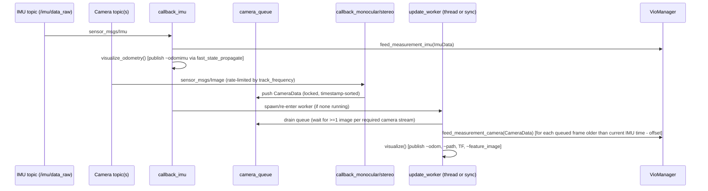

# ROS1 Integration (`vio_pipeline_v2/main.py`)

`main.py` is **not** a standalone dataset-replay script — it is a ROS1 node
wrapper (`RosVioManager`) around the core `VioManager` estimator (see
[vio-manager.md](vio-manager.md)). It requires `rospy`, `cv2`,
`message_filters`, `tf`, `cv_bridge`, and standard ROS message types
(`sensor_msgs/Image`, `sensor_msgs/Imu`, `nav_msgs/Odometry`,
`nav_msgs/Path`, `geometry_msgs/PoseStamped`).

Architecture explicitly mirrors OpenVINS C++'s `ROS1Visualizer`.

## Program entry point

```python
if __name__ == '__main__':
    RosVioManager()
    rospy.spin()
```

## `RosVioManager.__init__`

1. `rospy.init_node('openvins_python')`.
2. Loads config directory — default `<main.py dir>/config/Custom_v1`,
   overridable via ROS param `~config_path` — via
   `ConfigLoader.load_all(config_path)` (see [configuration.md](configuration.md))
   → `self.options`.
3. Constructs `self.vio_manager = VioManager(self.options)` — the actual
   estimator (propagator, trackers, updaters, `InertialInitializer` are all
   built inside `VioManager.__init__`).
4. Sets up `CvBridge`, a thread-safe `camera_queue` (`deque`) +
   `camera_queue_mtx` lock, a `thread_update_running` flag, and
   per-camera rate-limiting state (`camera_last_timestamp`).
5. **Publishers**: `~odomimu` (fast-propagated odometry at IMU rate),
   `~odom` (post-update odometry), `~path`, `~feature_image`; plus a TF
   broadcaster.
6. **Subscribers**: IMU topic `~topic_imu` (default `/imu/data_raw`) →
   `callback_imu`; camera topic(s) — if `options.use_stereo`, uses
   `message_filters.ApproximateTimeSynchronizer` on `cam0`/`cam1` topics
   (slop 0.05s) → `callback_stereo`; else single `cam0` topic →
   `callback_monocular`.

## Runtime data flow



- **`callback_imu`** is the main driver, invoked at IMU rate:
  1. Converts ROS `Imu` → `ImuData(timestamp, wm, am)`.
  2. `vio_manager.feed_measurement_imu(imu_data)` — internally routes to
     the propagator, `InertialInitializer.feed_imu`, and ZUPT detection
     (see [vio-manager.md](vio-manager.md)).
  3. `visualize_odometry(timestamp)` — publishes fast-propagated pose at
     full IMU rate via `propagator.fast_state_propagate` (see
     [propagation.md](propagation.md)).
  4. If no image-processing worker thread is currently running, spawns/
     re-enters `update_worker()` — either synchronously or on a daemon
     thread depending on `params.use_multi_threading_subs` — which drains
     `camera_queue` (locked by `camera_queue_mtx`), waiting until at least
     one image from each required camera stream is queued, then feeds each
     queued `CameraData` older than the current IMU time (adjusted by the
     camera-IMU time offset) into `vio_manager.feed_measurement_camera`
     followed by `self.visualize()`.

- **`callback_monocular` / `callback_stereo`**: only rate-limit (via
  `track_frequency`), convert images (`cv_bridge`, mono8), build a
  `CameraData` (with optional per-camera masks from `params.masks`), and
  push into the locked, timestamp-sorted `camera_queue`. **No VIO
  processing happens directly in these callbacks** — processing is
  deferred to the IMU-triggered worker thread. This design keeps camera
  callbacks lightweight and ensures IMU data always drives the actual
  estimator update timing.

- **`visualize_odometry`**: only runs if `vio_manager.initialized()` is
  `True`; calls `propagator.fast_state_propagate` to get a 13-vector
  `[q(4),p(3),v_local(3),w(3)]` and a 12×12 covariance, republishes as ROS
  `Odometry` on `~odomimu` (only if there are subscribers), remapping the
  12×12 covariance block order into ROS's 6×6 pose-covariance layout.

- **`visualize`** — full post-update visualization:
  - Broadcasts TF `global → body`.
  - Publishes `~odom` (position/orientation from `state._imu`, converted to
    ROS quaternion convention by **negating x/y/z** — this is the
    JPL→Hamilton quaternion convention conversion, see
    [state-and-types.md](state-and-types.md#jplquatpy--orientation-jpl-convention)).
  - Appends to and republishes `~path` (capped at 5000 poses).
  - Publishes the feature-tracking debug image
    (`vio_manager.get_historical_viz_image()`) on `~feature_image`.

## Topics summary

| Topic | Direction | Type | Notes |
|---|---|---|---|
| `~topic_imu` (default `/imu/data_raw`) | Subscribe | `sensor_msgs/Imu` | Drives the whole pipeline's timing |
| `cam0` (and `cam1` if stereo) | Subscribe | `sensor_msgs/Image` | Rate-limited by `track_frequency` |
| `~odomimu` | Publish | `nav_msgs/Odometry` | Fast, IMU-rate propagated-only pose |
| `~odom` | Publish | `nav_msgs/Odometry` | Post-update (camera-corrected) pose |
| `~path` | Publish | `nav_msgs/Path` | Trajectory history, capped at 5000 poses |
| `~feature_image` | Publish | `sensor_msgs/Image` | Tracked-feature debug visualization |
| TF | Broadcast | `global -> body` | |

## ROS params

| Param | Default | Purpose |
|---|---|---|
| `~config_path` | `<main.py dir>/config/Custom_v1` | Which config profile to load (see [configuration.md](configuration.md)) |
| `~topic_imu` | `/imu/data_raw` | IMU topic name |

## How this connects

`main.py` is purely the ROS transport/visualization glue — all actual
estimation happens inside `VioManager` (see [vio-manager.md](vio-manager.md)),
which internally drives `InertialInitializer.initialize` (static init, see
[initialization.md](initialization.md)) until `is_initialized_vio` becomes
`True`, after which `do_feature_propagate_update` runs the full MSCKF
track/update pipeline every frame.
