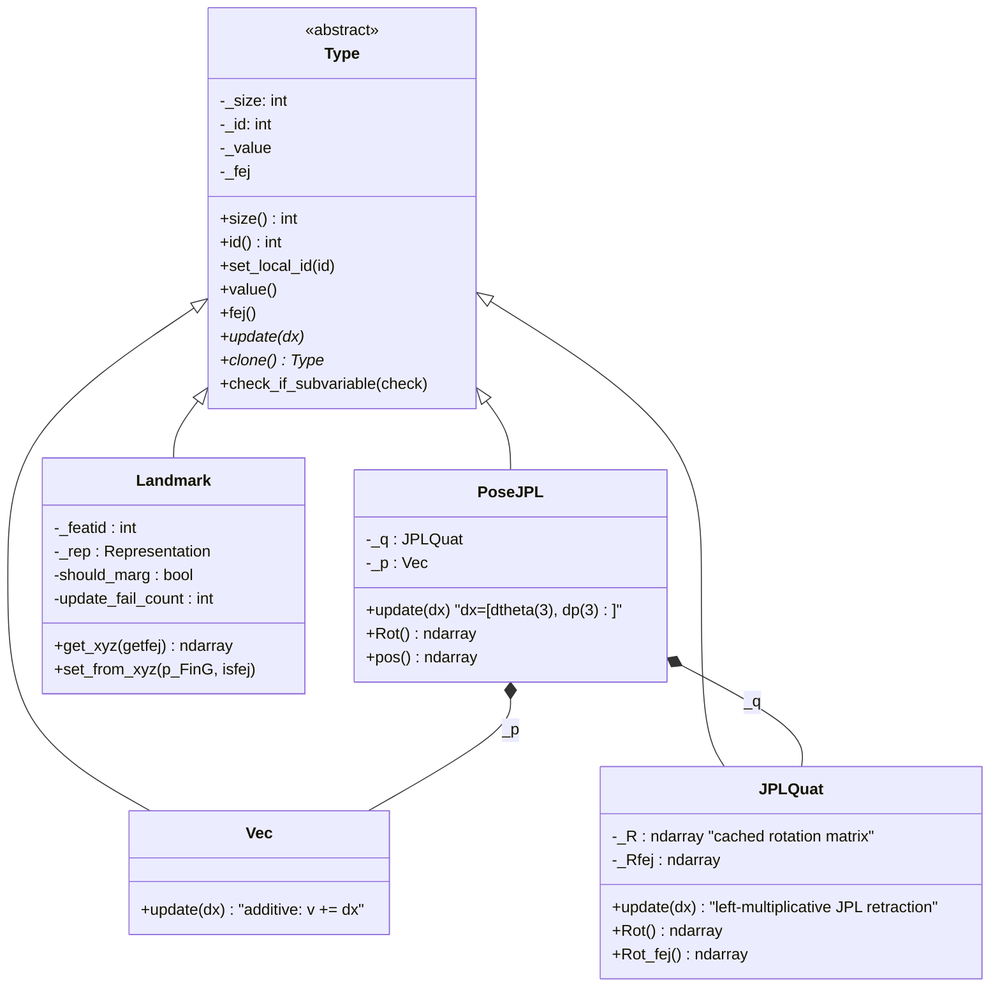

# State & Type System (`vio_pipeline_v2/type/`)

This module defines the primitive building blocks of the EKF's error-state
vector: how orientation, position, velocity, biases, calibration parameters,
and 3D landmarks are represented, stored, and updated on their respective
manifolds. Every quantity the filter estimates is a subclass of `Type`.

Files covered: `Type.py`, `Vec.py`, `JPLQuat.py`, `PoseJPL.py`,
`quat_ops.py`, `Landmark.py`, `LandmarkRepresentation.py`.

## Why a manifold type system

The EKF does not store or update state variables as flat numbers. Some
quantities (orientation) live on a manifold (`SO(3)`) where naive additive
updates are invalid — you cannot add two rotation matrices and get a
rotation matrix. The `Type` hierarchy solves this by giving every state
variable:

- a **storage value** (`_value` — the "on-manifold" representation, e.g. a
  4-vector quaternion),
- an **error-state size** (`size()` — the *tangent-space* dimension used in
  the covariance matrix, e.g. 3 for orientation even though storage is 4),
- an **update rule** (`update(dx)` — how a small tangent-space perturbation
  `dx` is composed onto the current value, i.e. the manifold retraction),
- a **first-estimate copy** (`_fej` — see FEJ note below),
- an **`_id`** — the variable's starting row/column offset inside the
  filter's single global covariance matrix.



## `Type.py` — abstract base

Constructor: `Type(size_)` stores the tangent-space `_size`, defaults
`_id = -1` (meaning "not currently allocated a slot in the covariance
matrix").

Key methods:

| Method | Purpose |
|---|---|
| `set_local_id(new_id)` / `id()` | Get/set the variable's starting offset into the global covariance matrix. `-1` = not in the filter. |
| `size()` | Tangent-space (error-state) DOF — this is what determines how many rows/cols the variable occupies in the covariance matrix, **not** the storage dimension. |
| `update(dx)` | Abstract. Applies a manifold retraction: given an error-state perturbation `dx` of length `size()`, produce the new on-manifold value. |
| `value()` / `fej()` | Current estimate / first-estimate value accessors, with shape assertions. |
| `clone()` | Abstract. Deep copy — used when the MSCKF sliding window clones the current IMU pose into a new state variable (see [estimator-core.md](estimator-core.md)). |
| `check_if_subvariable(check)` | Default `None`. Composite types (`PoseJPL`) override this so the state manager can identify whether a `Type` reference being marginalized is actually a sub-component (the quaternion or position half) of a composite pose. |

### First-Estimates Jacobians (FEJ)

`_fej` is a second, frozen copy of the value, captured the moment a variable
first participates in a Jacobian linearization. Re-linearizing an EKF at the
*current* (post-update) estimate on every step is a well-known source of
spurious observability gain in EKF-SLAM/MSCKF (the filter becomes
overconfident because the same information is "used twice" through slightly
different linearization points). FEJ fixes the linearization point for
certain Jacobian blocks to the estimate at first use, while residuals are
still computed from the current best estimate. This is controlled globally
by `StateOptions.do_fej` and is consumed throughout `msckf/updater_helper.py`
and `msckf/UpdaterSLAM.py`'s anchor-change logic (see
[updaters.md](updaters.md)).

## `Vec.py` — Euclidean vector variable

`Vec(dim)` — plain `R^n` state block, used for velocity, gyro/accel biases,
IMU intrinsic scale/misalignment vectors, and camera-IMU time offset.

- `update(dx)`: standard Euclidean addition — `v_new = v_old + dx`. No
  manifold structure needed.
- `clone()`: deep copy of `_value`/`_fej`.

## `JPLQuat.py` — orientation (JPL convention)

Storage: 4-vector `[x, y, z, w]` (vector part first, scalar last).
Error-state size: **3** (an `so(3)` rotation vector).

This codebase uses the **JPL quaternion convention** (Trawny & Roumeliotis,
*"Indirect Kalman Filter for 3D Attitude Estimation"*, 2005 — referred to as
"Trawny05b" throughout the source), **not** the Hamilton convention used by
most robotics libraries (Eigen, ROS `tf`, scipy). JPL and Hamilton
quaternions differ in multiplication order and how they compose rotations —
mixing the two conventions silently produces wrong results. This is why the
codebase carries its own quaternion math (`quat_ops.py`) rather than using a
general-purpose library, and it is the single most important convention to
respect if you extend this code. `main.py`'s ROS visualization code
explicitly negates x/y/z components when publishing to ROS `Odometry`
messages specifically to convert JPL → Hamilton for RViz/`tf` consumers.

**Update rule** (`update(dx)`, `dx` = 3-vector rotation perturbation):

```
dq      = quatnorm([0.5 * dx, 1])        # small-angle perturbing quaternion
q_new   = quat_multiply(dq, q_old)       # LEFT multiplication (JPL convention)
```

This implements the local error definition `δq ≈ [0.5·δθ; 1]`,
`q_new = δq ⊗ q_old`.

Rotation matrices are cached (`_R` from `_value`, `_Rfej` from `_fej`) so
repeated `Rot()`/`Rot_fej()` calls are O(1) rather than recomputing the
conversion every access — recomputed only inside `set_value`/`set_fej`.

## `PoseJPL.py` — composite 6-DOF pose

Composes one `JPLQuat` (`_q`) + one `Vec(3)` (`_p`). Total error-state size
= 6. Storage = 7-vector `[qx,qy,qz,qw, px,py,pz]`.

**Error-state layout convention** (set in `set_local_id`): orientation error
occupies `[id, id+3)`, position error occupies `[id+3, id+6)` — orientation
always comes first. This ordering is threaded through every Jacobian in
`msckf/updater_helper.py` and `msckf/Propagator.py` and must be preserved by
anyone adding new pose-like state.

`update(dx)` with `dx = [dtheta(3), dp(3)]`:

```
dq       = quatnorm([0.5*dtheta, 1])
q_new    = quat_multiply(dq, q_old)      # same JPL left-multiply as JPLQuat
p_new    = p_old + dp                    # simple additive
```

Used for: the IMU/body pose, every MSCKF sliding-window pose **clone**, and
camera-to-IMU extrinsic calibration (`do_calib_camera_pose`).

`check_if_subvariable(check)` returns `_q` or `_p` if `check` is either
sub-object — this lets `state_helper.marginalize` correctly identify and
remove a composite pose when given a pointer to one of its halves.

## `quat_ops.py` — JPL quaternion / Lie-algebra math library

Ported from OpenVINS C++'s `quat_ops.h`. All formula numbers below refer to
Trawny & Roumeliotis 2005.

| Function | Formula / role |
|---|---|
| `skew_x(w)` | `[w]_×`, the 3×3 skew-symmetric ("hat") matrix of a 3-vector. |
| `quat_2_Rot(q)` | Eq. 62: `R = (2w²−1)·I − 2w·[v]_× + 2·v·vᵀ`, `q=[v;w]`. **JPL** form — differs from Hamilton by transpose/sign convention. |
| `rot_2_quat(R)` | Eq. 74 (Shepperd's method): rotation matrix → JPL quaternion, branching on the largest diagonal term for numerical stability; enforces `w ≥ 0` (unique double-cover representative) and renormalizes. |
| `quat_multiply(q, p)` | Eq. 9: JPL product `q ⊗ p` via the 4×4 left-multiplication matrix `Qm = [[wI−[v]_×, v], [−vᵀ, w]]`, result `= Qm @ p`, renormalized with `w ≥ 0`. |
| `vee(w_x)` | Inverse of `skew_x` — extracts the 3-vector from a skew matrix. |
| `exp_so3(w)` / `log_so3(R)` | `SO(3)` exponential (Rodrigues' formula) / logarithm, with small-angle Taylor fallbacks near `θ≈0` and a numerically robust branch near `θ≈π` (trace ≈ −1). |
| `exp_se3(vec)` / `log_se3(T)` / `hat_se3(v)` / `Inv_se3(T)` | Full `SE(3)` exponential/log/hat/inverse (6-vector `[ω;u]` ↔ 4×4 homogeneous transform), using `V = I + B[w]_× + C[w]_ײ` for the translation block. |
| `Inv(q)` | JPL quaternion inverse = conjugate (negate vector part) since all quaternions used are unit-norm. |
| `Omega(w)` | `Ω(ω) = [[−[w]_×, w], [−wᵀ, 0]]`, the 4×4 matrix in the continuous-time quaternion kinematic ODE `q̇ = 0.5·Ω(ω)·q` — used by `Propagator.py`'s discrete/analytic integration. |
| `quatnorm(q)` | Normalize + enforce `w ≥ 0`. |
| `Jl_so3(w)` / `Jr_so3(w)` | Left/right Jacobians of `SO(3)`; `Jr(w) = Jl(−w)`. Used in IMU-propagation Jacobian construction. |
| `rot2rpy(R)`, `rot_x/y/z(t)` | Euler-angle extraction (`R = Rz(yaw)·Ry(pitch)·Rx(roll)`) and elementary axis rotations — used for logging/visualization and calibration-guess conversion. |

## `LandmarkRepresentation.py` — landmark parameterization enum

Static-only namespace class (not instantiable) defining
`Representation`, an enum of 7 values:

| Value | Meaning |
|---|---|
| `GLOBAL_3D` | Raw XYZ in the global frame. |
| `GLOBAL_FULL_INVERSE_DEPTH` | Spherical inverse depth `(θ, φ, ρ)` in the global frame. |
| `ANCHORED_3D` | Raw XYZ, expressed relative to an anchor camera pose. |
| `ANCHORED_FULL_INVERSE_DEPTH` | Spherical inverse depth, anchor-relative. |
| `ANCHORED_MSCKF_INVERSE_DEPTH` | `(x/z, y/z, 1/z)` in the anchor frame — the classic MSCKF anchored inverse-depth parameterization. |
| `ANCHORED_INVERSE_DEPTH_SINGLE` | Scalar inverse depth `ρ` only — bearing direction frozen at initialization. |
| `UNKNOWN` | Sentinel/error value. |

`is_relative_representation(rep)` returns `True` for any `ANCHORED_*`
variant — these require the anchor pose's Jacobian to be chained in via
`get_feature_jacobian_representation` (see [updaters.md](updaters.md)).
`as_string()`/`from_string()` convert to/from the YAML config strings (e.g.
`feat_rep_msckf: "GLOBAL_3D"` in `estimator_config.yaml`).

## `Landmark.py` — 3D feature point state variable

`Landmark(size, rep=GLOBAL_3D)`: `size` is 3 for all representations except
`ANCHORED_INVERSE_DEPTH_SINGLE` (size 1). Extra bookkeeping fields:

- `_featid` — unique feature ID (see [cameras-and-tracking.md](cameras-and-tracking.md)).
- `_unique_camera_id` — anchor camera ID.
- `should_marg` — flag set by `VioManager` when this landmark is no longer
  observed and is scheduled for marginalization.
- `update_fail_count` — consecutive chi-square-gate failures; landmarks that
  fail repeatedly get dropped (see `msckf/UpdaterSLAM.update`).
- `uv_norm_zero` / `uv_norm_zero_fej` — cached anchor-frame bearing vector,
  used only by `ANCHORED_INVERSE_DEPTH_SINGLE` since that representation
  does not store bearing in its 1-element state.

`update(dx)` is a plain additive update on whatever the internal
representation vector is — the *nonlinear* mapping to/from Cartesian XYZ is
handled separately so the rest of the pipeline never needs to know which
representation is active:

**`get_xyz(getfej=False)`** — internal state → XYZ:

```
GLOBAL_3D / ANCHORED_3D:
    xyz = value                                     (identity)

GLOBAL_FULL_INVERSE_DEPTH / ANCHORED_FULL_INVERSE_DEPTH:
    state = [theta, phi, rho]
    x = (1/rho) * cos(theta) * sin(phi)
    y = (1/rho) * sin(theta) * sin(phi)
    z = (1/rho) * cos(phi)

ANCHORED_MSCKF_INVERSE_DEPTH:
    state = [x/z, y/z, 1/z]
    z = 1 / state[2]
    xyz = z * [state[0], state[1], 1]

ANCHORED_INVERSE_DEPTH_SINGLE:
    state = [rho]                                    (1-DOF)
    xyz = (1/rho) * uv_norm_zero                      (frozen bearing)
```

**`set_from_xyz(p_FinG, isfej=False)`** — the inverse, used once at
initialization time immediately after `FeatureInitializer` produces a
Cartesian triangulation (see [triangulation.md](triangulation.md)):

```
Spherical inverse-depth:  rho = 1/||p||, phi = acos(rho*z), theta = atan2(y,x)
MSCKF inverse-depth:      [x/z, y/z, 1/z]
Single inverse-depth:     rho = 1/z   (and caches bearing = (1/z)*p into uv_norm_zero)
```

`getfej`/`isfej` select between the current estimate and the FEJ-frozen
estimate throughout, so Jacobians can be linearized at a consistent point.

## How this module connects to the rest of the pipeline

- `msckf/State.py` (see [estimator-core.md](estimator-core.md)) constructs
  the actual filter state as an ordered list of `Type` objects (`IMU`,
  `PoseJPL` clones, `Landmark`s, calibration `Vec`/`PoseJPL`s), and owns the
  single dense covariance matrix these objects index into via `_id`.
- `msckf/state_helper.py`'s `clone`, `marginalize`, and `initialize`
  operate generically on any `Type` through this shared interface —
  they never need to know the concrete subclass.
- `core/feature_initializer.py` triangulates in raw Cartesian XYZ and hands
  off to `Landmark.set_from_xyz` to seed whatever representation the config
  (`feat_rep_msckf`/`feat_rep_slam`/`feat_rep_aruco`) selected.
- `msckf/updater_helper.py`'s Jacobian construction is representation-aware
  through `Landmark.get_xyz` and per-representation Jacobian formulas — see
  [updaters.md](updaters.md).
