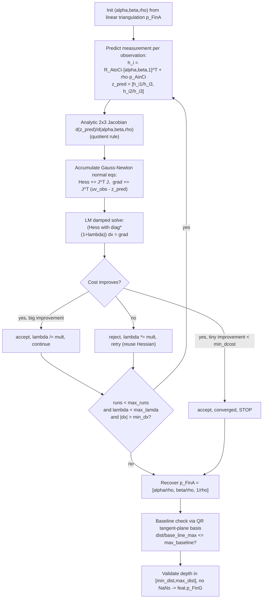

# Feature Triangulation (`core/feature_initializer.py`)

Converts a `Feature`'s multi-view 2D pixel observations into a 3D position,
first via closed-form linear least-squares, then (optionally) refined by
Levenberg-Marquardt nonlinear optimization. This is the geometric heart that
turns image tracks into landmarks the EKF can use — closely mirrors OpenVINS
C++'s `FeatureInitializer`.

Files: `feature_initializer.py` (`FeatureInitializer`),
`feat_initializer_options.py` (`FeatureInitializerOptions`).

## Configuration (`FeatureInitializerOptions`)

Loaded from YAML keys prefixed `fi_*` (e.g. `fi_max_dist: 10.0` in
`kaist_vio/estimator_config.yaml`):

| Field | Default | Meaning |
|---|---|---|
| `triangulate_1d` | `False` | Use 1D (bearing-fixed, depth-only) triangulation instead of full 3D. |
| `refine_features` | `True` | Run Gauss-Newton/LM refinement after the linear solve. |
| `max_runs` | 5 | Max LM iterations. |
| `init_lamda` | 1e-3 | Initial LM damping factor. |
| `max_lamda` | 1e10 | LM damping ceiling — exceeding this aborts refinement. |
| `min_dx` | 1e-6 | Convergence: minimum step norm. |
| `min_dcost` | 1e-6 | Convergence: minimum relative cost improvement. |
| `lam_mult` | 10.0 | LM damping multiplier (increase on reject, decrease on accept). |
| `min_dist` / `max_dist` | 0.10 / 60.0 m | Acceptable depth range (anchor frame) — outside this the point is rejected as degenerate. |
| `max_baseline` | 40.0 | Max depth-to-baseline ratio — insufficient parallax relative to depth is geometrically ill-conditioned and rejected. |
| `max_cond_number` | 10000.0 | Max condition number of the linear normal-equations matrix — high condition number ⇒ near-degenerate geometry (e.g. nearly-parallel rays). |

## Linear triangulation: `single_triangulation(feat, clonesCAM)`

Standard multi-view DLT-style least-squares, solved in an **anchor frame**
rather than the global frame (numerically better-conditioned, and matches
the anchored `LandmarkRepresentation`s used downstream).

1. **Pick the anchor**: the camera/timestamp pair with the *most*
   observations of this feature becomes `(anchor_cam_id,
   anchor_clone_timestamp)`.
2. For every observation `(cam_id, timestamp)`:
   - Fetch clone pose `(R_GtoCi, p_CiinG)` from `clonesCAM[cam_id][timestamp]`.
   - `R_AtoCi = R_GtoCi @ R_GtoA.T`, `p_CiinA = R_GtoA @ (p_CiinG − p_AinG)`
     — express camera `Ci` relative to the anchor frame `A`.
   - Rotate the observed normalized bearing `b_i = [u_n, v_n, 1]` into the
     anchor frame: `b_i ← normalize(R_AtoCi.T @ b_i)`.
   - Build the perpendicular projector `Bperp = skew_x(b_i)` — projects any
     vector onto the plane orthogonal to the bearing ray. The true point
     `p_f` (in frame A) must satisfy `Bperp @ (p_f − p_CiinA) ≈ 0`, i.e. it
     lies on the ray.
   - Accumulate normal equations: `Ai = Bperp.T @ Bperp`; `A += Ai`;
     `b += Ai @ p_CiinA`.
3. **Solve** `A @ p_f = b` (`np.linalg.solve`) — the closed-form
   least-squares intersection point of all observation rays, in the anchor
   frame.
4. **Validate**: condition number of `A` (via SVD, `S[0]/S[-1]`) must be
   `≤ max_cond_number`; forward depth `p_f[2]` (anchor-frame z) must be in
   `[min_dist, max_dist]`; result must be finite.
5. Store `feat.p_FinA = p_f` and `feat.p_FinG = R_GtoA.T @ p_f + p_AinG`.

## 1D triangulation: `single_triangulation_1d(feat, clonesCAM)`

A cheaper variant: fixes the bearing direction to the **anchor
observation's** bearing and solves only for a scalar depth along that fixed
ray (rather than a free 3D point). Enabled via `triangulate_1d: true`.

1. Same anchor selection; `bearing_inA` = normalized anchor bearing.
2. For every non-anchor observation, same relative geometry
   (`R_AtoCi`, `p_CiinA`) and bearing `b_i` as above, `Bperp = skew_x(b_i)`.
3. Scalar normal equation:
   `s = Bperp @ bearing_inA` (a 3-vector);
   `A_scalar += s·s` (accumulated as a scalar via dot product);
   `b_scalar += s · (Bperp @ p_CiinA)`.
4. `depth = b_scalar / A_scalar`; `p_f = depth * bearing_inA`.
5. Same distance-range checks (no condition-number check — it's a scalar
   solve). Store `p_FinA`/`p_FinG` identically.

## Nonlinear refinement: `single_gaussnewton(feat, clonesCAM)`

Levenberg-Marquardt refinement in the **MSCKF anchored inverse-depth**
parameterization `(α, β, ρ) = (x/z, y/z, 1/z)` (anchor frame), minimizing
total reprojection error across all observations.

Details:

1. **Initialize** `rho = 1/p_FinA[2]`, `alpha = p_FinA[0]*rho`,
   `beta = p_FinA[1]*rho` from the linear-triangulation result.
2. **LM loop** (damping `lam` starts at `init_lamda`; stop when
   `lam > max_lamda` or step norm `< min_dx` or `runs ≥ max_runs`):
   - Predicted measurement per observation:
     `h_i = R_AtoCi @ [α, β, 1]ᵀ + ρ·p_AinCi`, where
     `p_AinCi = −R_AtoCi @ p_CiinA`; `z_pred = [h_i1/h_i3, h_i2/h_i3]`.
   - Analytic 2×3 Jacobian of `z_pred` w.r.t. `(α, β, ρ)` via the quotient
     rule.
   - Residual `res = uv_norm_obs − z_pred`; accumulate
     `Hess += JᵀJ`, `grad += Jᵀ·res`.
   - Damped step: scale `Hess`'s diagonal by `(1+lam)`, solve
     `Hess_l @ dx = grad`.
   - Evaluate candidate cost via `compute_error` (sum of squared residuals
     at the trial point). Standard LM accept/reject:
     - Cost improves & relative improvement `< min_dcost` → accept, **stop**
       (converged).
     - Cost improves → accept, `lam /= lam_mult`, `runs += 1`.
     - Cost doesn't improve → reject, `lam *= lam_mult`, retry (Hessian not
       recomputed).
3. **Recover Cartesian**: `p_FinA = [α/ρ, β/ρ, 1/ρ]`.
4. **Baseline/parallax check**: builds an orthonormal tangent-plane basis
   `Q_tangent` (QR decomposition of `p_FinA`, columns orthogonal to the ray
   direction), finds `base_line_max = max_i ‖Q_tangentᵀ @ p_CiinA‖` across
   observing clones — a proxy for how much the cameras deviated
   perpendicular to the feature ray (parallax).
5. **Final validity**: depth `p_FinA[2] ∈ [min_dist, max_dist]`;
   `‖p_FinA‖ / base_line_max ≤ max_baseline` (rejects near-parallel-ray,
   low-parallax triangulations); no NaNs. On success, sets `feat.p_FinG`.

`compute_error(clonesCAM, feat, alpha, beta, rho)`: helper reused inside the
LM loop, sums `Σ‖uv_norm − z_pred‖²` over all observations for a candidate
parameter set, with a large penalty (`1e9`) if a point projects behind the
camera (`h_i3 == 0`).

## Where triangulation is called from

`UpdaterMSCKF.update` and `UpdaterSLAM.delayed_init` (see
[updaters.md](updaters.md)) both call `single_triangulation` /
`single_triangulation_1d` followed by `single_gaussnewton` (if
`refine_features`) on every candidate feature before building EKF
measurement Jacobians. The resulting `feat.p_FinA`/`feat.p_FinG` is handed
to `Landmark.set_from_xyz` (see [state-and-types.md](state-and-types.md))
to seed the landmark's internal representation.
