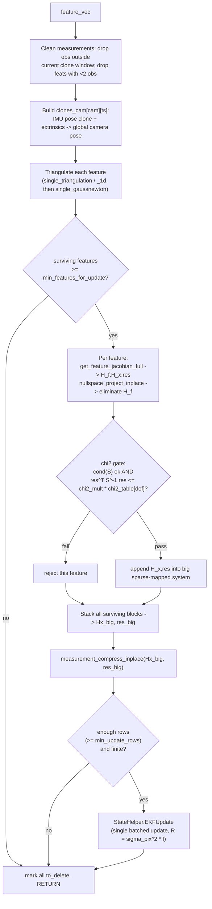

# Measurement Updaters (`msckf/updater_helper.py`, `UpdaterMSCKF.py`, `UpdaterSLAM.py`, `UpdaterOptions.py`)

Turns triangulated visual features into EKF corrections. Two distinct
update strategies exist because MSCKF landmarks and SLAM landmarks are
treated fundamentally differently:

- **MSCKF features** (`UpdaterMSCKF`): triangulated, used for one batched
  update, then **discarded** (never enter the state/covariance). This is
  the classic Mourikis & Roumeliotis "multi-state constraint" trick — you
  get the informational benefit of the feature without ever carrying its
  3D position (and its associated uncertainty) in the filter.
- **SLAM features** (`UpdaterSLAM`): triangulated once, then **kept** as a
  persistent `Landmark` state variable (see
  [state-and-types.md](state-and-types.md)) via delayed initialization, and
  updated like any other state block on subsequent frames. Used for
  long-lived, high-quality tracks and ArUco tags.

## `UpdaterOptions.py`

Shared config, instantiated separately for MSCKF/SLAM/ArUco/ZUPT:

| Field | Default | Meaning |
|---|---|---|
| `chi2_multipler` | 5.0 | Multiplier on the χ² 0.95-quantile gate — how lenient outlier rejection is. |
| `sigma_pix` | 1.0 | Raw pixel measurement noise std-dev. |
| `sigma_pix_sq` | (derived) | `sigma_pix²`. |
| `min_features_for_update` | 3 | *(Python-added robustness guard, not in original C++)* Minimum surviving triangulated features before attempting an update. |
| `min_update_rows` | 6 | Minimum rows in the batched system before applying the EKF update. |
| `max_innovation_condition` | 1e12 | Reject a feature if its innovation-covariance condition number exceeds this. |
| `ekf_innovation_jitter` | 1e-9 | Diagonal jitter added to `S` for numerical invertibility. |

## `updater_helper.py` — shared Jacobian/residual machinery

`UpdaterHelperFeature` is a plain data holder: per-camera/per-timestamp
pixel observations (`uvs`, `uvs_norm`), representation type, anchor
camera/timestamp, and 3D position (`p_FinA` for anchored reps, `p_FinG` for
global, plus FEJ copies).

### `get_feature_jacobian_representation(state, feature)`

Computes `H_f` (Jacobian of the *global* feature position w.r.t. the
feature's internal parameterization `λ`) and, for anchored representations,
`H_x`/`x_order` (Jacobian w.r.t. the anchor clone pose and anchor camera
calibration). Supports every `LandmarkRepresentation`:

| Representation | `H_f` |
|---|---|
| `GLOBAL_3D` | `I_3` |
| `GLOBAL_FULL_INVERSE_DEPTH` | Analytic spherical-to-Cartesian Jacobian |
| `ANCHORED_3D` | `R_CtoG` |
| `ANCHORED_FULL_INVERSE_DEPTH`, `ANCHORED_MSCKF_INVERSE_DEPTH`, `ANCHORED_INVERSE_DEPTH_SINGLE` | `R_CtoG · (local parameterization Jacobian)` |

For **anchored** representations (`R_CtoG = R_GtoI^T · R_ItoC^T`):

```
H_anc   (3x6, wrt anchor IMU pose)  = [ -R_GtoI^T · skew(R_ItoC^T·(p_FinA - p_IinC))  |  I ]
H_calib (3x6, wrt anchor cam calib) = [ -R_CtoG · skew(p_FinA - p_IinC)  |  -R_CtoG ]
```

When `do_fej`, the anchor pose used for linearization is the **frozen
first-estimate** (`Rot_fej`/`pos_fej`) while the "best estimate" `p_FinG` is
still used for computing the actual residual — the standard FEJ trick to
avoid the anchor pose gaining spurious extra observability.

### `get_feature_jacobian_full(state, feature)`

The top-level per-feature Jacobian/residual builder:

1. Collect every state variable this feature's measurements touch: per-
   camera calibration (if enabled), all observing IMU clones, and — for
   anchored representations — the anchor clone + anchor calibration.
2. Compute `p_FinG` (and FEJ copy), transforming from the anchor frame if
   the representation is relative.
3. Get the representation Jacobian from
   `get_feature_jacobian_representation`.
4. For every `(cam_id, timestamp)` observation:
   - Transform into clone IMU frame: `p_FinIi = R_GtoIi·(p_FinG − p_IiinG)`,
     then camera frame: `p_FinCi = R_ItoC·p_FinIi + p_IinC`, normalize:
     `uv_norm = [x/z, y/z]`, apply distortion (`distort_d`) → `uv_dist`.
   - **Residual** = `uv_measured − uv_dist` (classic reprojection error).
     If `do_fej`, recomputed at FEJ poses for the *linearization point*
     while the residual still uses the current best estimate.
   - Chain-rule assembly of the 2×N Jacobian: `dz/dzn` (distortion),
     `dzn/dp_FinCi` (perspective projection), `dp_FinCi/dp_FinG`,
     `dp_FinCi/d(clone θ,p)` (via `skew_x(p_FinIi)` for rotation,
     `−R_ItoC·R_GtoIi` for position), `dp_FinCi/d(calib extrinsics)` (via
     `skew_x(p_FinCi − p_IinC)`), `dz/d(intrinsics)` directly from
     `compute_distort_jacobian`.
   - Fills the global-column-mapped `H_f` / `H_x` blocks, stacks 2 residual
     rows per observation.
5. Returns `(H_f, H_x, res, x_order)`.

### `nullspace_project_inplace(H_f, H_x, res)` — the MSCKF trick

Full QR of `H_f` (`rows × cols`, `rows = 2M > cols`), then projects
`H_x`/`res` onto `Q_null = Q[:, cols:]` — the left null-space of `H_f`.
Algebraically eliminates the feature-position dependency without ever
adding the feature to the state or covariance. This *is* Mourikis &
Roumeliotis's MSCKF projection: triangulate once, use the geometric
constraint, discard the landmark.

### `measurement_compress_inplace(H_x, res)` — QR compression

For a tall `H_x` (rows ≫ cols): sequentially zeroes sub-diagonal entries
column-by-column, bottom-up, using 2×2 Givens rotations applied to both
`H_x` rows and `res` (manual port of Eigen's in-place `applyOnTheLeft`
triangularization), then truncates to the top `min(rows, cols)` rows. Shrinks
a large stacked multi-feature system to an equivalent smaller one *before*
the expensive `O(n_state² · n_meas)` Kalman-gain computation — no
information is lost, this is an exact algebraic compression.

## `UpdaterMSCKF.py` — `UpdaterMSCKF.update(state, feature_vec)`



Every processed feature is marked `to_delete=True` regardless of outcome —
MSCKF features are never kept. All surviving features are updated in **one
single batched Kalman update** across the whole set, not one update per
feature (numerically better and cheaper).

## `UpdaterSLAM.py` — `UpdaterSLAM`

Handles landmarks kept persistently in `state._features_SLAM`
(anchored-representation features with delayed init, plus ArUco tags,
distinguished by `featid < max_aruco_features` — separate noise/chi2
options `_options_aruco` vs `_options_slam`).

### `delayed_init(state, feature_vec)` — bring a new landmark into the state

1. Clean measurements, triangulate (same steps as MSCKF above).
2. Per feature: pick representation (`feat_rep_aruco`/`feat_rep_slam`),
   `H_f, H_x, res, Hx_order = get_feature_jacobian_full(...)`.
3. **Special case for `ANCHORED_INVERSE_DEPTH_SINGLE`**: split `H_f` into
   bearing columns (first 2) and depth column (last); nullspace-project out
   only the *bearing* portion (bearing isn't stored in state — only depth
   is), leaving `H_xf = [H_x | H_depth]`.
4. Build a `Landmark` (size 1 for single-inverse-depth, else 3), set anchor
   info and initial value (+ FEJ) from `p_FinA`/`p_FinA_fej` (or `p_FinG`
   for global representations).
5. `StateHelper.initialize(state, landmark, Hx_order, H_x, H_f, R, res,
   chi2_mult)` — QR-split delayed init + chi2 gate + covariance
   augmentation (see [estimator-core.md](estimator-core.md#initializestate-new_variable-h_order-h_r-h_l-r-res-chi_2_mult)).
   On success, added to `state._features_SLAM`.

### `update(state, feature_vec)` — update existing SLAM landmarks

Unlike MSCKF, **no nullspace projection of the feature Jacobian** — the
landmark stays in the state, so its Jacobian block is included directly:

1. Clean measurements; drop features not already in
   `state._features_SLAM`, or lacking enough measurements (≥2 for
   scalar-depth representations needing a bearing constraint, else ≥1).
2. Per feature: get the landmark's current representation/anchor,
   `H_f, H_x, res, Hx_order`; `H_xf = [H_x | H_f]` (for scalar-depth reps,
   first project out the bearing part as in `delayed_init`).
   `Hxf_order = Hx_order + [landmark]`.
3. **Chi2 gate** on `S = H_xf · P_marg(Hxf_order) · H_xf^T + σ_pix²`. On
   failure, `landmark.update_fail_count += 1` and the feature is dropped
   (repeated failures eventually trigger marginalization — see
   `fifo_update` in [vio-manager.md](vio-manager.md)).
4. Surviving feature blocks accumulate into a big sparse-mapped system —
   **the landmark itself is a state variable in `Hxf_order`**, so it
   participates directly; mixed ArUco/SLAM noise handled with a diagonal
   `R_big` carrying different σ per feature-row-block (rather than the
   single isotropic `R` used by MSCKF).
5. One batched `StateHelper.EKFUpdate(...)` for the whole set.

### `change_anchors(state)`

When the oldest clone is about to be marginalized
(`state.margtimestep()`), finds any anchored SLAM landmark whose
`_anchor_clone_timestamp` equals that timestamp and calls
`perform_anchor_change` to re-anchor it to the current (newest) clone —
otherwise the landmark's parameterization would reference covariance rows
that are about to disappear.

### `perform_anchor_change(state, landmark, new_anchor_timestamp, new_cam_id)`

Deterministic re-parameterization from old anchor to new anchor:

1. Compute both old-anchor and new-anchor representation Jacobians
   (`H_f_old/H_x_old`, `H_f_new/H_x_new`).
2. Rigid transform `R_OLDtoNEW`, `p_OLDinNEW` between the two anchor camera
   frames; transform the stored value:
   `p_FinA_new = R_OLDtoNEW · p_FinA_old + p_OLDinNEW`.
3. Build a linearized transition `Phi` mapping
   `[old-anchor state, old landmark value, new-anchor state] -> new landmark
   value`, using `H_f_new^{-1}` (matrix inverse for 3×3 reps, pseudo-inverse
   for scalar-depth) applied to `+H_x_old`, `+H_f_old`, `-H_x_new` — an
   implicit-function-theorem linearization of the reparameterization
   constraint `H_f_old·δf_old + H_x_old·δx_old = H_f_new·δf_new +
   H_x_new·δx_new`.
4. `StateHelper.EKFPropagation(state, [landmark], all_vars, Phi, Q=0)` — a
   zero-process-noise "propagation" that is really a deterministic
   covariance basis-change for the landmark, not a real time step.
5. Update the landmark's `_anchor_cam_id`, `_anchor_clone_timestamp`, and
   XYZ value.

## How this connects

Both updaters consume `Feature`/`FeatureDatabase` data (see
[cameras-and-tracking.md](cameras-and-tracking.md)) and
`FeatureInitializer` triangulation (see [triangulation.md](triangulation.md)),
operate through `Landmark`/`LandmarkRepresentation` (see
[state-and-types.md](state-and-types.md)), and call into
`StateHelper` (see [estimator-core.md](estimator-core.md)) for all actual
covariance mutation. `VioManager.fifo_update` (see
[vio-manager.md](vio-manager.md)) is the sole caller of both updaters and
owns the feature-triage logic (which features go to MSCKF vs SLAM vs are
dropped) each frame.
