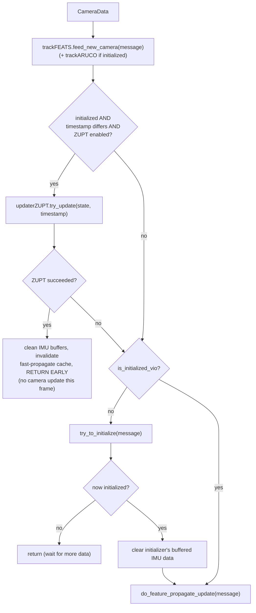
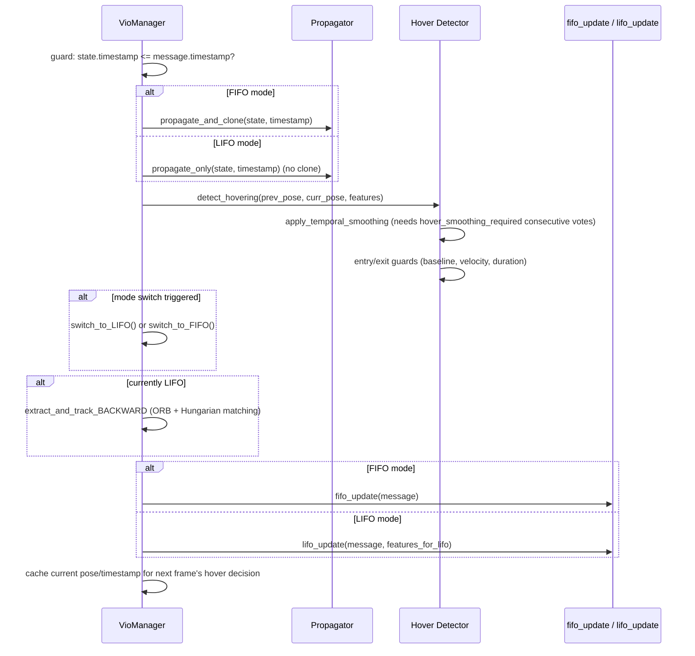
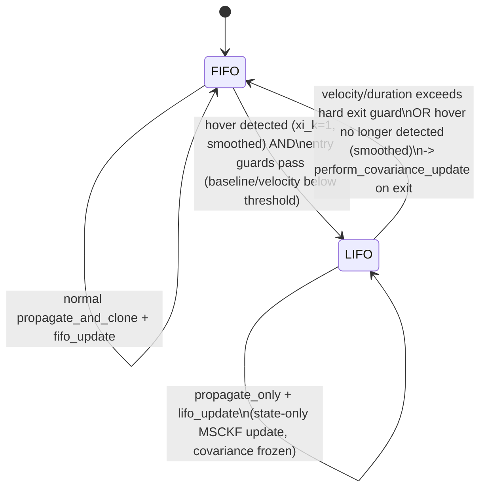

# VIO Manager: The Main Orchestrator (`msckf/VioManager.py`, `VioManagerOptions.py`)

`VioManager` is the top-level class tying together the tracker, propagator,
initializer, and updaters into the full VIO pipeline. Everything else in
`msckf/`, `core/`, `initialize/`, and `type/` exists to be called from here.

## `VioManagerOptions.py` — top-level config aggregator

Aggregates every sub-config object:

- `state_options` (`StateOptions`, see [estimator-core.md](estimator-core.md))
- `init_options` (`InertialInitializerOptions`, see [initialization.md](initialization.md))
- `imu_noises` (`NoiseManager`, see [propagation.md](propagation.md))
- `msckf_options`, `slam_options`, `aruco_options`, `zupt_options`
  (four `UpdaterOptions` instances, see [updaters.md](updaters.md))
- `featinit_options` (`FeatureInitializerOptions`, see [triangulation.md](triangulation.md))

Plus estimator-level settings: `dt_slam_delay=2.0` (seconds after startup
before SLAM features may initialize — avoids seeding landmarks before the
filter has settled), ZUPT toggles/thresholds, timing-log options, state
defaults (`gravity_mag=9.81`, default IMU intrinsics vectors, IMU-sensor
rotation quaternions, per-camera intrinsics/extrinsics, mask usage), and
tracker settings (stereo/KLT/ArUco toggles, FAST threshold, grid size,
min pixel distance, histogram equalization mode, KNN ratio, track
frequency).

### Hovering-mode parameters (custom extension, not stock OpenVINS)

A distinct block of options governs the FIFO↔LIFO hovering state machine
(see below): `sliding_window_size`, `hovering_threshold`,
`hover_smoothing_required`, baseline/epipolar/bearing inlier thresholds,
entry/exit velocity/duration guards, and a family of `lifo_*` parameters
controlling a backward feature-chain tracker used only while frozen in hover
mode.

`sync_state_options()` pushes loaded camera/IMU calibration into
`state_options` right before `State` construction. `print_and_load_*`
methods load from a YAML-like `parser` dict (see
[configuration.md](configuration.md)).

## `VioManager.__init__`

Builds, in order: the `State`, pushing IMU intrinsics/camera calibration
into it → timing-log file → `TrackKLT` feature tracker (+ optional ArUco
tracker) → `Propagator` → `InertialInitializer` → `UpdaterMSCKF` →
`UpdaterSLAM` → (if `try_zupt`) `UpdaterZeroVelocity`. Initializes
bookkeeping (`is_initialized_vio=False`, `startup_time`, `timelastupdate`,
cumulative `distance`), visualization caches, and hovering-mode state
(`self.mode = "FIFO"`, `_hover_*`/`_lifo_*` buffers, an ORB detector
`self._lifo_orb`).

## Entry points

| Method | Called when | Effect |
|---|---|---|
| `feed_measurement_imu(message)` | Every raw IMU sample | Buffers into `Propagator`; feeds `InertialInitializer` if not yet initialized; feeds `UpdaterZeroVelocity` if initialized & ZUPT enabled. |
| `feed_measurement_camera(message)` | Every camera frame | → `track_image_and_update(message)`. |
| `feed_measurement_simulation(...)` | Simulation mode | Bypasses the real tracker (`TrackSIM`), still routes through the ZUPT-check → update path. |

### `feed_measurement_imu(message)`

Computes an `oldest_time` cutoff (the state's marginalization timestamp if
initialized, else the initializer's window), then:
1. `propagator.feed_imu(message, oldest_time)`.
2. If not yet initialized and no init thread running: also feeds
   `self.initializer` (static/inertial initialization — see
   [initialization.md](initialization.md)).
3. If initialized and ZUPT enabled (and not "zupt only at beginning,
   already moved"): also feeds `self.updaterZUPT`.

## `track_image_and_update(message)` — per-image processing



## `try_to_initialize(message)`

Manages a (possibly background-threaded) call into
`InertialInitializer.initialize(...)` (see [initialization.md](initialization.md)).
On success: **validates plausibility** of the estimated biases — rejects
init if `|bg| > 0.35 rad/s` or `|ba| > 3.5 m/s²`, resetting the IMU state to
identity/zero and returning failure (a sanity-check safety net on top of
the static initializer's own internal gating). If valid:
`StateHelper.set_initial_covariance`, sets `state._timestamp`/
`startup_time`, cleans feature-database history before that time, and
**catches the state up** to any camera frames that arrived while
initializing was in progress — repeatedly calling
`propagator.propagate_and_clone` + `marginalize_old_clone` for a strided
subsample of queued timestamps. Uses a lock/queue (`camera_queue_init`) to
buffer image timestamps arriving mid-init when multithreaded.

## `do_feature_propagate_update(message)` — the core per-frame algorithm



1. **Guard**: if `state._timestamp > message.timestamp` (out-of-order
   image), warn and return.
2. **Propagation**: FIFO → `propagate_and_clone` (adds a clone); LIFO →
   `propagate_only` (clone window frozen during a detected hover). Guard
   again if propagation failed to reach the target timestamp.
3. **Hovering-mode detection** (only if there's a previous camera frame):
   see dedicated section below.
4. If in LIFO mode: `extract_and_track_BACKWARD` — custom backward
   ORB-descriptor/geometric feature association (Hungarian assignment).
5. **Dispatch**: FIFO → `fifo_update(message)`; LIFO →
   `lifo_update(message, features_for_lifo)`.
6. Cache current IMU pose/timestamp for next frame's hover-decision input.

## Hovering detection: FIFO/LIFO state machine

**This is a custom extension not present in stock OpenVINS.** It detects
near-zero-parallax (pure-rotation / hovering) motion segments — scenarios
where MSCKF triangulation would be numerically weak due to zero baseline —
and switches strategy rather than feeding the filter weak/noisy geometric
constraints.



- **Hover decision `xi_k`** (`detect_hovering`): uses bearing-vector
  residuals between the previous and current camera pose's predicted
  rotation (`C_q_hat = R_curr · R_prev^T`) to measure "no-parallax"
  condition — either an epipolar-SVD-based inlier residual (if baseline >
  threshold) or raw bearing residual (if baseline small), thresholded
  (`hovering_threshold`) against the mean/median residual `d_k`.
- **Temporal smoothing** (`apply_temporal_smoothing`): requires
  `hover_smoothing_required` consecutive identical decisions (via a
  `deque`) before flipping the persisted mode — avoids flapping between
  FIFO/LIFO on noisy single-frame decisions.
- **Entry guard**: blocks FIFO→LIFO if current baseline or velocity already
  exceeds `hover_entry_max_baseline`/`hover_entry_max_velocity` (don't enter
  hover mode mid-fast-motion).
- **Hard exit guard**: forces LIFO→FIFO if velocity exceeds
  `hover_exit_velocity_threshold` or hover duration exceeds
  `hover_max_duration_sec`.

**`switch_to_LIFO()`**: freezes `hover_poses_fixed`, seeds backward
feature-tracking chains from the current feature database.

**`switch_to_FIFO()`**: performs a **deferred** `perform_covariance_update`
using accumulated hovering measurements before resuming normal operation —
covariance is only allowed to shrink once, batched, on hover-exit.

**`extract_and_track_BACKWARD`**: builds ORB-descriptor + geometric-
consistency-matched "backward chains" of feature observations while frozen
in LIFO mode, via Hungarian assignment (`scipy.optimize.linear_sum_assignment`
on a combined geometric+descriptor cost matrix) with mutual-consistency and
quality/miss-count bookkeeping — an entirely custom feature-association
mechanism used only during hover, with no stock-OpenVINS counterpart.

**`lifo_update(message, features_for_update)`**: gathers
`features_for_cov` from the backward chains, merges into
`_hover_feature_measurements`, then does a **state-only** MSCKF update
(`msckf_state_only_update`): calls `updaterMSCKF.update` on a deep-copied
feature list, then explicitly **restores the pre-update covariance**
(`state._Cov = cov_snapshot`) afterward — updates the *mean* (pose/velocity/
bias corrections) but prevents covariance from shrinking while frozen,
since the clone window assumptions don't hold mid-hover. The full covariance
correction happens once, batched, in `switch_to_FIFO`'s
`perform_covariance_update` (which snapshots/restores only the *state
values*, not covariance, the mirror-image restriction).

## `fifo_update(message)` — the standard per-frame MSCKF+SLAM pipeline

This is the closest analog to stock OpenVINS's
`VioManager::do_feature_propagate_update`.

```mermaid
flowchart TD
    A["Require >= min(max_clone_size,5) clones\n(bootstrap guard)"] --> B["has_moved_since_zupt = True"]
    B --> C["Feature triage:\nfeats_lost = features_not_containing_newer\nfeats_marg = features observed at margtimestep\nfeats_maxtracks = long tracks split out of feats_marg"]
    C --> D["SLAM budget management:\npromote feats_maxtracks -> feats_slam\nif under max_slam_features budget & past dt_slam_delay"]
    D --> E["Existing SLAM landmarks:\nrefresh measurements, flag should_marg\n(lost OR update_fail_count > 1)"]
    E --> F["StateHelper.marginalize_slam(state)"]
    F --> G["Split feats_slam into\nfeats_slam_DELAYED (new) vs feats_slam_UPDATE (existing)"]
    G --> H["featsup_MSCKF = feats_lost + feats_marg + feats_maxtracks\n(sorted by track length, cropped to max_msckf_in_update,\nkeeping the LONGEST tracks)"]
    H --> I["updaterMSCKF.update(state, featsup_MSCKF)\npropagator.invalidate_cache()"]
    I --> J["updaterSLAM.update(state, chunk)\nfor chunk in feats_slam_UPDATE (size max_slam_in_update)"]
    J --> K["updaterSLAM.delayed_init(state, feats_slam_DELAYED)"]
    K --> L["retriangulate_active_tracks (visualization only)"]
    L --> M["mark featsup_MSCKF to_delete=True\n(recording p_FinG into good_features_MSCKF first)"]
    M --> N["cleanup() feature databases"]
    N --> O["updaterSLAM.change_anchors(state)"]
    O --> P["cleanup_measurements at margtimestep if still over cap"]
    P --> Q["StateHelper.marginalize_old_clone(state)"]
    Q --> R["_print_update_summary: log pose/velocity,\nupdate cumulative distance"]
```



Key details:
- **Bootstrap guard**: no update attempted until at least
  `min(max_clone_size, 5)` clones exist.
- **Feature triage** carefully avoids double-counting: `feats_lost`
  excludes anything already about to be marginalized;
  `feats_maxtracks` (tracks whose length exceeds `max_clone_size`) are
  pulled *out* of `feats_marg` since they're candidates for SLAM promotion
  rather than pure marginalization.
- **SLAM budget**: only promotes new SLAM features if
  `max_slam_features > 0`, past `dt_slam_delay`, and current SLAM count is
  below budget — fills remaining budget with the longest-tracked available
  features.
- **`featsup_MSCKF` cropping** keeps the *longest* tracks (best geometric
  conditioning) when there are more MSCKF candidates than
  `max_msckf_in_update`.
- **Ordering matters**: `change_anchors` must run *before*
  `marginalize_old_clone`, since re-anchoring needs the old anchor clone's
  covariance rows to still exist.

## Supporting methods

| Method | Purpose |
|---|---|
| `initialize_with_gt(...)` | Bypass the inertial initializer, seed state directly from ground truth. |
| `retriangulate_active_tracks(message)` | Running incremental linear-least-squares triangulation (`A·p = b` from bearing vectors, accumulated across frames) — **visualization only**, not part of the EKF. |
| `get_state`, `get_propagator`, `get_good_features_MSCKF`, `get_active_tracks`, `get_features_SLAM`, `get_features_ARUCO`, `get_historical_viz_image` | Getters consumed by `main.py`'s ROS visualization (see [ros-integration.md](ros-integration.md)). |

## End-to-end summary

```
feed_measurement_imu(imu_msg)          [continuous, high rate]
  -> propagator.feed_imu()              (buffer)
  -> initializer.feed_imu()             (if not yet initialized)
  -> updaterZUPT.feed_imu()             (if initialized & zupt enabled — implicit via try_update below)

feed_measurement_camera(img_msg)
  -> track_image_and_update(img_msg)
       1. trackFEATS.feed_new_camera()          [KLT tracking -> FeatureDatabase]
       2. trackARUCO.feed_new_camera()          [if initialized]
       3. updaterZUPT.try_update()  -> early return if stationary
       4. try_to_initialize()       -> return if not yet initialized
       5. do_feature_propagate_update(img_msg)
            a. propagator.propagate_and_clone() [IMU mean+cov propagate + add clone]  (FIFO)
               or propagate_only()                                                     (LIFO)
            b. hover mode detection / FIFO<->LIFO switch
            c. fifo_update(img_msg):
                 - triage tracked/lost/marginal/maxtrack features
                 - marginalize dead SLAM landmarks
                 - updaterMSCKF.update()          [nullspace-projected batched EKF update]
                 - updaterSLAM.update()            [in-state landmark EKF update]
                 - updaterSLAM.delayed_init()      [QR-split new landmark initialization]
                 - updaterSLAM.change_anchors()    [re-anchor before marg]
                 - StateHelper.marginalize_old_clone()  [drop oldest pose clone]
               or lifo_update(img_msg, ...):        [state-only update, covariance frozen]
```

This mirrors stock OpenVINS's estimator loop (propagate → track → MSCKF
update → SLAM update → SLAM delayed-init → marginalize), with the Python
port adding: FEJ-consistent Jacobians throughout, robustness guards
(`min_features_for_update`, condition-number rejection, covariance-diagonal
flooring — see [estimator-core.md](estimator-core.md)), and the substantial
custom FIFO/LIFO hovering extension described above.
