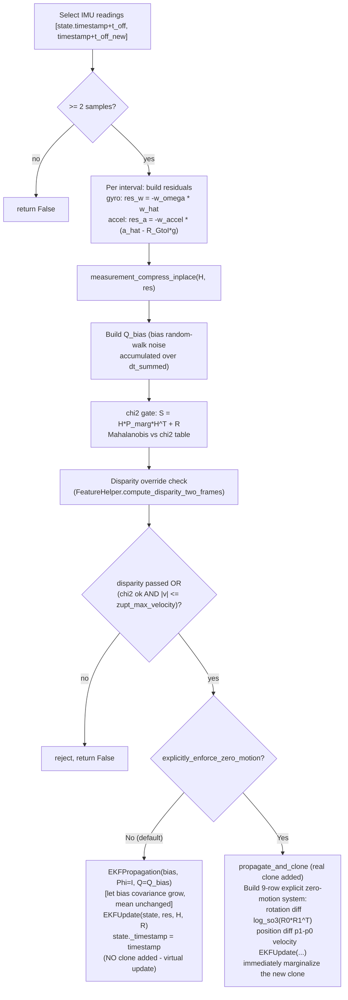

# Zero-Velocity Update / ZUPT (`msckf/update_zero_velocity.py`)

Detects stationary periods and applies a motion-constraint update **instead
of** the normal camera-based update — dramatically reduces drift while the
platform is not moving (e.g. a drone hovering, a ground vehicle stopped at a
light).

Class: `UpdaterZeroVelocity`.

## Why ZUPT matters here

When stationary, camera-based MSCKF/SLAM updates are weak or degenerate
(near-zero parallax gives ill-conditioned triangulation — see
[triangulation.md](triangulation.md)'s baseline/condition-number checks,
which would reject most features anyway). ZUPT instead directly constrains
the IMU state using the physical fact that a stationary platform has zero
angular velocity and a specific-force reading that should equal gravity
exactly. This codebase's config exposes ZUPT as a first-class, often
aggressively-enabled feature (`Custom_v1/estimator_config.yaml` sets
`try_zupt: true`) — likely reflecting a UAV/hover use case (see also the
FIFO/LIFO hovering-detection logic in
[vio-manager.md](vio-manager.md#hovering-detection-fifolifo-state-machine),
and the reference PDF shipped in the repo, *"Detecting and Dealing with
Hovering Maneuvers in Vision-aided Inertial Navigation Systems"*).

## `try_update(state, timestamp)`



### Building the linear system (default, non-integrated mode)

For each consecutive IMU interval `i`, corrected `a_hat`, `w_hat` as in
[propagation.md](propagation.md)'s `predict_and_compute`. Whitening
weights: `w_omega = sqrt(dt)/sigma_w`, `w_accel = sqrt(dt)/sigma_a`.

```
Gyro residual  (zero-angular-velocity constraint):
    res_w = -w_omega * w_hat
    d(res_w)/d(bg) = -w_omega * I

Accel residual (measured specific force should equal gravity in body frame):
    res_a = -w_accel * (a_hat - R_GtoI @ g)
    d(res_a)/d(theta) = -w_accel * skew(R_jacob @ g)      # R_jacob = FEJ rotation if do_fej
    d(res_a)/d(ba)    = -w_accel * I
```

State order for the Jacobian: `[imu.q(), imu.bg(), imu.ba()]` (9 columns) —
or, if `integrated_accel_constraint` mode is enabled (off by default), also
`imu.v()` (12 columns), using `w_accel_v = 1/(sqrt(dt)·sigma_a)` weighting
instead.

### Chi-square gate with bias-drift-aware noise

`Q_bias`: random-walk bias process noise accumulated over the total
interval `dt_summed`, added into the marginal covariance of the bias block
specifically for the chi2 test — accounts for the fact that even while
"stationary," bias uncertainty grows over the interval (a time-varying-bias
model), so the gate isn't overly strict for longer static intervals.

### Disparity override

Independently checks visual feature disparity between the two frames
(`FeatureHelper.compute_disparity_two_frames`, see
[cameras-and-tracking.md](cameras-and-tracking.md#feature_helperpy--featurehelper-disparity-statistics)).
If disparity is very low with enough features, **forcibly accepts** the
ZUPT even if the chi2/velocity checks alone would reject it
(`override_with_disparity_check`) — a second, independent signal that the
platform truly isn't moving, guarding against IMU-only false negatives.

### Rejection condition

Rejects if **(not disparity-passed) AND (chi2 too high OR `|v| >
zupt_max_velocity`)**.

### Applying the update — two modes

**Default** (`explicitly_enforce_zero_motion=False`):
1. `EKFPropagation` on just the bias block with `Phi=I(6)`, `Q=Q_bias` —
   lets bias covariance grow to reflect drift during the static interval
   *without* changing the bias mean.
2. `StateHelper.EKFUpdate(state, Hx_order, H, res, R)` — applies the
   zero-motion residual correction to orientation/bias (and velocity, if
   integrated-accel mode).
3. `state._timestamp = timestamp` set manually — **no clone is added**.
   This is a "virtual" propagation+update: the sliding window is
   untouched, only the mean/covariance at the current instant are
   corrected.

**Alternative** (`explicitly_enforce_zero_motion=True`, disabled by
default): calls `propagate_and_clone` normally (a real clone *is* added),
then builds an explicit 9-row system directly penalizing:
- rotation difference `log_so3(R0 · R1^T)` between the two most recent
  clones,
- position difference `p1 − p0`,
- current velocity,

each with tight fixed noise (`R` diag `[1e-2², 1e-1², 1e-1²]`). Applies
`EKFUpdate`, then **immediately marginalizes** the newly-created clone
(since ZUPT should not grow the sliding window).

## How ZUPT fits into the per-frame loop

`VioManager.feed_measurement_imu` routes IMU samples to
`self.updaterZUPT` (if enabled and initialized). Every camera frame,
`VioManager.track_image_and_update` calls `updaterZUPT.try_update` **before**
the normal MSCKF/SLAM update path — if it succeeds, the frame's camera-based
update is skipped entirely for that step (see
[vio-manager.md](vio-manager.md#track_image_and_updatemessage)).
`zupt_only_at_beginning` (config option) can restrict ZUPT usage to before
the vehicle has ever moved (`has_moved_since_zupt` flag in `VioManager`),
useful for platforms where post-liftoff "false ZUPT" would be catastrophic.
