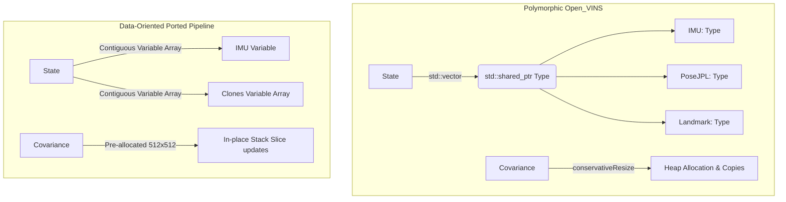

# Data-Oriented Design (DOD) Architecture

This document describes the design principles, memory management strategies, object lifetimes, and memory arena configurations used in the ported C++ VIO pipeline.

## DOD vs. Polymorphic Design (Open_VINS)

The official Open_VINS repository is built on a polymorphic design that represents EKF state variables as individual objects derived from a virtual base class (`Type`). While flexible, this introduces several bottlenecks that our DOD implementation resolves:

### 1. Pointer Chasing & Cache Misses
* **Open_VINS**: Loops over variables require dereferencing pointers to heap-allocated structures (`std::shared_ptr<Type>`). This forces the CPU to fetch disjoint memory locations, leading to cache misses.
* **Ported DOD**: Variables are stored contiguously in flat structures (`type::Variable`). The nominal values and error-state offsets are flat stack-allocated arrays of size 16 (`double value[16]`), allowing vectorization and sequential cache-friendly access.

### 2. Heap Allocations during Execution
* **Open_VINS**: Augmenting sliding window clones instantiates new types via `std::make_shared<PoseJPL>()`. In an online tracking scenario running at 30Hz+, this constant cycle of `new`/`delete` causes memory fragmentation.
* **Ported DOD**: Zero heap allocations! Clone variables are pre-allocated in static arrays (`Variable clones[12]`) on the stack.

### 3. Covariance Matrix Resizing
* **Open_VINS**: The EKF covariance matrix is dynamically resized via `Eigen::MatrixXd::conservativeResize()` as clones and landmarks enter/leave the state. This causes expensive memory reallocations and copies of large blocks.
* **Ported DOD**: The covariance matrix is pre-allocated on the stack with a fixed maximum size of $512 \times 512$ (`Eigen::Matrix<double, 512, 512> Cov`). Resizing is replaced by updating integer bounds and operating on in-place slices (`Cov.block(r, c, rows, cols)`).

---

## Memory Arenas & Lifetimes

To enforce deterministic, high-frequency operation on target embedded boards (e.g., Jetson Orin Nano), the pipeline implements strict object lifetime scopes:

### 1. EKF State Lifetime (`msckf::State`)
* **Scope**: Persistent throughout the run.
* **Allocation**: Stack-allocated during system instantiation. Contains the flat IMU variable, the camera pose clones, and the static covariance matrix.

### 2. Feature Database Lifetime (`core::FeatureDatabase`)
* **Scope**: Persistent, but internal elements are pruned.
* **Allocation**: Stack-allocated. Features are tracked using flat arrays of static size. The database acts as a ring buffer; measurements older than the initialization time or marginalized clones are cleaned up in-place to avoid dynamic memory shifts.

### 3. Temporary Allocations (Memory Arena)
For operations requiring temporary variable-sized arrays (such as storing filtered IMU data during propagation or extracting active track subsets):
* **No dynamic allocations**: Custom local buffers with compile-time capacities (e.g., `core::ImuData filtered[2000]`) are placed on the stack frame.
* **Stack limit preservation**: The stack limit is increased via compile definitions (`EIGEN_STACK_ALLOCATION_LIMIT=8388608`) to ensure large EKF temporary operations do not cause stack overflows.
